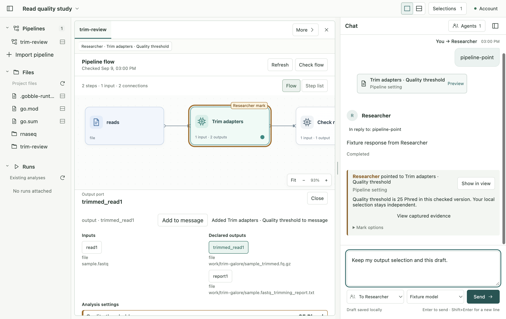
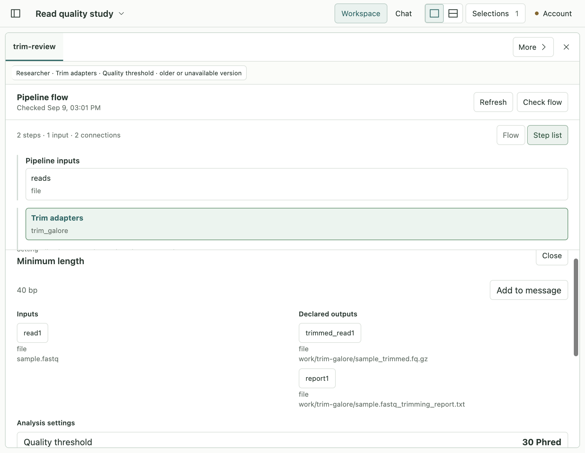
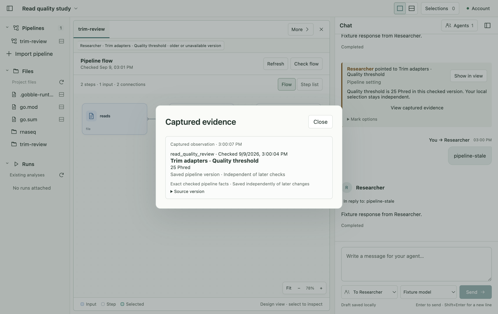

# P2A-2 — Verification and limits

Subject: checked-flow discussion on macOS 26.5.2 arm64, Electron 44.2.0,
Node 25.7.0, React 19.2.8 and TypeScript 5.9.3. Native service uses host Go 1.27.1;
inspection uses the pinned Linux/amd64 Go 1.26.8 runtime. This qualifies the local
development App, not a packaged release or the whole Gobble engine.

## Owner-level and native checks

- App unit suite: 335 cases across 31 files passed in `unit.log`, including exact
  address validation, copy ownership, retained evidence, migration, observation
  bounds and actual Main workspace policy integration.
- Native service race checks and vet passed (`service-race.log`, `service-vet.log`).
- Focused root/CLI/module tests passed in cached Linux/amd64 with network disabled
  (`gobble.log`). The first metadata ownership test fixture lacked its required
  output; the corrected test retains the intended copy/validation assertions.
- Actual native service -> pinned Gobble inspection passed for the branching
  five-step/seven-edge example and the real Trim Galore module. The latter
  returned 25 Phred and 40 bp without creating a Run (`native-go-settings.log`,
  `native-go-settings.json`). Earlier fixture failures and the passing branching
  check are retained in `native-go-first.log`.
- Actual Electron -> Main -> Go service -> pinned runtime discussion scenario
  passed (`native-discussion.log`, 2.2 minutes). A protocol test Agent observes and
  points at a supported setting; a second held receipt is rejected after source
  changes and re-check. The scenario verifies immutable 25 Phred evidence beside
  current 30 Phred state, restart, keyboard selection, graph/list parity, preserved
  User selection/draft/focus/zoom, Show/Return and compact Workspace/Chat switching.
- The existing native branching-flow scenario also passed in `native-compact-first.log`.
  The other scenario in that initial run reached the final compact UI but targeted
  a hidden Chat control. Its correction performs the real responsive Chat switch;
  no product assertion was removed.

Full App and actual signed-in Agent results are recorded below, separately from the protocol test peer.

The first actual-Agent launch copied the existing authorized credential into an
isolated profile but omitted the Account connection refresh; its disabled Add
agent control correctly refused use (`live-agent-first.log`). After the refresh,
an actual Agent successfully observed and marked the setting. That first screen
also exposed a fast-click selection race before the Agent turn. Its evidence is
retained as `live-agent-selection-first-*`; it proves a live mark and unchanged
baseline, but not the intended output-port baseline. The interaction was corrected
and is re-qualified below. The first whole-App check was deliberately interrupted
for that correction after 14 native cases (`check-interrupted.log`); it is not
reported as a complete pass.

One final actual-Agent attempt encountered an unavailable foreground window after
the long native inspection (`live-agent-background.log`,
`live-agent-background.png`). It correctly refused observation/pointing, reported
only the attached 25 Phred fact and did not invent the unobserved minimum length
or connection. The qualification script now also asserts actual native foreground
immediately before Send and records it at completion. This changes the test setup,
not the App's foreground requirement; it never substitutes a permissive callback.

## Complete App regression

`GOBBLE_FLOW_LIVE=1 npm run check` passed: formatting, all TypeScript process and
shared-schema checks, 335 unit cases in 31 files, the native service/production App
build and **69 Electron cases** in 6.5 minutes (`check.log`). Both real pipeline
inspection scenarios were enabled. The final selection/capture timing correction
is included. Existing file/image/table/PDF/Notebook/Run/dependency/question and
multi-Agent behavior remains covered by that suite.

After that functional build, the only production adjustment bounds a long/multiple
Agent badge to its card and removes unused hiding CSS. `final-visual-build.log`
records its production rebuild and `final-css-format.log` its format check. The
final actual-Agent screen qualifies that built presentation. No repeated whole-App
count is claimed for this narrower cosmetic change.

## Actual signed-in Agent — final pass

The final `live-agent.ts` run used the App's default model, `gpt-6-astra`, through
the actual Codex runtime and existing authorized account. It inspected the same
real checked artifact, published an exact v7 Quality threshold mark and explained
25 Phred, 40 bp and the actual output-to-input connection. Before/after selection
records prove the User retained **trimmed_read1 output port**, while the Agent's
independent target was **Quality threshold**. The unsent draft and composer focus
remained unchanged; actual native foreground was true at completion.

Evidence: `live-agent-review.json`, `live-agent-observation.json`,
`live-agent-pipeline.png`, `live-agent.log`, and the retained script. The script's
assertions completed, its isolated App/profile was closed and removed, and
`live-isolation.json` confirms the original credential was unchanged. Only owned
synthetic Project information was sent. This proves one real model interaction;
it is not a guarantee that every model/turn will choose the same tool sequence.
Stale refusal and restart are qualified separately by the deterministic native
scenario, not attributed to this model turn.

## Source and historical preservation

`after.json` inherits the 665-file source corpus, records 61 changed inherited
files, 20 added files and one explicitly expanded module-file coverage entry (686
files total). It is not a whole-repository baseline. All **25** previously
inventoried published schema/storage files and **886** prior design/stage artifacts
remain byte-identical. Only the two mutable desktop status indexes were updated
among the 888 inventoried documents. App status/qualification READMEs and new stage
documents explain the active v19/v16/v10 contracts. Existing dirty work, prior
proposals and stage evidence were preserved; no commit, push or release was made.

## Runtime provenance and isolation

Derived image `sha256:1d4dccd578363c104aa65127e33a4d924f1f2e4a15ae3d9e6ee8ab4c46695adb`
was built locally from cached base
`sha256:bccd458a724b795ac507e3dd0be43e8431269db2819fa544784d73dc751ba22b`
with no network/pull/push. `runtime-context.json` inventories the explicit source
context; `runtime-build.log` and `runtime-lock.json` identify the build and daemon.
Only the owned qualification Project lock was updated. Test Projects, source
changes and App profiles are temporary and isolated from normal research work.

The first native launches could not acquire window focus while the OS notification
application was foreground (`native-focus-first.log`). Access to that protected
system application was refused by the computer-control tool; its contents were
not inspected or manipulated. Later native focus succeeded, and the actual
foreground requirement stayed enabled throughout. This is an environment
preflight failure, not evidence that a pipeline interaction failed.

## Visual review

Agent amber marks and User teal selection remain separate. A port/setting mark
identifies its parent card and exact field in details. Retained references state
when their version is older or unavailable. Text labels accompany color; no Run
success/failure state is invented on a checked design. The compact view retains
scrollable details and switches between Workspace/Chat through existing controls.
Screens are actual native test UI. The protocol peer's response is not an LLM result.

## Coverage limits

Trim Galore is the only module with supported settings in this part. Other modules
still expose actual steps/ports/connections and report absent setting metadata.
Tool defaults are unknown, not guessed. Existing Projects keep their pinned runtime; v1 artifacts remain readable without settings. Declared settings require a compatible v2 runtime/module. The App does not rewrite runtime locks or install upgrades. Bounded semantic observations describe the
loaded artifact, not viewport pixels or arbitrary hidden Project files.

Native macOS root-library/whole-engine support remains limited by the earlier
Linux-only engine code. The two earlier packed-runner failures remain unresolved:
`TestPackPrintpipeArtifact` and `TestPackHostpipeEmptyInspectProtocol`. These checks
do not prove source adoption, analysis execution, Stop/Resume, packaging, signing
or cross-platform release. P2B remains a separate owner checkpoint.
