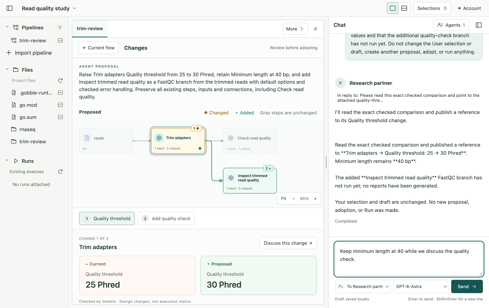

# P2B-1 — B / Change spotlight

Implemented 2026-09-09; result finalized 2026-09-10 (KST). The owner accepted B in alternatives-v2 and requested implementation.
The existing-Pipeline refinement loop is implemented. This is the result-review
checkpoint before P2B-2; it is not authorization to start new-Pipeline creation.

The User asks for a change in Chat, explicitly allows a proposal for that message,
and sees a checked Proposed flow. Changed steps are amber, additions green and
unchanged context gray. Selecting a number, changed card or added connection shows
Current/Proposed facts below. **Discuss this change** uses the existing composer;
Agent references name the exact retained comparison without changing User selection.

In the synthetic qualification Project, the actual Agent changed Quality threshold
from 25 to 30 Phred, retained Minimum length at 40 bp, and added a FastQC branch
from the trimmed reads. Gobble checked the actual source. The User adopted the
same checked proposal; original imported files and the unsent draft stayed intact,
and no Run was created. This demonstrates interaction and processing correspondence,
not a scientific recommendation for those values.

First adoption creates an app-managed source copy as current. The import stays
separate. Old comparisons remain readable and references retain both versions.
An incomplete, stale or unexplained proposal cannot be adopted. An uncertain
response is resolved through the saved operation outcome before another attempt.

- [Concepts, ownership diagram, code boundaries and limits](design.md)
- [Implementation record](implementation.md)
- [Design and code review](review.md)
- [Verification and environment limits](verification.md)
- [Actual added-branch comparison](evidence/actual-agent/b-added-step-review.png)
- [Actual User adoption](evidence/actual-agent/b-adopted-review.png)

Current contracts: Workspace v17, bundle v20, service catalog v3 and toolset v11.
Existing Agents on older shared tools must use **Start new conversation** in their
settings; earlier messages/evidence remain in Project history. Existing source
runtimes need the qualified `review` capability before they can check proposals;
an incompatible runtime produces a refusal, not an automatic runtime replacement.

The first scope is canonical Trim Galore quality/length refinement and an added
canonical FastQC leaf, with one registered Pipeline per Project and eight retained
proposals. Other processing changes remain unsupported. Execution controls and
new-Pipeline creation are not implemented here. Document editing and CSV chart
creation stay excluded.

After result approval, the next sketch should show **analysis goal + Project data
→ Agent-created first Pipeline → the same B review → User adoption**, including
first-version ownership and cancellation. That P2B-2 work has not started.
