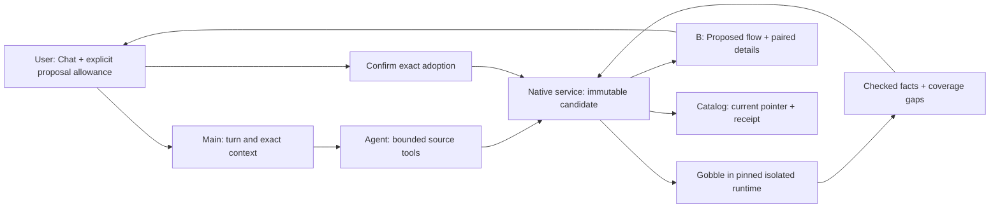

# P2B-1 — Change spotlight

2026-09-09. The owner accepted **B in alternatives-v2**. B is one Proposed flow
with numbered changes and paired Current/Proposed detail underneath. Historical
A/B labels in the first proposal do not describe this decision.

## Product interaction

The current Pipeline toolbar offers **Discuss changes**. It adds the exact current
version to the existing Chat composer, preserving unsent text. The User explicitly
allows a source proposal for that message. The Agent receives only the retained,
declared source scope and qualified constructor guidance. Ordinary discussion does
not grant authoring authority. The allowance is recorded with the addressed message
and is never inferred from prose, an attachment, shared-view access or another turn.

**Changes** opens a review within the central Pane. Added steps are green, modified
steps amber and unchanged context gray. Numbers and labels carry the meaning without
color. Existing rounded orthogonal routes, fit/zoom and dense-list fallback are reused.
Selecting a changed node or a numbered change shows paired facts below. Multiple
setting changes in one step remain separate numbered subjects. The User sees analysis
labels and units rather than a source diff.

**Discuss this change** places the exact comparison/change in the same composer.
An Agent can read the retained comparison and publish an independent reference. Such
references do not claim viewport observation and do not move the User's selection.
The User explicitly chooses the Agent reference to inspect it. Current-flow v7
observation is invalidated while review replaces that view; it cannot accidentally
claim the Proposed flow is the previously acknowledged Current flow.

Adoption explains the exact action before confirmation. First adoption creates an
app-managed source copy; the imported folder remains separate. The service makes
that retained proposal current and saves an operation receipt in one catalog commit.
Adoption never creates a Run. On an uncertain response, the App queries the same
operation identity. History remains readable after a new current version or restart.

## Concepts and owners

| Concept                 | Definition                                                                                                                   | Owner                                  |
| ----------------------- | ---------------------------------------------------------------------------------------------------------------------------- | -------------------------------------- |
| Pipeline registration   | Project identity and source-package binding; no inferred execution state                                                     | Native service catalog                 |
| Current source revision | One Project pointer to a retained checked source bundle, qualified initially for one participating Pipeline                  | Native service catalog v3              |
| Candidate               | Immutable replacement bytes for declared existing Go files in the scoped package                                             | Service retention; Agent authors bytes |
| Review definition       | Full checked task fingerprints, canonical setting recipes, exact directed connections and context digest                     | Gobble                                 |
| Comparison              | Checked differences plus explicit coverage gaps between two retained definitions                                             | Gobble portable review domain          |
| Comparison reference    | Pipeline, proposal, both artifact identities, optional exact change and side                                                 | Main validates; Workspace stores       |
| Agent reference         | Comparison reference attributed to one active Agent submission                                                               | Main / Workspace writer                |
| Adoption                | Expected-current publication of one exact explained proposal plus durable operation outcome                                  | User requests; service commits         |
| Pane / View             | Pane remains the presentation slot; flow and comparison are presentations within that slot, never source or execution owners | Gobble App                             |

## Code organization and constraints

- `internal/modulecommand` is a pure leaf shared by actual module construction and
  canonical recipe verification. It adds no engine or platform dependency.
- `internal/engine/pipeline_review.go` fingerprints every exported TaskPlan field,
  including fields absent from Plan JSON. Root inspection adds visual/context facts.
- `internal/pipelinereview` compares portable checked definitions without importing
  the engine, provider, process runner or filesystem application owners. Native
  service architecture tests permit this one leaf and test its dependency boundary.
- Service source retention, check lifecycle, adoption, and HTTP routes have separate
  files. Pipeline inspection and Run query semantics remain separate.
- Main's `PipelineProposalService` owns wire validation and association.
  `PipelineReviewHost` owns per-message authority and exact discussion. The existing
  collaboration coordinator retains the opt-in and delivers immutable facts.
- React requests named operations and renders checked facts. It cannot read source,
  compare executable behavior, mutate managed files, grant Agent authority or adopt
  on the Agent's behalf. User selection and Agent references remain independent.

Workspace v17 / contract bundle v20 / shared toolset v11 / service catalog v3.
The v16 storage shape is frozen. Historical schemas exclude new authority fields.
Original catalog v1/v2 and Workspace bytes are archived before migration writes.
Pipeline flow stays v2; older flow and v7 reference readers remain available.

## Qualified first scope

Canonical Trim Galore quality/length changes and addition of a canonical FastQC
leaf from an existing output are supported. Existing unsupported steps may remain
unchanged by complete fingerprint. Unknown behavior, removed steps, rewired existing
connections, altered runtime/setup/dependency/sample files and shared-Pipeline source
publication refuse adoption. This qualifies declared processing for the checked inputs;
it is not proof of scientific suitability or all possible future samples.

Only existing declared Go files in the participating package are editable: 16 files,
32 KiB per file and 48 KiB total text. Retained evaluator input limits remain 1,000
files / 32 MiB, with 8 MiB per file. Up to 8 proposals are retained per Pipeline so
full comparison history fits the bounded service response. Each retained comparison
is bounded to 1.75 MiB; a larger result fails without changing current. Inspection/proposal checks
share a two-check service limit. A proposal check runs at most two minutes per side
inside the existing no-network, read-only, unprivileged runtime boundary.

No deletion or automatic reclamation of referenced versions; no setup/dependency
editor, general shell, CSV chart creation, document editor, new-Pipeline creation,
Run preparation/control, packaging or publication is included.
