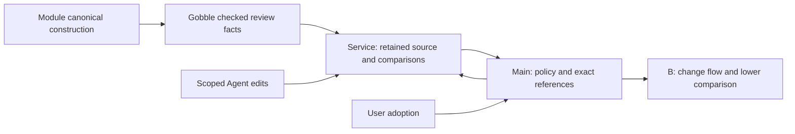

# P2B-1 implementation record

2026-09-09. User accepted **B — Change spotlight** and requested implementation.
The approved presentation is one Proposed flow with numbered changes, and exact
Current/Proposed detail below. Other comparison concepts remain historical.
Implementation mode; P2B-1 follows the accepted source/review/adoption design.

Source scope: create focused command construction/review owners, service proposal
and revision lifecycle, contracts and validators, Main proposal policy and tools,
renderer pipeline comparison, qualification fixtures and tests. Co-touch existing
module wrappers, Gobble flow driver, service catalog/routes, preload/IPC and shared
reference/evidence consumers only as needed by these dependencies. No engine Run
control, package/release or external Project source mutation.

CRUD / lifetime: Agent creates immutable candidate bytes within a retained declared
scope; Gobble reads those bytes and produces checked facts; service retains checks,
comparisons and operation outcomes and updates a Project current revision under
its catalog writer. Main owns permission and Workspace/reference changes; React
renders and requests User actions. Cancellation/restart invalidates active tool
capabilities; retained history remains readable. Uncertain adoption is queried by
operation identity, never guessed or auto-repeated. No deletion of referenced
versions. All new storage is bounded. Existing imported source remains separate.

Go module github.com/HahyeonJeon/gobble, language 1.26; native Go 1.27.1 for service
and mechanism-free packages, pinned Linux/amd64 evaluator for root engine tests.
Existing dependencies/caches and disposable owned fixtures are authorized by the
user's development/test request. No new dependency, credential disclosure, commit,
push or release. Electron 44.2.0 / React 19.2.8 / TypeScript 5.9.3 remain pinned.
Construction and behavioral evidence are recorded separately as implementation
progresses. Previous packed-runner failures and macOS engine support limits remain
outside this work's completion claim.
