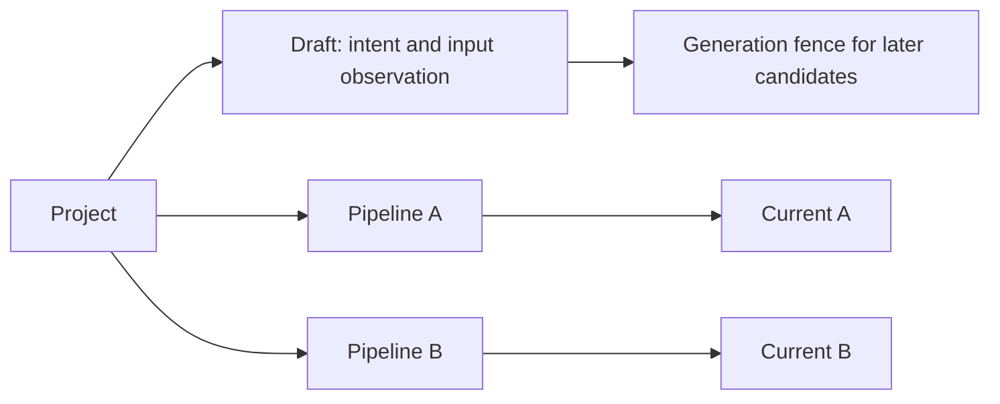

# P2B-2.1 — Creation storage foundation

2026-09-12. Author mode. The owner approved the P2B-2 design and explicitly approved
starting with draft/Pipeline storage. This slice implements service-owned draft
metadata and per-Pipeline revision ownership, with strict legacy catalog migration.

## Boundary before implementation

Project owns multiple registered Pipelines and separate creation drafts. Drafts hold
a bounded brief and optional selected-file observation; generation changes fence
later candidates. No candidate check, new-Pipeline adoption or UI entry is exposed
until the following parts supply actual Gobble qualification. Draft view identity is
specified as a separate contract, not added to the live Pane registry prematurely.
Workspace17 and shared tools11 stay unchanged. The service origin contract moves the bundle to21; historical bundle20 remains frozen.

## Effect and implementation contract

`internal/appservice` remains the owner under module `github.com/HahyeonJeon/gobble`.
No new Go package/dependency or process. Catalog lock serializes writes; HTTP routing
only decodes bounded input and delegates to storage. Imported/managed origin is an
explicit union; managed records require retained Current, never fake Project files.
Current pointers migrate from Project to Pipeline keys; original v1/v2/v3 bytes are
archived before the first successful write. Imported source-sharing restrictions
remain conservative; managed copies have independent retained source.

CRUD: create draft lifecycle/types/routes/tests and stage evidence; read prior
P2B-1 artifacts and current consumers; update catalog/migration/revision callers,
Pipeline contract and native service parser; no deletions. This is required to
support later source-free creation alongside existing analyses. The approved design
selects separate drafts over early empty registration and Pipeline-owned Current
over Project-owned Current. Private names/file splits follow existing conventions.

Go language directive1.26; selected go1.27.1 darwin/arm64. Service default build is
`npm --prefix app run build:service` (`go build ./cmd/gobble-service` with App output).
Verify focused service tests then race/vet, App type/schema/unit/build and affected
Electron foundation/flow scenarios. Root engine native macOS support remains outside
this service-only change. Test fixtures are disposable directories; normal Go/npm
caches and generated build/schema outputs are part of authorized development. No
credentials, downloads, publication, external mutation or real Project writes.

Candidate source/check records and live draft Pane integration belong to parts2/3;
no placeholder ready/adoptable state is introduced here. Next checkpoint follows the
owner's requested result-review rhythm.

## Result documents

- [Implemented concepts, APIs and file responsibilities](implementation.md)
- [Verification and limitations](verification.md)
- [Accepted creation sketch and full sequence](../../proposals/p2b2-pipeline-creation/README.md)

Current scope is native storage only. The next owner review determines continuation
into the Gobble-owned scaffold and whole-creation qualification part.

## Completion

Storage foundation implemented and verified: 55 top-level Go service tests with
race detection, all 345 App tests, type/schema/format/vet/build checks, and ten distinct
Electron regression scenarios including actual Gobble flow and B adoption/restart.
See verification for the initial B reference-test failure and corrected window-focus
precondition. No production focus guard changed. This is the result-review checkpoint;
new-Pipeline creation as a complete user-facing feature remains unfinished.
