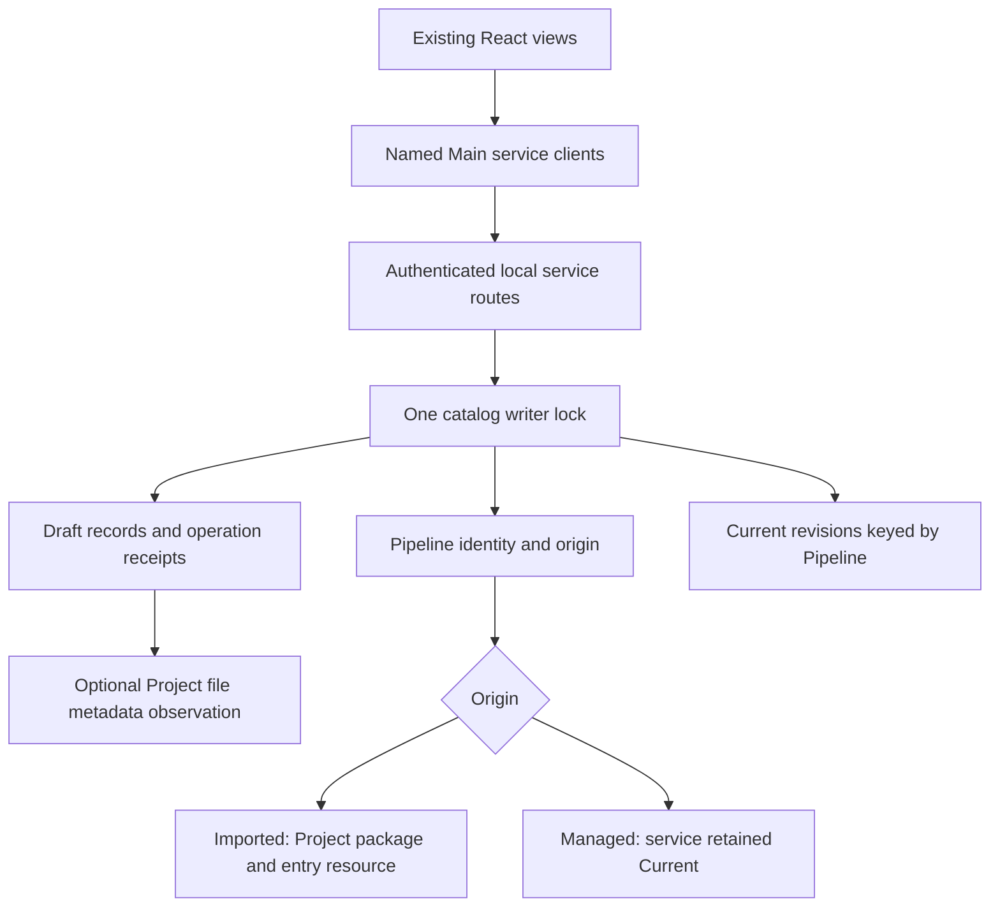

# P2B-2.1 result and code boundaries

Implemented 2026-09-12 within the accepted storage-foundation scope. This result
supplies durable creation intent and compatibility; it does not yet supply creation
source checking, an App creation entry, Agent creation tools or first adoption.

## Data ownership

`draftId` uses `drf_`, distinct from `pip_` and `req_`. Draft generation starts at1.
Each accepted brief/input update or discard increments it. Expected generation is
checked under the same lock that commits the record. A stale writer cannot change
or resurrect a discarded draft. There are no checked/ready/adopted draft states yet;
adding them without a real qualifier would misrepresent the available capability.

The service keeps a bounded brief, optional single-end file observation and a retained
discard tombstone. Metadata observation opens a regular contained file, compares its
open descriptor with the named file, and stores resource ID, relative path, size,
modified time and opaque file identity. It reads no FASTQ contents and proves no
scientific validity or content digest. Future candidate publication/adoption must
reobserve and compare it; that integration belongs to part2/4.

Every mutation has a request identity and catalog receipt. Repeating a matching
request returns the latest saved draft, including a later tombstone; it never
replays an earlier edit. This is current-state retrieval, not a claim that the
returned generation was produced by that historical request. A differing intent
under the same request ID is a conflict. Input clearing requires explicit empty
resource/layout fields; omitted or null fields cannot clear selection.

## Files and APIs

| File / owner | Responsibility |
| --- | --- |
| `internal/appservice/pipeline_creation.go` | Draft records, generation checks, request receipts, copy boundaries and catalog publication |
| `pipeline_creation_input.go` | Contained metadata observation and validation; no reads parser, analysis runner or source builder |
| `pipeline_creation_routes.go` | Scoped HTTP endpoints and strict bounded request decoding |
| `pipeline_origin.go` | Closed imported/managed origin shapes, including rejection of mixed empty fields |
| `catalog_migration.go`, `catalog.go` | Frozen historical decoding, owner-preserving revision-key migration, original-byte archive, atomic save and independent copies |
| Existing Pipeline inspection/proposal/adoption files | Read/write Pipeline-keyed Current and keep shared-import restrictions at one predicate |
| `app/contracts/src/pipeline-creation.ts`, `pipeline.ts` | Draft identity/storage requests/results, origin union and separately prepared draft View subject |
| `app/desktop/src/main/service/pipeline-drafts.ts` | Named native API with request parsing, result association and duplicate-list checks |
| Existing `ProjectService` | Composes the draft client and understands Pipeline origin without manufacturing Project package IDs |

HTTP paths are `/v1/projects/{project}/pipeline-drafts`, `/{draft}`,
`/{draft}/update` and `/{draft}/discard`. The first two provide list/create and read;
the final two are explicit POST mutations. There is no draft source, check, adopt
or Run endpoint in this part. The Main client is available as `ProjectService.drafts`;
no renderer IPC or Agent capability has been added prematurely.

Current revisions are now keyed by Pipeline ID. Managed-origin definitions require
an existing Current and contain no Project package/source references. Origin is
provenance: an imported Pipeline that adopts a separate managed copy still records
where it was imported. Its retained Current supplies authoring bytes thereafter.
A retained managed copy can be refined independently of siblings. For a Pipeline
still reading imported source, multiple imported registrations remain unsupported
for refinement; isolated managed origins do not count as shared imported source.
This changes no Gobble semantic qualification rule.

## Compatibility and recovery

Catalog1/2/3 →4 migration is supplied. Pre-origin Pipeline and pre-draft receipt
shapes are frozen and reject new fields. V3 revision ownership is checked against
its original Project before moving the key; corrupted owners are not repaired by
guesswork. Reading performs in-memory migration only. The first successful write
archives the exact original bytes as `catalog.vN.backup.json`. Conflicting archives
and missing primaries with retained v3 backups require explicit recovery, not reset.
A failed save does not publish a new in-memory draft or claim a reliable retry result.

Contract bundle21 captures the origin change and new native storage contracts.
Bundle20 remains byte-for-byte historical. Workspace17 and shared toolset11 are
unchanged because live draft Panes and Agent tools are not present yet. Existing
Pipeline View identities and backup/workspace restoration remain intact.

## Author design review

The draft lifecycle, input observation, transport and presentation identities are
separate; there is no generic workflow framework or new dependency. Catalog writes
remain serialized, and lifecycle code does not reach React or runtime execution.
Draft input results and catalog copies do not alias the stored pointer. Revision
copies also clone artifact JSON bytes. Consumer parsing now deduplicates imported
package IDs only for imported origins, so two managed Pipelines do not share a
fabricated empty package identity.

Reviewed failure boundaries include cross-Project reads/updates, generation races,
late updates, request reuse, explicit selection clear, outside symlink/missing input,
archive conflict and failed publication. Whole-creation graph qualification, durable
candidate jobs, Agent references and first-adoption receipts remain named later work.
See [verification](verification.md) for actual evidence and limits.
