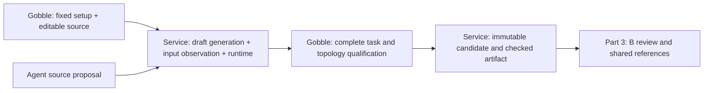

# P2B-2.2 — Complete creation checking

Author mode; the owner approved continuation after the storage result and remaining-plan review. Implements the accepted single-end creation scaffold, profile runtime binding, immutable candidates and whole-graph Gobble qualification. UI/Agent tool exposure and first adoption remain parts 3 and 4. No Run or research-file writes.

## Author contract and responsibilities

Go module github.com/HahyeonJeon/gobble, language 1.26; selected Go 1.27.1 darwin/arm64. Native service is supported; root engine checks run in the existing Linux/amd64 qualification runtime. Existing local build/test/cache and disposable Docker qualification effects are necessary within approved implementation. No credential use, network installation, publication, commits or unrelated mutation.

CRUD: read existing refinement/catalog/runtime APIs; create focused creation scaffold, engine qualifier, service runtime/source/job files and tests; update CLI dispatch/help and shared job-budget consumers; no deletions. Gobble owns command/scaffold/semantic facts, service owns profile binding and immutable storage, Main remains the sole workspace writer. No renderer semantics or fake Pipeline identity. Existing versions and refinement behavior remain compatible unless new native contracts require explicit additions in part 3.

The accepted design resolves managed scaffold versus copying arbitrary Project setup, full canonical qualification versus refinement residual checks, metadata-only input observation, pinned local runtime versus installation, and retained evidence versus overwriting. Routine wire/file names implement these decisions. Creation uses one logical input descriptor; the artifact binds it to the observed Project resource without mounting its data. Execution admission/content identity remains P3.

Verification: focused Go tests/race/vet, Linux whole-plan adversarial and actual isolated-runtime tests, native service build and default App build. Existing UI is unchanged; no prototype is presented as implementation evidence.

## Result review

- [Implemented concepts, native APIs and ownership](implementation.md)
- [Verification and remaining boundaries](verification.md)
- [Accepted four-part creation sequence](../../proposals/p2b2-pipeline-creation/plan.md)

This part does not add an accessible creation screen, Agent authoring tools, first
adoption or execution. Next: Part 3 connects the accepted Project/data/Chat/B review
flow and exact shared references, after the owner reviews this result.

Completed and verified: 61 native service tests with race detection, four portable
review tests, 24 selected Linux engine/library/CLI tests, all 345 App tests, and
actual isolated Gobble creation checks on the final pinned image. The live test
accepted compressed and uncompressed input descriptors and rejected an unsupported
command. Type/schema/format/vet/default-build checks passed. See verification for
exact commands, skips, diagnostics and unsupported claims.
