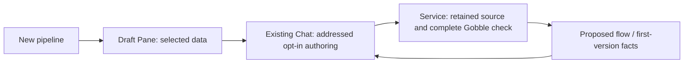

# P2B-2.3 — Creation UI and shared Agent discussion

Implementation mode. The owner approved this part after the complete creation-check
result. Accepted UI: Project action → central data chooser → existing right Chat →
Gobble-checked Proposed flow above a No current version / Proposed details pair.
No extra composer. First adoption and execution remain later stages.



## Implementation contract

React owns presentation and transient selection; Main owns workspace persistence,
per-message authoring and exact shared references; Go service owns drafts, input
observation, runtime selection and immutable candidates; Gobble owns semantics.
Source stays outside React. Creation references explicitly have no current base,
never synthetic Pipeline IDs. A removed discussion context does not unbind data.

CRUD/5W1H: freeze workspace17; add creation native/IPC/reference contracts and
workspace18 migration; add focused Main service/creation host and preload routes;
add renderer draft entry, chooser, status, B details and Chat context; update only
resource/view consumers and existing collaboration admission/routing. Native engine
connection discovers explicitly labeled installed local engines; no download or
arbitrary renderer/Agent runtime arguments. Shared tools renew to12, schema bundle22,
catalog4 unchanged. Existing B refinement, saved text, pinned tabs and source data
remain preserved. No dependencies, global OS integration, packaging or deployment.

Construction uses the accepted process contract and installed versions. React-local
checks do not claim Electron behavior; targeted Electron testing supplies separate
screen/keyboard and Agent-fixture evidence. Full creation adoption and a real signed-in
Agent acceptance run belong Part4. No performance optimization claim or speculative
memoization is part of this change.

## Implemented ownership

| Owner | Files / responsibility |
|---|---|
| Contracts | `creation-review.ts`: closed candidate/context/target envelopes and exact fact resolution; `creation-bridge.ts`: renderer capability names; workspace18 + frozen17 migration |
| Native service | `creation_engines.go`: discover labeled local engines, verify daemon and image, bind scaffold through existing Part2 service; original draft/check storage remains its owner |
| Main | `PipelineCreationService`: association-checked native transport; `PipelineCreationHost`: per-message source opt-in, source-read receipt, retained fact reads and independent Agent marks |
| Preload | Frozen creation IPC API for lifecycle, state, selection, cancellation and engine choice. Source authoring, raw runtime bindings, adoption and execution are absent |
| React navigation | `CreationDrafts`: Project-local draft list and creation intent |
| React central View | `CreationView`: draft/candidate navigation; `CreationInput`: Project file selection; `CreationEngine`: installed capability choice; shared `PipelineFlow`/`PipelineDetails`: scientific UI |
| React Chat | One existing composer; `CreationReferenceLabel` resolves the attached immutable version instead of reading the current selection |

```mermaid
sequenceDiagram
  participant User
  participant View as Creation View / Chat
  participant Main
  participant Service as Native service
  participant Agent
  participant Gobble
  User->>View: Choose single-end data
  View->>Service: Update draft with resource ID and expected generation (through IPC)
  User->>View: Send goal with proposal opt-in
  View->>Main: Exact draft generation + addressed message
  Main->>Agent: Retained draft facts + bounded authoring permission
  Agent->>Main: Read source, then propose
  Main->>Service: Scoped source candidate
  Service->>Gobble: Isolated complete creation check
  Gobble-->>Service: Checked flow + definition
  Service-->>View: Immutable candidate
  User->>View: Select Quality threshold; Add to message
  View->>Main: Candidate + artifact + exact setting
  Main->>Agent: Same checked setting facts
  Agent->>Main: Read candidate, then point at setting
  Main-->>View: Agent mark (User selection unchanged)
```

Creation references describe retained scientific semantics, not proof that the Agent
has observed current pixels. Generic viewport reading explicitly refuses this subject;
`gobble_creation_review` is the truthful dedicated mechanism. Historical candidates stay
readable after input changes or discard. Sending a stale editable draft is refused.
Removing a Chat attachment does not edit a draft's data binding. A draft is never a
registered Pipeline and checking never starts a Run.

The renderer lists current drafts and polls the open creation View sequentially with
cleanup on unmount. These bounded reads reuse native ownership; they do not start checks,
create messages or mutate source. There is no duplicate metadata cache or generic plugin
framework. The initial supported recipe is single-end Trim Galore → FastQC only.

## Remaining gate

**Part4: first adoption**, after the owner's review of this result. Revalidate selected
input observation, generation, runtime and checked artifact, then atomically register the
first managed Pipeline/Current with retry and restart recovery. Add a real signed-in Agent
acceptance scenario after its final UI is approved. Run creation/control and broader
recipes remain separate work. No adoption endpoint or fake Run button was added here.

## Evidence

- [Verification, failures and limits](verification.md)
- [Actual creation review](screenshots/creation-reviewed.png)
- [Compact Workspace](screenshots/creation-compact.png)
- [Remaining product sequence](../../remaining-work.md)
