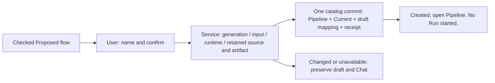
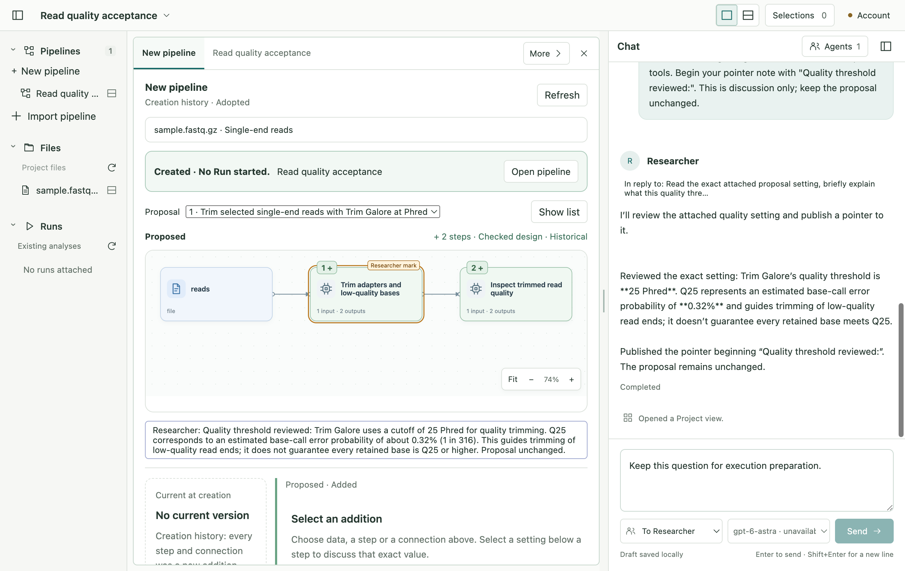
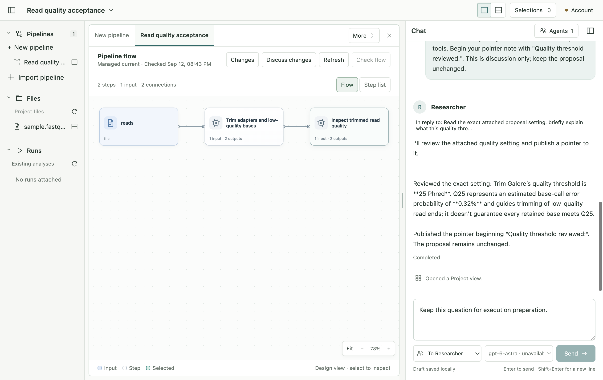

# P2B-2.4 — First Pipeline adoption

Implementation authorized after Part3 review. Accepted creation design/plan governs
this slice; existing Electron process boundaries remain. Workspace18 and tools12 stay;
bundle23 and catalog5 add the first-adoption state. No Run, source editor or packaging.

CRUD/5W1H: Contracts add User-only adoption request/outcome and adopted draft. Native
catalog5 freezes4, retains immutable birth mapping on draft and distinguishes creation
source from later proposal revisions. Service revalidates under Service→catalog writer
locks; no new cross-file transaction. Main association checks and trusted IPC expose
adopt/outcome only to renderer. Preload has no Agent adoption tool. React confirmation
owns only name and pending UI; deterministic per-candidate operation ID reconciles
retries and restart. Existing Current inspection/refinement resolves retained creation
source through a focused adapter, without synthetic comparison records. Native data
observation remains the owner of original input identity for later execution preparation.

Affected set: native creation adoption/source/catalog migration, managed revision source
resolution; creation contracts/service/IPC/preload; focused adoption React component,
creation view and navigation refresh; tests/fixtures and this stage's documentation.
No new dependencies, profile publication, current research-project writes or OS setup.

Dynamic handoff — Development → testing: typed/build checks are construction only.
Testing must cover duplicate/concurrent requests, wrong scope, changed data/runtime,
retained-source corruption, discard/stale generation, pre/post durable save interruption,
restart/historical references, unrelated Pipeline preservation and zero Runs. Actual
Electron adds confirmation, retry/outcome, opened Current, existing Chat/draft preservation.
The accepted plan also calls for an isolated real signed-in Agent acceptance scenario;
record its actual environment and result separately from the deterministic fixture.

Evidence request `p2b2-4-adoption-20260912`: Development → Testing, construction
claim above; predecessor Part3 report. Subject: current stage source delta against
`before.json`, final digest captured with results. Target: macOS darwin/arm64,
Electron44, development bundle, real foreground display and installed Docker linux/amd64
creation engine. Native tests observe transaction and source ownership; TS tests observe
closed contracts/association; Electron observes confirmation/navigation/Chat/restart.
Pass means one registered Pipeline and matching first Current, no Run, preserved birth
and sent context, explicit uncertain outcome, no adoption authority exposed to Agent.
Packaged/installed/update and non-macOS app targets: unsupported claim for this stage.

- [Concepts, ownership diagram and API](implementation.md)
- [Verification and retained failures](verification.md)
- [Remaining product sequence](../../remaining-work.md)

## Actual app result

Final result: 353 unit tests, native race/vet and real creation-to-refinement
qualification passed; 12 distinct Electron scenarios passed across the recorded
regression and corrected reruns. This is a macOS development-build result.
Return to owner review before P3 execution preparation.
