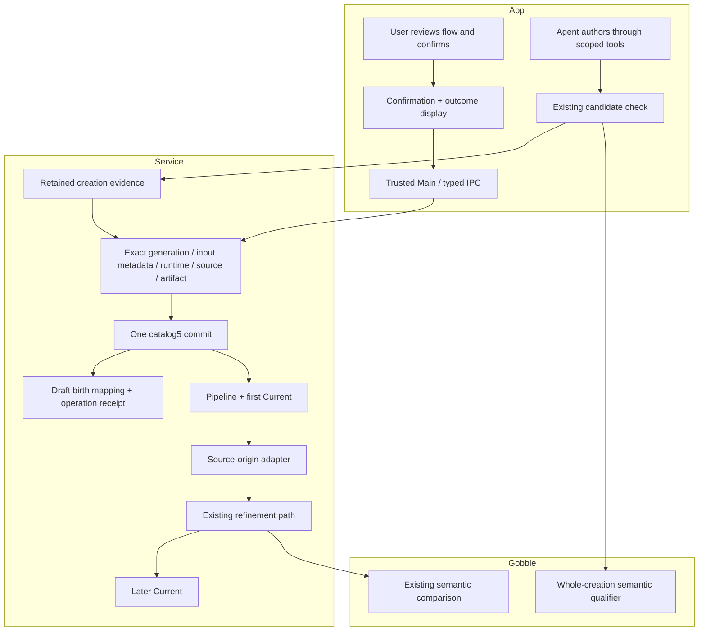

# First adoption — ownership and behavior

A checked creation proposal becomes a registered Pipeline only after an explicit
User confirmation. The App asks for a display name and repeats the selected data
and checked settings. It then shows `Created · No Run started.` and an explicit
`Open pipeline` action. Registration preserves the existing Chat, unsent text,
references and panes. All product strings are English.

## Definitions

| Concept               | Meaning and owner                                                                                                                                                                  |
| --------------------- | ---------------------------------------------------------------------------------------------------------------------------------------------------------------------------------- |
| Creation draft        | Service-owned analysis goal and observed input, with a generation. It is not a Pipeline. `draft → adopted` closes mutation; discard remains a different terminal outcome.          |
| Creation candidate    | Immutable Agent-authored source and Gobble-checked facts for one draft generation. A successful check does not authorize registration or execution.                                |
| First adoption        | User intent naming an exact candidate, checked artifact, generation and Pipeline name. Native validation and one catalog publication register it.                                  |
| Birth mapping         | Retained on the adopted draft: winning request, Pipeline, candidate, artifact, generation and name. It records creation forever, even after subsequent refinement changes Current. |
| Current               | The registered Pipeline's presently adopted checked artifact and retained source origin. Source comes from either a creation candidate or a later proposal, never both.            |
| Creation history view | The original no-before comparison. `No current version` means before this analysis was created. It does not pretend to show a later Current.                                       |
| Run                   | Separately authorized engine execution. First adoption never creates a Run, validates FASTQ content or executes a processing tool.                                                 |

## File boundaries and API

`creation_adoption.go` owns intent validation, repeat-result reconciliation,
publication and birth/Current catalog invariants. `creation_adoption_source.go`
verifies retained evidence and adapts creation source to the existing refinement
reader. `creation_adoption_routes.go` only handles HTTP decoding and deadlines.
Catalog copy and migration code retain their existing storage responsibility.
The per-store writer boundary permits tests to simulate both failure before
publication and failure after rename; production uses the existing atomic writer.

Main's `PipelineCreationService` checks Project/draft/request/candidate/artifact
association; its trusted IPC and frozen preload bridge expose User actions.
`PipelineCreationHost` remains Agent authoring/review/pointing only. No adoption tool
is added, and shared tools remain version12. React's `CreationAdoption` owns the
confirmation and uncertain-outcome display. Native storage alone owns truth.
The existing draft list signals a changed list to its parent so registered
Pipelines refresh; no new global event bus or second workspace writer.

- POST `/v1/projects/{project}/pipeline-drafts/{draft}/adopt`: exact request,
  candidate, artifact, expected generation and name.
- GET `/v1/projects/{project}/pipeline-drafts/{draft}/adoptions/{request}`:
  `not-recorded` or the stored `adopted` result. Storage uncertainty is an error.
- An identical retry resolves the existing result, including after restart or
  later refinement. A concurrent identical intent with another request ID records
  an alias receipt, not another Pipeline. Conflicting content is refused.
- Before publication the service re-observes file metadata and checks exact source,
  engine identity, candidate and generation. Cancellation is checked before commit.
  After a successful publication, outcome lookup does not rerun these checks.
- A failed durable write poisons further writes and outcome inference until restart.
  Recovery reads the atomic disk catalog; it cannot reconstruct a partial Pipeline.

## Compatibility and future work

Bundle23 adds the adopted draft and User commands. Catalog5 freezes the exact v4
draft/revision shapes, reads earlier supported versions without rewriting them,
and archives the original bytes on first mutation. Workspace18, persisted sent
creation references and shared tools12 are unchanged.

First Current refers to the retained four-file creation bundle; Agent refinement
can edit only its Pipeline source file. Setup, input descriptor and dependencies
stay sealed. The original input metadata remains a birth observation, not execution
readiness. P3 must define an engine-owned prepared execution payload and revalidate
source, original data and runtime. P4 must separately reconcile launch and Stop.
Neither boundary is authorized by clicking first adoption.
