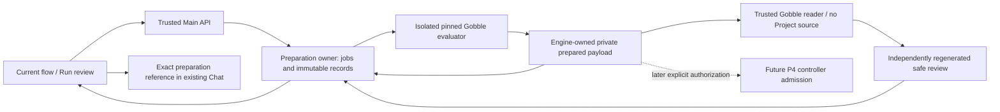
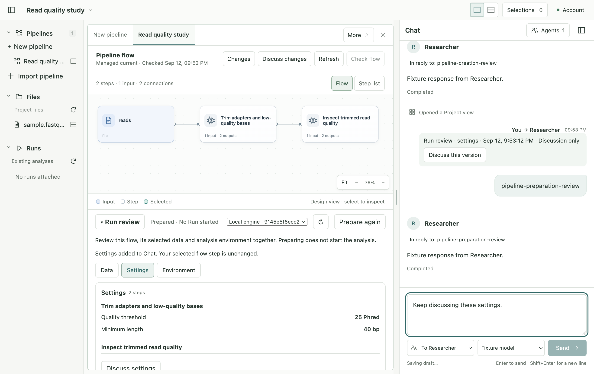

# P3 — Run preparation

Status: implemented and verified on 2026-09-12 under the owner’s continuous-completion authorization. P3 is complete within the qualified scope below; P4 execution is a separate next checkpoint.

The User prepares the exact Current flow, reviews data, settings and environment below that same flow, and discusses it in the existing Chat. Preparation creates no Run and modifies no research file. Scope is the qualified single-end Trim Galore → FastQC design, including refinements. Other pipelines receive an explicit unsupported result.

## Definitions and ownership

- Current is an adopted source revision, not a Run. Preparing never changes it.
- Preparation is one durable, bounded operation pinned to Current, retained source, a metadata observation of the original selected input, the exact engine image/daemon binding and fixed serial scheduling (cap 1). A different operation never overwrites a reviewed artifact.
- Prepared payload is Gobble's versioned complete engine Document and binding. It includes fields absent from public Plan JSON. It is private, hash-bound and decoded/validated by Gobble; the native service only retains opaque bytes and checks integrity. It is not authored workflow syntax.
- Run review is a safe projection of that same evaluation. Unknown behavior is refused. Settings, input/output descriptions and resource requirements come from Gobble, never guessed from source text.
- Data is observed, not snapshotted: metadata does not prove byte equality or FASTQ validity. Future Start must stage and validate actual data and workspace occupancy. Preparation does not claim those launch-time checks have passed.
- Agent discussion binds the exact preparation identity. It grants neither adoption nor execution. User and Agent continue to share the Current flow.

## Construction and recovery contract

Author mode; existing dirty baseline recorded in before.json. No dependencies, module identity, deployment, credential changes or publication. Native service remains engine-import-free. Go module 1.26, local Go1.27.1/macOS arm64 service and Linux/amd64 engine qualification. Development builds and temporary test profiles/images/caches are within the authorized implementation/testing scope.

Create engine codec and CLI preparation verb; create service-owned preparation directory/job owner/routes; add closed TS contract and typed Main/preload API; add compact React run review. Co-touch parser/help, job budget/shutdown, schema export, exact Chat context and persistence compatibility. Existing catalog ownership and Run controller remain unchanged.

Compare alternatives: ordinary Plan JSON is incomplete and cannot be admitted; reevaluating Project Go at Start breaks exact review. The previously accepted isolated preparation + exact admission design therefore determines this choice. Metadata-only data observation is disclosed rather than pretending to hash or snapshot large research data. Engine validation and conservative scope qualification reject unrepresented behavior.

Preparation records are append-only per request identity. Active work is cancelled on service close, replay never starts another evaluation, interrupted jobs are reported as interrupted after restart. Current/source/input/runtime are rechecked before publishing, and saved reviews are read as historical if their preconditions changed. At most two analysis evaluations globally; bounded retained preparation history. Payload is never returned in renderer or Agent responses.

## Verification request

Development → Testing: `p3-preparation-20260912`. Validate codec round trip including Path/environment/control fields, digest and binding rejection, ordinary Plan rejection, no execution effects; native exact source/data/current association, replay/cancel/restart/privacy; TS closed schemas and bridge association; actual isolated Gobble and Electron review/discussion scenarios; typecheck, native race/vet, Vitest, schema/build and visual screenshot review. Retain initial failures and distinguish corrected failures from final results. No claim of P4 launch, packaged app or cross-platform release readiness.

## Explicit preparation environment

Current's source-inspection runtime remains part of its historical identity. The User separately selects an installed, qualified preparation engine. That engine evaluates the retained source in isolation and must reproduce the exact Current Flow with complete scope qualification. The new prepared binding records its actual daemon/image/mapping identity; neither Current nor its original source manifest is rewritten. This supports existing adopted Pipelines without silently changing their inspection history. A runtime selection change requires a new preparation request and review.

The renderer receives only an engine display identity. It cannot supply a Docker endpoint, mount, arbitrary command, cap or workspace path. Discovery returns at most eight local label-qualified choices; the native host resolves and verifies the selected exact image at preparation time. The label is a local development qualification marker, not a published release guarantee.

Persistence: contract bundle 24, Workspace 19 with frozen Workspace 18 and original-byte archival; catalog remains 5. Shared views toolset 13 extends exact review/point coordinates with preparation identity and section. Existing Agent threads renew their tool definitions through the established renewal flow. No new Agent execution/adoption tool is exposed.

## Independent review of private bytes

Arbitrary Project Go is confined to the evaluator, so its returned descriptions are not sufficient proof of executable semantics. After that container exits, a second tightly bounded container runs the trusted installed `prepared-review` command. It mounts only the service-created private payload and exact intent, with no Project source, compiler invocation or controller authority. Gobble decodes and qualifies the complete sealed Document, then regenerates its safe Flow/settings/resource projection. The service rejects disagreement with either the evaluator's description or the accepted Current Flow. Only this independently regenerated review is published. The temporary validation copy is removed; the durable private payload remains mode 0600 under the private profile.

This is a read-only codec/qualification boundary, not P4 launch admission. Start must still validate the reviewed digest, exact runtime, actual staged data and workspace preconditions without invoking Project Go.

## Implementation map

| Owner | Code | Boundary |
| --- | --- | --- |
| Private executable representation | `internal/engine/prepared.go`, root `preparation.go` | Complete versioned Document codec, exact binding, scope qualification and safe projection; no execution effects. |
| Trusted reader entry | `cmd/gobble/prepared_review.go` | Read only sealed payload/intent, with no Project compilation or evaluation. |
| Preparation lifecycle | `internal/appservice/preparation.go` | Request replay, jobs/cancellation, durable records, private payload publication, history/freshness. |
| Retained source and isolated validation | `internal/appservice/preparation_source.go`, `preparation_reader.go` | Resolve birth input and Current source; run bounded evaluator and independent reader; compare exact projections. |
| Native routes and IPC | `preparation_routes.go`, `contracts/src/run-preparation.ts`, `main/service/run-preparation.ts` | Closed DTOs and exact Project/Pipeline/request/artifact/engine association; no renderer-supplied command or mount. |
| Shared discussion | `main/pipeline-review/host.ts` | Saved preparation resolution, explicit author permission, Agent read-before-point, originating-submission marks. |
| Presentation | `RunPreparation.tsx`, `useRunPreparation.ts`, `PreparationReferenceLabel.tsx` | Section navigation and local request UI; native service remains the durable preparation owner. |

## User scenario and visual checklist

- Open the adopted Current Flow; prepare with a selected installed engine while retaining the Chat draft.
- Read Data, Settings and Environment through compact section buttons. Flow remains visible above the scrollable review.
- Discuss Settings through the existing composer. The sent reference identifies the saved review time; sending clears only the matching draft context.
- Let an Agent read and mark that exact section. Its mark must not change the User's Flow selection or acquire source/launch permission.
- Restart: retained review, authored mark, sent reference and unsent Chat survive.
- Change the temporary selected file's metadata: prior review becomes historical. Prepare again without rewriting history; reselect an earlier sent reference and prove it still names the original saved preparation.
- Confirm there is no new Run and no analysis execution throughout.

See [verification](verification.md) for actual checks, initial failures and qualification limits. P4 must separately design exact launch admission, input staging, output workspace ownership, reconciliation and conditional Stop before adding execution controls.

## Completion

P3 acceptance passed through actual Electron/Main/native service/Gobble. App checks passed 359 tests; the real P3 scenario and nine existing workspace/B regression scenarios passed. Native race/vet and focused Linux engine/root/CLI checks passed. Actual birth and refined Current preparations both passed with the new independent reader. No analysis Run was created.

Full [verification and limits](verification.md), [source delta](source-delta.json), and [tested build identity](tested-build.json) are retained. The next stage is P4 exact launch admission, data staging, durable Start reconciliation and conditional Stop; it has not been implemented or implicitly authorized by preparation.
