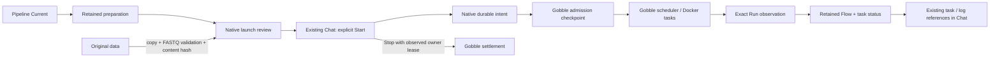

# Prepared execution ownership

P4 implements the accepted local single-end Trim Galore → FastQC execution scope. All editing remains Agent-mediated; the User confirms effects through UI. Run execution is independent of App and native-service lifetime.

## Concepts

- **Project** owns registered research resources, Pipelines, Runs and shared discussion. Its storage and catalog boundaries are unchanged.
- **Pipeline Current** is the adopted design, not a running process. New Current versions never substitute for an admitted Run's design.
- **Preparation** retains a Gobble-validated private plan and safe Flow/data/settings/environment facts. P3 metadata observation alone grants no execution authority.
- **Launch review** belongs to exactly one Project/Pipeline/preparation. It retains a separately copied input, content digest, installed tool identities and a new result allocation. Checking copies data but does not submit tasks. Only complete four-line FASTQ / gzip is supported; this is structural validation, not scientific quality assurance.
- **Launch operation** is a service-owned durable command receipt. Accepted, dispatching, admitted and reconciling describe delivery/observation, independently of Run outcome. It also retains a separate expected-owner Stop request. Unknown execution must be reconciled before another launch of the same Pipeline.
- **Admission** is Gobble's authoritative correlation between exact launch intent, private prepared bytes, result allocation and owner lease. It is written before scheduling any task. An identical replay observes the same admission; another request cannot reuse the workspace.
- **Run** is Gobble execution truth. The catalog only associates its identity, engine and directory with the Project. A Run Flow uses the retained preparation and joins statuses by task ID, never by labels or the newer Pipeline Current.
- **Pane / Surface** still describe layout and an open shared view. P4 adds no editor or new Pane kind. A Run step resolves to the existing observed instance/attempt selection; User and Agent pointers remain independent and reuse current evidence delivery.

## Code ownership

| Owner | Modules | Responsibility |
| --- | --- | --- |
| Shared Go DTO | `internal/preparation/launch.go` | Mechanism-free intent/admission representation |
| Gobble | `internal/engine/admission.go`, checkpoint, Stop, Docker executor | Sealed-plan validation, exact admission, scheduling, installed-image pinning, lease-addressed settlement |
| CLI | `cmd/gobble/prepared_run.go`, root `launch.go` | Fixed trusted command entry; no Project source evaluation |
| Native data check | `launch_data.go`, `launch_staging.go`, `launch_space_*` | Bounded cancellable copy/format/hash validation, disk and target checks |
| Native journal | `launch_review.go`, `launch_operations.go` | Checksummed review, intent ordering, replay/reconciliation, Run registration |
| Native runtime | `launch_runtime.go` | Exact local Docker controller specification, status and conditional Stop |
| Main / preload | `run-launch.ts`, named IPC handlers | Closed DTO validation, Project/review/request association, trusted window enforcement |
| React | `renderer/run-launch/` | One shared Project observation cache, review controls, existing Chat action cards, retained Run Flow |

Start revalidates Current and source metadata before accepting the intent. After acceptance, original edits cannot replace the copied data. The worker and Gobble independently verify the exact staged bytes/target. Required tool images must already exist; the prepared execution path never pulls an image. The independent controller is limited to the exact result workspace, read-only staged input and private launch bundle, plus the local Docker socket needed to run tasks.

A service shutdown cancels data checking and local query waits, not admitted execution. Reconciliation may start only the exact verified controller still in Docker's created state. It never recreates a missing/exited controller after ambiguous dispatch. A committed admission remains readable after controller removal. Stopping sends the observed lease and distinguishes requested, settled, owner-changed and recovery-required. Recovery/Resume is a separate P5 decision.

## Compatibility and limits

Bundle **25** adds closed launch DTOs and named bridge methods; Workspace **19**, catalog **5** and Agent toolset **13** remain unchanged. No Agent Start/Stop tools are added. Launch records stay in the private service profile, not the Workspace document. P3 prepared payload v1 and ordinary monitor schema2 remain unchanged. Admission checkpoints use pointer **format2**, paired with admission v1; older readers reject the pointer. The new reader supports existing format1 and refuses an inconsistent pointer/admission pair.

Bounds: two concurrent data checks across the service, one per Project; 32 retained launch reviews per Project; 64 GiB compressed input, 256 GiB decoded content and 16 MiB per FASTQ line. Result directories are exclusively allocated. Cancel removes only incomplete task-owned staging; ready/admitted copies and execution evidence remain retained. Automatic retention, remote hosts, arbitrary pipelines, concurrent resource management, Resume and packaging are not part of this milestone.
