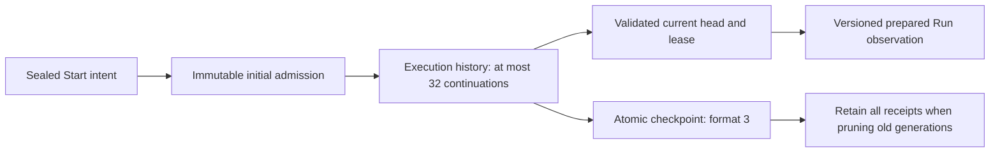

# P5B-1 — Immutable Start and continuation history

Owner approved the [P5B design](../../proposals/p5b-continuation/README.md) on 2026-09-13. This first implementation increment establishes the execution-history boundary. It does not implement reuse review, continuation scheduling, capability negotiation or an App Resume action. Those remain the next dependent increments, reviewed in order.

## Implemented boundary

A prepared Run's original Start admission remains the origin. A bounded ordered continuation chain names each accepted review, request, preceding history head, lease and admission snapshot. The current epoch is derived only after the entire chain validates, so it cannot be confused with the original Start lease.

An accepted review's digest belongs in the receipt; review/task/output evidence will be constructed and validated by the next engine slice. The receipt does not duplicate the full review payload. Decoding or saving a receipt is not execution authorization. The future admission operation must still enforce the exact content checks and task plan under ownership lock before scheduling.

## Code boundaries

| Paths                                                               | Ownership and change                                                                                                                                    |
| ------------------------------------------------------------------- | ------------------------------------------------------------------------------------------------------------------------------------------------------- |
| `internal/preparation/continuation.go`                              | Shared intent, receipt, history and epoch value types; 32-admission limit; no scheduler or transport                                                    |
| `internal/preparation/launch.go`                                    | Documents opt-in version 2 initial history; existing version 1 remains compatible                                                                       |
| `internal/engine/continuation_history.go`                           | Validate complete chain, derive current epoch, reject immutable-history rewrites and non-settled appends                                                |
| `internal/engine/state.go`, `run.go`                                | Persist history alongside origin; version 2 initial admission creates an empty chain before task submission                                             |
| `internal/engine/admission.go`                                      | Accept explicitly selected initial schema 2, derive prepared-v2 identity, keep Start replay original, expose current epoch only in observation schema 2 |
| `internal/engine/checkpoint.go`, `release.go`                       | Match format 1/2/3 to contents, refuse conversion/downgrade/flat-history fallback, validate transition before publishing                                |
| `internal/engine/continuation_history_test.go`, `admission_test.go` | Storage, malformed-chain, retention, compatibility and unchanged Start/ordinary Resume guards                                                           |

Mode: Go author implementation and test authoring. Actor: implementation agent; consumer/owner: project maintainer. Module remains `github.com/HahyeonJeon/gobble`, Go directive 1.26. No package, dependency, UI, public CLI command, Agent tool or configuration has been added. New schema 2 is explicitly opt-in at the existing sealed Start boundary; the App still creates schema 1 and cannot offer Resume. New history-capable engine installation and negotiated App support are not claimed.

## Invariants

- Schema-1 Start/observation retain the old format-2 and no-epoch wire shape.
- Schema-2 initial Start writes format 3 with history version 1 and an explicit empty continuation array; it cannot begin with invented prior continuations.
- Each continuation binds workspace, origin digest, review digest and previous head. Intent content and digest must agree; request IDs, leases and admission snapshots cannot repeat.
- The current occupancy lease matches the validated last receipt, or the origin when history is empty.
- Every committed update preserves origin, Run identity/start time, installed engine identity and the entire existing receipt prefix. One update may append at most one receipt, only from an inactive stopped Run, and its snapshot must match the new admission checkpoint.
- More than 32 continuations refuses new state; receipts are not discarded to make space.
- The original Start replay still returns its original admission and never invokes scheduling; ordinary prepared Resume remains unsupported.
- A format-3 checkpoint cannot be read through a format-1/2 pointer. Existing format 2 cannot be converted in place. History cannot be read as legacy flat state when its pointer is absent.

These are storage/identity guarantees, not proof of output validity or a successful continuation. Tests use synthetic history admissions to isolate persistence; they do not assert that a failed task is resumable. Whole-task restart, exact output verification, new-epoch Stop and crash-safe request execution remain engine admission work.

## Verification and handoff

See [verification](verification.md), [owned source delta](changed-paths.json), and [source hashes](after.json). Existing dirty-tree changes are retained. No commit or publication is made: this is an intermediate increment of the approved P5B feature, whose execution and App path remain unfinished.

Next: implement the read-only continuation review, exact reviewed admission and task-attempt invariants on this foundation. Before that increment, summarize this result for the owner's requested stage review. Capability negotiation, Main/native restoration, shared references, UI and real Linux tool qualification then follow the approved order.
