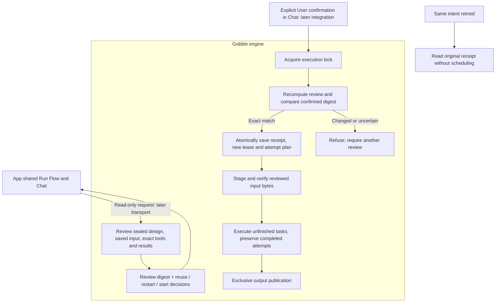

# P5B-2 — Review and continue the same stopped Run

Owner authorized this increment on 2026-09-27. The engine now reviews eligible stopped Runs without changing them and executes an exact confirmed continuation. This completes the engine slice of the [approved P5B sequence](../../proposals/p5b-continuation/plan.md). App transport, capability negotiation, visual references and real-tool qualification remain subsequent stages.

## Concepts and ownership

A **Run** is one execution of a sealed design against its saved data and runtime bindings. Continuing it keeps its identity, original Start, design and data. An **attempt** is one whole-task execution; a stopped task starts from its beginning with a new attempt. A **continuation review** is evidence about which results can be reused and which tasks need work. It grants no permission. An **intent** is a trusted controller's record of explicit User confirmation of that exact review. An **admission receipt** acknowledges the intent and a new execution lease; it does not mean that execution completed successfully.

Gobble owns eligibility, content verification, ownership, admission, execution and result integrity. The App will own presentation, exact references, User confirmation and transport restoration. The Agent can discuss and point at shared review facts; an Agent execution tool is not introduced. The trusted host must verify its actual container using `containerenv.Prepare` before invoking the public prepared boundary.

## Supported behavior

- Only schema-2, inactive, cleanly stopped, sealed single-end Trim Galore → FastQC Runs qualify. The full recorded plan must still match the original prepared payload.
- Completed prefix tasks retain their attempt and files only after exact input fingerprints, output content, image identity and backend settlement checks. Missing or changed output refuses continuation; it never silently becomes a rerun.
- A canceled incomplete task receives attempt + 1 and separate logs. A task that never started uses its existing first unexecuted attempt. Earlier attempts remain in the same Run's task history.
- Review performs no reconciliation, container removal, log copying, repair or execution. It checks that no container remains for each exact recorded submission on its recorded daemon. Unavailable or ambiguous evidence is an error.
- Admission recomputes the review while holding the existing execution lock. A different snapshot, history head, file content, saved design or tool identity refuses the old confirmation. The receipt and new attempt plan commit before any task submission.
- Reviewed input bytes are checked again after staging. Output publication is exclusive: a destination created after review causes failure. Rollback removes only outputs installed by that publication, preserving a destination that caused the collision.
- Replaying an admitted intent returns its receipt without running anything, including after loss of acknowledgement or controller death. Request reuse with different effects is rejected. This operation does not recover an interrupted active owner automatically.
- New Stop addresses the new lease. Delayed Stop for an earlier lease reports `owner-changed`; it does not stop the replacement execution. Original Start replay remains unchanged.

The first slice deliberately rejects failed, unknown, interrupted, published-unfinalized and older-format Runs. The existing 32-continuation bound remains. New designs and changed data use the separate preparation → new analysis route.

## Code boundaries

| Owner | Responsibility |
| --- | --- |
| `internal/preparation/continuation.go` | Review, intent and receipt values; no source editing, scheduler or transport |
| `internal/engine/continuation_review.go` | Read-only eligibility and exact review digest, including sealed-plan and content checks |
| `internal/engine/continuation_admission.go` | Exact receipt lookup, serialized admission and construction of the existing scheduler |
| `internal/engine/exec/submission.go` | Read-only proof of absent backend submission, separate from mutating reconciliation |
| `internal/engine/run.go` | Staged-input verification and exclusive publication for reviewed continuation |
| `internal/engine/exec.go` | Publication rollback tracks successfully installed outputs, preserving a competing destination |
| `launch.go` | Public prepared operations bound to the accepted actual engine/daemon |

Public sequence: `ReviewPreparedContinuation` → retain the review digest and collect User confirmation → `ContinuePreparedPipeline`. Resolve uncertain acknowledgement with `ReadPreparedContinuation` using the same original launch and exact intent. A returned nonzero receipt alongside an execution error still means admission happened. Replacing the request ID is not a recovery strategy.

## Verification and next stage

See [verification](verification.md), [owned delta](changed-paths.json) and [source hashes](after.json). Tests use the real scheduler, Stop, filesystem publication and checkpoint storage with deterministic tool/daemon doubles. They do not qualify actual Trim/FastQC execution. The App remains on schema 1 with Resume disabled; no engine image has been replaced.

Next, after the requested stage review: add typed native-service and Electron Main transport, capability negotiation and exact intent/receipt restoration. Then connect the approved Flow and Chat review, followed by actual Linux tool and Electron qualification. No new visual design decision is introduced in this engine increment.
