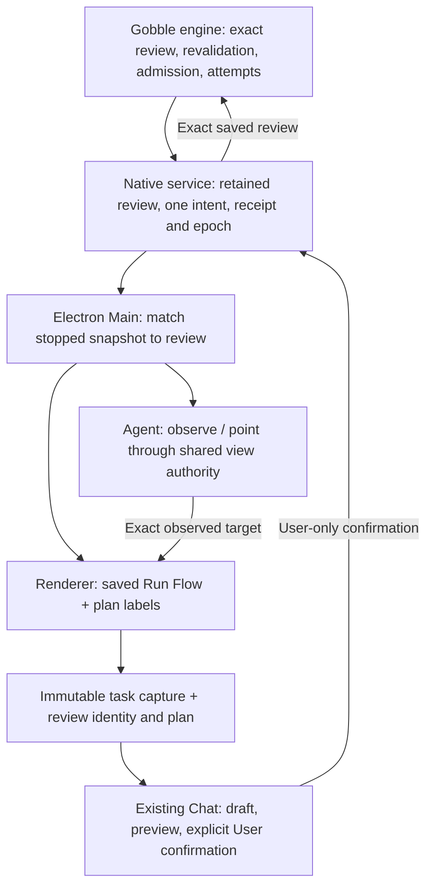

# P5B-4 — shared continuation review

Implemented for owner review on 2026-09-27. The approved in-Run concept now connects the saved Run Flow, immutable discussion evidence and the existing Chat action area. Real Trim/FastQC qualification remains P5B-5; the engine image has not been replaced.

## User behavior

1. Open a stopped analysis and choose **Check continuation**. This reads the engine review; it cannot start work.
2. The saved Flow labels steps **Can reuse**, **Will restart** or **Will start**, including the intended attempt. Selecting a node shows what is kept and whether the whole step restarts.
3. **Discuss this step** captures the displayed task attempt plus the exact continuation review into the existing Chat draft. It neither sends the message nor executes the plan.
4. The Chat card names the steps, saved data and whole-step restart consequence. Only **Resume analysis** creates the continuation intent. Gobble revalidates that exact review before admitting it.
5. After admission, the same Run observes its new attempt. **Stop analysis** uses the continuation receipt/current epoch lease; the original Start's Stop control is not reused.

Current may be newer than this Run. Continuation still uses the Run's saved design and checked data. Unsupported engines, a settling Stop, blocked/interrupted checks and unknown confirmation outcomes have distinct copy. Unknown outcomes expose status reconciliation, not another confirmation. Status is labelled **Last checked execution**, not live truth.

## Ownership

A continuation review is an immutable proposed attempt plan, not current execution status. A Run task selection remains an observed instance/attempt; continuation is its visible review context, not a new resource or Pane. The existing semantic data hash covers this context, so a different review cannot silently inherit an earlier reference. The catalog remains native-owned; the renderer's shared Project store only polls records.

Main overlays only the latest ready review whose Project, Run, checkpoint and task attempts match the stopped Monitor snapshot. A newer blocked/checking record prevents fallback to an older ready overlay. Captured evidence retains the old meaning independently. User and Agent use the existing acknowledged view and exact-reference authority; Agent receives the same review metadata and has no continuation execution tool.

## Structure and compatibility

- `contracts/src/run-presentation-v2.ts`: versioned display context and bounded review facts. Original RunPresentationSchema stays frozen.
- `contracts/src/observed-evidence-v2.ts`: new captured Run representation. Original captures continue to use/read v1.
- `main/service/continuation-context.ts`: pure association of a stopped observation with native review evidence.
- `main/workspace/service.ts`, `main/shared-context/run-observation.ts`, `main/evidence/capture.ts`: resolve, observe and capture through established owners.
- `renderer/run-continuation/`: shared read-only catalog, check controls, context presentation and User action card. Flow/Chat consume those units; no new composer/navigation family.
- Existing `PipelineFlow`/`PipelineNode`: optional semantic plan badges; design change spotlight behavior is preserved.
- Existing evidence preview and Agent reference panel: human-readable saved plan with no execution control.

Contracts bundle is v28; workspace storage remains v19, catalog v5 and shared toolset v13. No persisted selection migration is needed: the existing schema-3 observed target hashes the versioned content, and immutable asset bytes hold the new capture. Older bundles are untouched. New App versions read old captures; older binaries are not promised to read new v2 captures.

## Screenshots

These are actual Electron renderer captures using an isolated deterministic engine/Codex protocol fixture, not evidence of real tool execution or model inference.

- [Flow and Chat](screenshots/ready-wide.png)
- [Compact Flow](screenshots/compact-flow.png)
- [Compact Chat](screenshots/compact-chat.png)
- [Agent reference view](screenshots/agent-reference.png)
- [Historical evidence after blocked recheck](screenshots/historical.png)
- [Unknown confirmation outcome](screenshots/unknown.png)

See [verification](verification.md) for checks and limits. Next: owner stage review, then P5B-5 actual engine image and end-to-end qualification.
