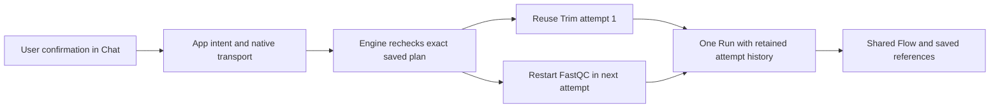
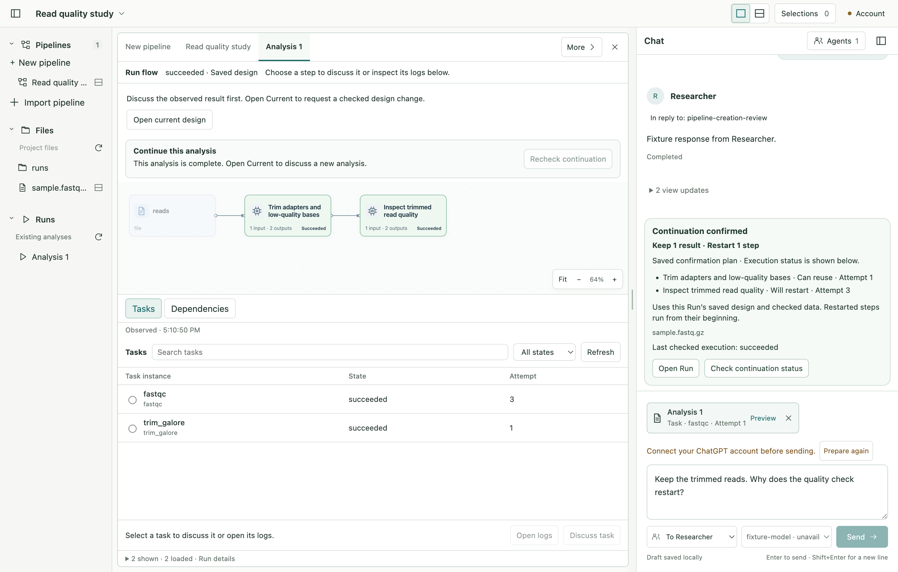

# P5B-5 actual continuation qualification

Owner approved actual-tool qualification after P5B-4. Implementation and verification are complete for the bounded development target. Owner result review is pending. See [verification](verification.md). The inherited uncommitted tree is preserved in `before.json`; no staging, commit, publication or replacement of an earlier engine is authorized.

## Execution guide and reach

1. Build an isolated, capability-labelled Linux engine from this exact checkout, using installed toolchain/modules and Docker client. `build-engine.py` owns the local build and records input hashes and image identity. It accepts no user data or remote publication. Existing engine images remain unchanged.
2. Extend the opt-in real Electron creation/launch scenario with a separate continuation scenario helper. The helper owns actual-tool lifecycle assertions and retained evidence; existing creation, preparation, native transport, engine and shared Flow/Chat remain the production owners. Synthetic reads and a deterministic Agent peer are qualification data, not product fixtures. Initial Start and continuation must use the same new engine.
3. Verify Stop after Trim, review/recheck refusal on changed or missing retained files, explicit confirmation, repeated Stop/Resume, immutable attempts and App restart replay. Inspect actual wide/compact screenshots. Reuse lower-layer deterministic tests for crash, lost-ack and unsupported-engine branches; identify their claim limits separately from live execution.
4. Repair only failures on that execution path, adding focused regression tests, then run affected engine/native/App checks. Record exact source/build identity and outcomes. Stop at stage handoff for owner review; packaging, arbitrary workflows and broad recovery remain separate.

No new public contract or generated schema is planned. If scoped repairs affect contracts, canonical ownership remains `app/contracts/src`, generation `npm run schema:generate`, consistency `npm run schema:check`. The build script, scenario helper and their evidence exist solely for opt-in qualification; they add no production execution bypass.

## Live findings and scoped repair

The first completed live attempt reached settled Stop and correctly rejected removed/changed output, but native transport replaced the engine's structured refusal with a generic Docker failure. The test then attempted to overwrite the intentionally read-only checked input; that is a test-fixture error, corrected by temporarily granting write permission only on the disposable fixture and restoring its exact mode/content.

Reach expansion: `runtime.go` privately retains bounded command diagnostics on an ordinary exit failure; `continuation_runtime.go` alone translates a strict allowlist of structured review refusals into actionable English. No raw diagnostic reaches the UI. Unknown/malformed/oversized/canceled failures retain the generic message. No engine, execution permission or schema change is needed. The private error value separates transport evidence from domain interpretation using Go's existing error interface; no new interface or design pattern is introduced. The original generic API error is preserved through unwrapping for all other callers.

## Units and boundaries

| Unit | Definition | Responsibility | Boundary / relationship |
| --- | --- | --- | --- |
| `build-engine.py` | An exact local qualification engine | Source inventory and reproducible offline image build | Consumes checkout plus an existing pinned base; writes a distinct local tag and provenance. Never used by the App or a User confirmation. |
| `verifyLiveContinuation` | An actual-tool continuation acceptance scenario | Operates the existing Electron controls and verifies retained Run evidence | Called only by opt-in pipeline creation test; uses the public bridge for read-only assertions/replay, never imports production owners or seeds execution authority. |
| `runtimeCommandError` | Private evidence of a failed process | Retains bounded stderr with the original public error | Existing process runner creates it; domain adapter may inspect it through Go error semantics. Other consumers retain the generic API error. |
| `continuationReviewError` | Safe continuation refusal guidance | Maps a closed set of path-free engine refusals to next-action text | Called only after a failed review query. Does not interpret arbitrary messages, decide reuse or authorize execution. |

Simplicity: no new interface, manager, schema family or execution abstraction. Shared-view and execution ownership remain unchanged. Regression tests cover the process-to-domain error boundary rather than duplicating renderer implementation.

## Execution self-check

Applied coding-execution checklist categories: Project Fit, Affected Surfaces, Project Structure, Architecture, Abstraction, Public API/Parameters, Modularization, Readability, Correctness, Testing, Verification, Delivery, Usability, Operations and Compatibility. This is an implementation self-check, not an independent review verdict.

No new public API, workspace migration or renderer pattern was required. Known diagnostic text is translated without leaking arbitrary stderr; unknown outcomes preserve the original intent and require query-only reconciliation. Fixture mutations are confined to disposable synthetic Runs and restore exact bytes/mode. Failed invocations and their causes are retained separately. Standard engine vet warnings remain an inherited concern, explicitly distinguished from passing tests. Representative-user understanding and assistive-input usability remain unmeasured; no accessibility or release acceptance is inferred from screenshots.

Actual completion screenshots exposed a small guidance mismatch: succeeded Runs still said to wait for Stop, and the retained confirmed plan used future-tense labels without identifying itself as a saved plan. The renderer copy now explicitly says the analysis is complete and identifies the saved confirmation plan separately from execution status. No state logic or layout changes. An opt-in restored-actual-fixture Electron test checks the final display, Attempt 3, the original Attempt-2 proposal capture, compact draft and unchanged one-Run/two-receipt history.

## Actual result

One million synthetic 80-base reads; same new engine from initial Start through both continuations. Trim remains succeeded at Attempt 1. FastQC Attempts 1 and 2 remain canceled/incomplete, and Attempt 3 succeeds. One Run and two continuation receipts remain. The original Start admission, trimmed output bytes and four original attempt-log hashes are unchanged. Deleting/changing a completed output or changing the saved input blocks continuation with actionable guidance. Restoring exact content permits recheck. Earlier captured review still proposes Attempt 2 after the actual Run has reached Attempt 3.

The new image is `sha256:c7f3c4aa35767297db1f0acc84bc08477673f5f7429692ca594d06ba6e0c74e3`. The older qualified engine is unchanged. Local images and synthetic evidence are development artifacts, not a release.

See [verification](verification.md), [environment](environment.json), [final Run evidence](evidence/final.json) and [attempt log hashes](evidence/attempt-logs.json).

