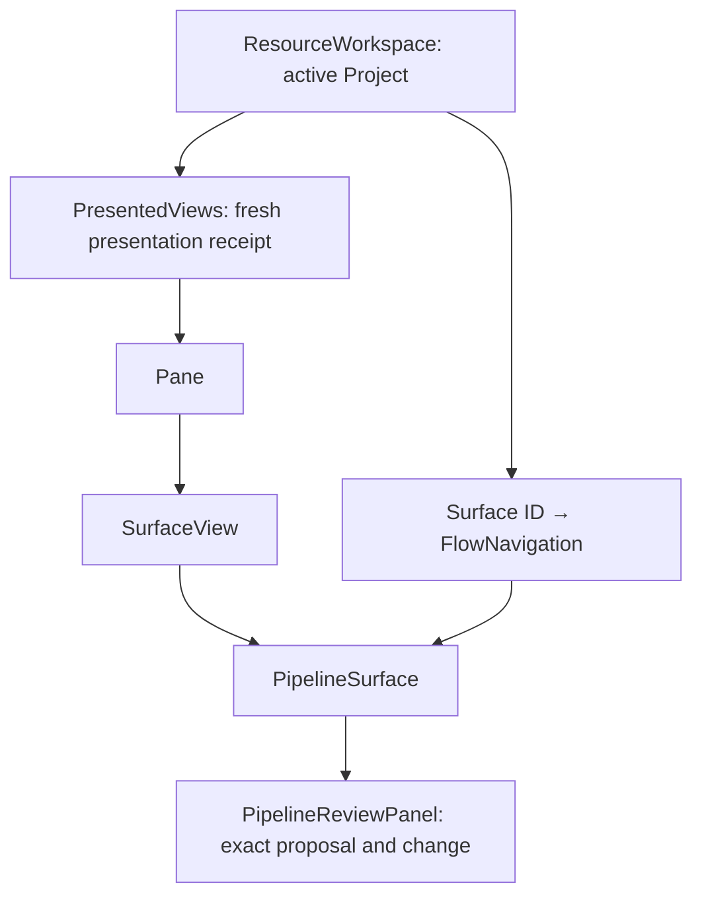

# Pipeline comparison navigation repair

Accepted scope: retain Current/Changes, proposal identity and change identity across temporary View remounts in the active Project session. No persisted schema, restart restoration, editor or Chat rendering changes. Existing dirty tree stays uncommitted.

## Reach and ownership

- ResourceWorkspace: Project-scoped map of per-Surface navigation, above PresentedViews; remove entries for closed Surfaces. Existing Project key discards this map on Project switch.
- Pane / SurfaceView: pass navigation to the Pipeline presenter; no navigation ownership below presentation gating.
- FlowNavigation: existing session-only location record, extended with review location. No capabilities, fetched facts, pending adoption or confirmation.
- PipelineSurface: transition to Changes only after invalidation succeeds; ignore late callbacks after unmount.
- PipelineReviewPanel: preserve exact IDs, initialize defaults only without a chosen identity, display missing selections explicitly.
- PipelineView: artifact replacement resets viewport fields only.
- PresentedViews / useSurfaceLoad / contracts / native service: no-op; receipt renewal and durable state remain their responsibility.

## Thinking guide

1. Add a deterministic Electron regression using the existing native continuation fixture plus synthetic stored comparison records. Reproduce the reset before production edits. This is UI navigation evidence, not engine comparison/adoption qualification.
2. Lift the existing object; bind Current/Changes and IDs; reject missing identity fallback. Stop once maximize/restore and compact Chat round trips keep the older proposal's second change without keeping confirmation or observation authority.
3. Verify close/reopen/restart defaults, separate duplicate Views, disappearance recovery, current viewport behavior, existing presentation tests, type/build/format checks. Record limitations and exact final source hashes.

New test file `pipeline-review-navigation.spec.ts`: concept = comparison navigation regression; responsibility = observable retention/recovery assertions; boundary = synthetic owned profile, no real Agent or execution; relationships = existing fixture/support and production UI/IPC. No new production abstraction or public service API.

Advice: read-only review_navigation_advice confirmed the owner and exposed the artifact-reset and silent-fallback traps. This is implementation advice and self-verification, not independent acceptance.

## Result

Implemented and verified. See [verification](verification.md) for reproduction, evidence, command outcomes and limits. The original walkthrough also passes on a copied profile. The completion boundary is session-only navigation retention; no next feature was started.
