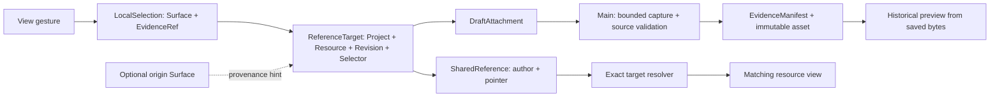

# R1 — Durable reference targets

Status: implementation approved by the user on 2026-09-07; implemented and verified on 2026-09-08. User completion review pending. R1 only. R2 requires a separate checkpoint. This follows the [research](../proposals/shared-research-workbench/research.md), [design](../proposals/shared-research-workbench/design.md) and [staged plan](../proposals/shared-research-workbench/implementation-plan.md).

## Scope and concept decisions

A **ReferenceTarget** identifies a Project resource at an exact data revision, optionally narrowed by a typed selector. It survives changes in pane placement and the lifetime of any opened view. **EvidenceRef** is the existing compatibility name for that target with optional `origin.surfaceId` provenance. Origin is never access authority, target identity or proof of visibility.

A **LocalSelection** binds an EvidenceRef to one currently open Surface. Moving that Surface retains the binding. Duplicating a Surface gives it an independent local selection. Closing a Surface removes its local selection; published marks and message/question attachments retain their targets. A **SharedReference** is an authored pointer. A **DraftAttachment** is selected context awaiting capture. An **EvidenceManifest** describes immutable captured bytes. A pointer does not promise that those bytes were captured; an old source revision is not automatically available.

The existing Project / Workspace / Pane / Surface meanings stay intact. A Pane owns tab placement; a Surface presents one Resource. No generic adapter registry is introduced in R1. Gobble owns execution identity, state and logs; Gobble App owns these reference, capture, presentation and collaboration records. No engine or native service changes are required.



## Versioned contract

WorkspaceDocument moves from v2 to **v3**. EvidenceRef and AddressedContext use **schemaVersion 2**. ResourceRef, Workspace domain identity, catalog and engine protocols keep their versions. Main, preload and renderer are rebuilt together; the generated bundle is `contracts/schema/v3.json`. The v1/v2 bundles remain frozen. External independently deployed consumers still require a future negotiation design.

```typescript
// Portable reference: this is valid without origin or an open Surface.
{
  schemaVersion: 2,
  projectId: 'prj_atlas',
  resource: { kind: 'file', resourceId: 'res_samples' },
  dataRevision: 'sha256:…',
  selection: {
    kind: 'table',
    coordinateSpace: 'revision-row-column-keys',
    rowKeys: ['row_3'],
    columns: ['col_0'],
  },
  origin: { surfaceId: 'srf_original' }, // optional
}
```

| Selector | Explicit coordinateSpace | Interpretation |
| --- | --- | --- |
| Text / log | `utf16-line-column` | 1-based line, 0-based UTF-16 column, half-open range. Empty/reversed/out-of-preview ranges and boundaries inside surrogate pairs are rejected. |
| Table | `revision-row-column-keys` | Exact row keys and column IDs within this resource revision. Reordering loaded rows does not change membership. Current CSV ordinal keys do not become biological IDs or stable keys across file revisions. |
| Raster image | `normalized-original-image` | Normalized top-left coordinates against the original image, with its pixel dimensions and content hash. Independent of viewport size/zoom. Not exact plot entities. |
| Whole preview | No selection | Resource/revision target; capture remains bounded and declares truncation where applicable. |

For files, dataRevision is the existing content revision. For Run displays it is the engine revision. For logs it is the hash of the bounded displayed log text, so changing the tail invalidates a selection even without another engine checkpoint. Revision strings support equality, not chronological ordering. View-spec revisions and semantic plot IDs belong to R2.

## Resolution and authority

`resolveReferenceTarget` is a pure shared contract operation. Main passes a validated loaded snapshot; React uses the same rules for display. It checks Project/resource identity, exact revision and selector compatibility/bounds.

| Result | Meaning and UI |
| --- | --- |
| `exact` | Matching resource revision and valid selector; the view may display the mark. It does not by itself prove the view is currently visible. |
| `historical` | The current resource has a different revision. Show “older version”; do not highlight current content. Saved message/question evidence can still be previewed from immutable bytes. |
| `unavailable` | Source unavailable, resource identity mismatch, or selector absent/incompatible with the bounded preview. No highlight or guessed location. A saved evidence asset has its separate missing/corrupt error. |

There is no quote search, approximate remapping or resolver ambiguity in R1. Ambiguity becomes meaningful with future heuristic selectors/mappings and must be designed with them; an unused state would imply unsupported recovery behavior.

User `select`, `attach` and `share` actions name their source Surface separately from the target. Main checks membership, Project/resource match and the render acknowledgment. Agent `workspace_point` resolves the portable target against ready matching instances, preferring origin only as a hint; if that instance is closed it can use another exact instance. Hidden sources cannot establish a live observation. Existing session, modal, revocation and capture guards remain in force. The toolset is `shared-views-v3`; existing conversations with older shared tool definitions use the existing explicit conversation-renewal flow. No provider thread is silently rewritten or replayed.

## File and API ownership

| Owner | Responsibility |
| --- | --- |
| `contracts/src/selection.ts` | Closed selector schemas and coordinate conventions. |
| `contracts/src/reference-target.ts` | ReferenceTarget, EvidenceRef provenance and LocalSelection. |
| `contracts/src/surface-data.ts` | Shared validated resource preview data; independent of workspace IPC. Existing bridge exports remain compatible. |
| `contracts/src/reference-resolution.ts` | Pure exact/historical/unavailable resolution, including text/table/image bounds. No source I/O, placement or capture. |
| `contracts/src/context.ts` | Addressed envelope and compatibility exports; no longer owns selector geometry. |
| `reference-v1.ts`, `workspace-document-v1.ts`, `workspace-document-v2.ts`, `workspace-migration.ts` | Storage-only compatibility. Every old nested reference owner has an explicit frozen shape. |
| `workspace-document.ts`, validation owners | Current aggregate shape, association and semantic checks. |
| `main/workspace/controller.ts`, `model.ts`, `storage.ts` | Serialized mutations, presentation admission, local-selection lifetime and atomic persistence. No second reference store. |
| `main/workspace/selection.ts` | Computes runtime display revisions and turns pure resolver outcomes into strict admission/capture failures. |
| `main/shared-context/references.ts`, `host.ts` | Publication label/author and ready-instance resolution. Same target semantics for Agent and User. |
| Renderer SurfaceView / Pane / selection controls | Gestures, per-Surface binding and resolution display. No filesystem access or historical-byte reconstruction. |
| Existing evidence service/storage | Bounded immutable capture and authorized historical preview. Asset bytes and hashes are not rewritten during migration. |

## Migration and recovery


The v1 presentation mapping keeps the existing equal vertical split/420px chat defaults. v2 already has that presentation. Both migrate local selections, legacy decision references and every applicable nested v2 branch: User/Agent marks, draft attachments, sent manifests and question manifests. Closed origins are preserved as optional provenance without creating a Surface. Project IDs, resource IDs, revisions, keys, hashes, asset byte lengths, representations, author identities, question links, provider conversation state and drafts retain their meanings.

The pure migration validates before storage changes. On the first accepted write, storage preserves exact original bytes in a version-specific immutable archive and uses the existing atomic writer. Later saves never replace that archive. Corrupt, foreign, unsupported-version, externally changed or archive-conflicting data is preserved and rejected. No assets are recaptured and no Agent turn is sent. The original user profile and research files were not used as migration test inputs.

## Verification and checkpoint

The final `npm run check` passed: formatting, TypeScript, generated schema consistency, **166 unit/contract tests across 14 files**, service/app build and **36 Electron tests**. Evidence: [check output](r1-review/checks.log), [machine-readable record](r1-review/verification.json), [source/test changes and hashes](r1-review/changes.json). Electron 44.2.0 / React 19.2.8 / TypeScript 5.9.3 / Playwright 1.63.0, macOS arm64.

Additional coverage includes the complete frozen v2 schema matching the published schema; all nine reference positions in a composite v2 fixture (three local selections, two authored marks, draft, sent, question and legacy decision); immutable original archives and captured asset bytes after restart; unsupported/foreign/malformed inputs; UTF-16 surrogate boundaries; image dimensions/hash/bounds; and Agent pointing without origin after closing/reopening a Surface. Existing keyboard, split/move/duplicate, text/image pointing, reply, account, capture and restart regressions also pass.

The first adaptation run exposed test fixtures still using the old command fields/version expectations. They were updated to exercise the new contract; access, freshness, immutable-byte and replay assertions remain. Formatting the synthetic JSON asset changed its fixture bytes, so its fixture manifest hash/size was regenerated before the final passing run. No application data or production failure was hidden by a reset.

Visual review inspected the actual Electron screenshots: the exact reference highlights only S03's selected two cells; the changed source shows “older version” and no highlight; the sent attachment still shows the original S03/Treatment; deleting the source shows an unavailable view while preserving chat and historical preview. Controls remain visible and the central-work/right-chat layout is retained.

- [Exact reference after v2 migration and reopening](r1-review/r1-migrated-exact.png)
- [Changed resource, with no historical highlight on current data](r1-review/r1-historical.png)
- [Original captured evidence beside the changed source](r1-review/r1-captured-evidence.png)
- [Missing source, retained conversation and attachment](r1-review/r1-source-unavailable.png)

Tests use isolated profiles, synthetic resources and a fixture provider. They are not evidence of real scientific computation, live model behavior, packaging or deployment. No dependency was added; the native service and engine were unchanged in this slice. The broader Stage 6 engine baseline limitations remain outside this app check.

R2 remains pending: an actual linked table/scatter view, precise entity identity, Discuss selection in the existing composer and bidirectional Agent pointing. Review this R1 result before starting that feature slice.
