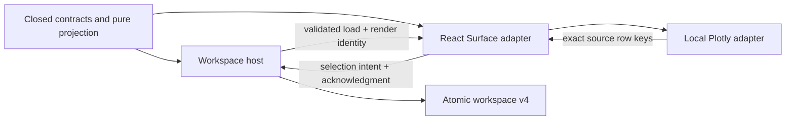
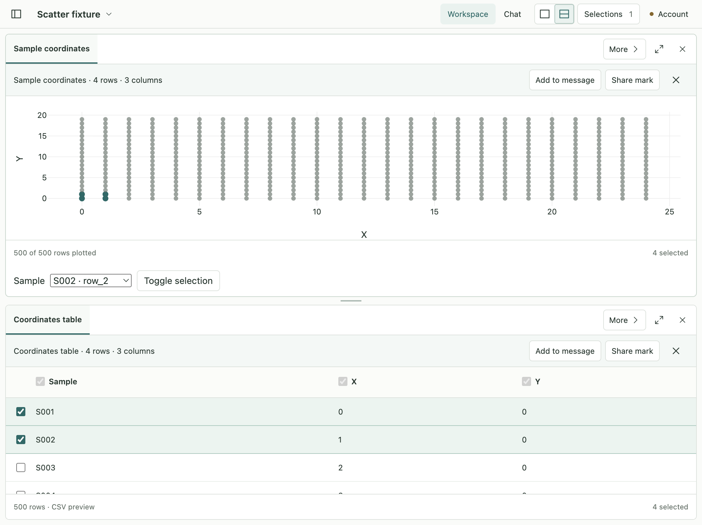

# R2a — Contracts and chart foundation

Status: **Implemented and verified on 2026-09-08; R2b approval pending.** Accepted inputs: [R2 design](../proposals/r2-linked-views/design.md) and [sequential plan](../proposals/r2-linked-views/implementation-plan.md). This slice does not add the R2b open/filter/axis UX or the R2c Agent round trip.

## Source and process boundary

Starting tree: `codex/project-workspace-design`; full affected-source hashes are recorded in [baseline](r2a-review/baseline.json). The pre-existing app and engine edits are retained. Engine execution, accounts, real provider calls and user research files are outside this slice.

| Layer / paths                                                                                      | Change and lifecycle owner                                                                                                                                                                                                     |
| -------------------------------------------------------------------------------------------------- | ------------------------------------------------------------------------------------------------------------------------------------------------------------------------------------------------------------------------------ |
| `contracts/src/tabular-view.ts`, `tabular-projection.ts`, `view-links.ts`                          | Closed scatter/filter/presentation/link schemas; exact numeric conversion and membership. Shared pure logic, no I/O.                                                                                                           |
| `surface.ts`, `surface-v3.ts`, `workspace-document*.ts`, `workspace-migration.ts`, `validation.ts` | A scatter Surface requires a typed specification. v4 links have one selection owner. Historical readers retain their published shapes; migration creates no inferred links.                                                    |
| `workspace-bridge.ts`, generated v4 schema                                                         | Versioned render identity, including spec/view/filter revisions. Versioned load/acknowledge and new invalidate named preload methods transport checked payloads; no raw IPC capability is exposed.                             |
| `main/workspace/{model,controller,render-session,tabular-snapshots,storage,ipc}.ts`                | Main owns link selection, one visible source snapshot lease, close cleanup, render invalidation and immutable v3 backup. It verifies exact source rows and current render before accepting selection.                          |
| `renderer/workspace/views/ScatterView.tsx` and adjacent chart adapter                              | React owns display/failure state; a bounded adapter owns the external chart and event cleanup. No service or evidence writes in chart code.                                                                                    |
| Existing renderer Surface/Pane dispatch                                                            | Read committed linked membership; produce selection intent with the current receipt. SelectionMenu counts a linked group once; linked table column projection stays fixed. Normal file navigation remains unchanged until R2b. |
| App manifests, renderer stylesheet/entry, architecture allowlist                                   | Pin the minimal Plotly bundle; allow it only in the renderer. Keep runtime network disabled and production CSP unchanged.                                                                                                      |
| Contract, migration, host and Electron tests                                                       | Verify numeric failures, exact identity, historical compatibility, stale render refusal and actual chart lifecycle.                                                                                                            |

Changes are ordered as contracts/migration → host guards → renderer/chart lifecycle → generated schema and compatibility callers → focused tests → full app checks. Create links only explicitly; read immutable versioned data; update a single membership owner; delete local link state when its last Surface closes. Evidence references survive that deletion.

## Dynamic handoff — Development → testing

Request: `r2a-20260908`. Source-scoped macOS arm64, Electron 44.2.0 / React 19.2.8 / TypeScript 5.9.3. Existing Vitest and Playwright runners remain authoritative. No signing, installation, update, Windows or Linux claims are made in this slice.

Pure tests cover decimal parsing, duplicate labels/keys, empty/non-finite coordinates, reference-presentation bounds, one link owner and v1/v2/v3 migration. Host tests cover cross-view render identity, old spec/filter/source callbacks and link cleanup. Real Electron tests cover local chart loading, production CSP, 500 points, exact pointer selection, resizing, failure containment and disposal/reopen. Source/type/build checks establish construction only.

## Chart investigation

Candidate: `plotly.js-basic-dist-min@4.0.0`, exact npm package. The initial real-Electron run displayed 500 points but reported an inline stylesheet CSP violation; that result is retained in [raw investigation](r2a-review/plotly-raw-spike.json).

The pinned implementation can write its global rules into a same-origin external stylesheet with the expected stylesheet ID. The subsequent run preserved the production CSP and reported zero violations: [stylesheet investigation](r2a-review/plotly-stylesheet-spike.json). The integration checks that the stylesheet exists before importing Plotly. This is a version-specific adapter dependency, not permission to use `unsafe-inline`, patch the library, or allow runtime network access. Modebar is disabled; App controls own chart actions. Additional chart features must re-establish this CSP result.

Upstream source reviewed: [Plotly v4.0.0 DOM/style integration](https://github.com/plotly/plotly.js/blob/v4.0.0/src/lib/dom.js), [bundle definitions](https://github.com/plotly/plotly.js/blob/v4.0.0/dist/README.md). These source facts explain the adapter choice; final runtime evidence must use the built React application, not only the isolated investigation.

## Completion record

The current foundation renders a locally bundled SVG scatter over the same bounded source snapshot as its explicitly linked table. Click, native keyboard selection and a completed two-dimensional box resolve exact revision-scoped row keys; the host commits one membership set. Table and scatter derive highlights from that set. Closing one Surface preserves the link and membership, and closing the last removes the local group. A persisted linked fixture restores the same members after relaunch.

Source responsibilities were reviewed within this task. Shared conversion is pure; schemas reject unknown shapes; main owns authorization, persistence and ready leases; preload exposes named checked methods; React owns transient controls; the chart adapter owns external rendering/events/disposal. An old spec, filter, renderer generation or failed render cannot authorize a new selection. A missing linked filter column is refused before acknowledging the table. No new engine writer, generic event bus or secondary membership store was introduced.

### Verified results

| Check                      | Result / evidence                                                                                                                                                                                                                                                                  |
| -------------------------- | ---------------------------------------------------------------------------------------------------------------------------------------------------------------------------------------------------------------------------------------------------------------------------------- |
| Full app check             | Formatting, separate process typechecks, generated schema, 179 unit/contract tests in 16 files, and 38 actual Electron tests passed. [Log](r2a-review/checks.log).                                                                                                                 |
| Compatibility              | v1/v2/v3 storage readers and published historical schemas remain frozen. First mutation writes an immutable original-version backup; captured assets retain bytes and hashes. Unknown versions/extra fields are rejected.                                                          |
| Exact tabular semantics    | Decimal/scientific ASCII notation, finite coordinates, zero vs blank/malformed values, overflow/underflow, duplicate labels/keys, reorder/filter and exact box members are covered by pure tests. Raw cells are retained.                                                          |
| Render/source guards       | Cross-view receipt replay, source/spec/filter changes, failed-render invalidation and snapshot coalescing/refusal are covered by host tests.                                                                                                                                       |
| Built Electron             | 500 real CSV points, pointer and keyboard selection, an exact four-member box, one group count, table synchronization, resize, close/reopen, production CSP and invalid-spec containment passed. Temporary isolated profile and real native Go file reader; no live provider call. |
| Measurement-only follow-up | Added launch timestamps to the test without changing product code; the two scatter Electron scenarios passed again against the same build. [Log](r2a-review/measurement-runtime.log), [measurements](r2a-review/measurement.json). Final formatting/type checks also passed.       |
| Source/asset identity      | [Changed source hashes](r2a-review/changes.json), [environment and verification](r2a-review/verification.json). The production CSP and origin handlers match the starting hashes.                                                                                                  |

### Observed dependency cost

The pinned Plotly dependency remains isolated to a lazy renderer chunk. The emitted chunk is **1,773,953 bytes**, or **441,192 bytes** with gzip level 9; gzip is an analysis of the asset, not a claim that Electron serves a compressed file. The external chart stylesheet is 207 bytes. The npm package is pinned at `4.0.0`; changing it requires repeating the CSP/lifecycle checks.

One measured local macOS run reached an empty workspace in **495 ms** and the seeded linked workspace in **689 ms**, including Electron launch, focus and native-service work. They are different workloads, so their difference is not isolated chart startup overhead. A pointer-to-persisted-membership check took **51 ms**, including test observation. These are single-run observations, not percentile budgets, cold disk guarantees or large-data performance evidence. The separate initial stylesheet investigation measured 36 ms for chart-only creation and must not be confused with app startup.

### Review findings and corrections

- The initial library investigation raised an inline-style CSP violation. A pinned, same-origin external stylesheet provides the library's expected CSSOM target. Production CSP was not weakened; the final application reported zero policy violations. A default dotted lazy-chunk filename also conflicted with the existing asset allowlist; the build now emits simple hashed chunk names instead of widening the handler.
- Plotly's default automatic selection direction made a thin drag select entire x bands. The adapter now explicitly requests a two-dimensional box. The actual gesture test encloses four neighboring source members; its rectangle exceeds the library's minimum drag threshold. Click and the native selector remain alternatives for tiny regions.
- The first full run found two old-version test fixtures that spread a new v4 field into v1/v2 documents. Those fixtures now preserve their historical shapes; product readers were not made permissive. The initial failures are preserved in [initial full runtime log](r2a-review/checks-initial-runtime.log), followed by the passing final check.
- Render failure now explicitly invalidates its current host receipt. A delayed acknowledgment cannot resurrect it, and an obsolete error response cannot overwrite a newer load.

### Visual review and remaining UX

The screenshot is the built app with a synthetic 500-row CSV. Four points are highlighted and the table reports the same four selected rows; the upper navigation counts one linked group. It uses the existing compact Workspace mode with Chat collapsed to exercise resizing. It is not the final R2b chat-side interaction design.

The existing per-pane selection toolbars are visibly duplicated, table column controls are fixed for linked views, and the native sample selector is intentionally a basic keyboard path. The accepted R2b sketch supplies one shared Discuss action, compact plot settings and the normal CSV-to-linked-view workflow. Those controls should be reviewed together with right-side Chat before the next interaction checkpoint.

### Explicit limits and next checkpoint

- R2a is a contract/chart foundation. The Electron scenario seeds a validated v4 document while its isolated app is stopped; normal navigation does not yet create a scatter link. R2b implements that user flow, axes, shared filters, sort/viewport controls, linked refresh and the unified selection toolbar.
- `ReferencePresentation` is a typed separate contract. It is not yet bound into draft/sent evidence. Existing row evidence and its preparation/acceptance freshness checks remain authoritative. Capturing plot context, reference-view/return behavior and a real Agent round trip belong to R2c.
- The Agent toolset remains `shared-views-v3`. Internal render IPC load/acknowledge/invalidate channels are v2 and require main/preload/renderer to be rebuilt together; R2c handles the changed Agent capability contract explicitly.
- Visible linked views use one retained bounded source snapshot. R2a has no file watcher. A changed file is detected when the source lease is renewed and by the existing evidence freshness checks; coordinated user refresh is R2b. This does not imply real-time source tracking.
- The current CSV preview remains at most 500 rows and 100 columns within existing byte limits. No transformations, statistical analysis, full-dataset performance, PDF/Notebook/genome viewer, external MCP server, live Agent trial, signing, installation or cross-platform result is claimed here.

R2b starts only after the user's requested completion review and approval.
