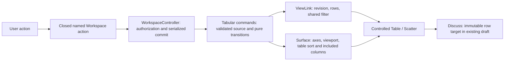
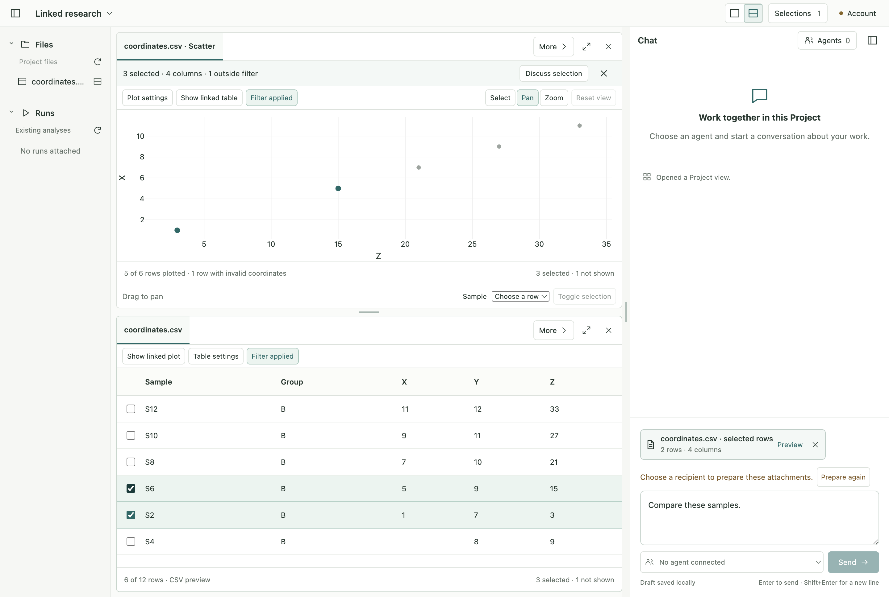

# R2b — Linked User interaction

Status: **Implemented and verified, 2026-09-08; awaiting user review before R2c.** Accepted inputs: [R2 design](../proposals/r2-linked-views/design.md), [sequential plan](../proposals/r2-linked-views/implementation-plan.md), [R2a result](r2a-contracts-and-chart.md), and the user's approval to implement R2b.

## Outcome and ownership

Open a real CSV as a table, choose compatible numeric axes, and open its linked plot. Keep one row set across sorting, shared filtering, axes and viewport changes. Offer one Discuss action for the visible linked group and focus the existing Chat composer. R2b attaches exact row evidence under existing semantics; freezing plot presentation and the live Agent loop remain R2c.

Shared membership has one durable owner. Table settings are optional with explicit defaults (source order/all columns), persist on the table Surface, and never create a second row set. An explicit selection action from the table records its included columns; the toolbar derives its target from the current interaction source without moving the toolbar. Plot targets include X/Y/label columns. A short descriptive target label identifies the column scope.

One toolbar remains at the first visible member of each link, stable under selection changes. All other linked members suppress their selection/whole-preview action strip. If that member is hidden or closed, the remaining visible member owns the action strip. This is a presentation choice, not a second selection owner.

New linked plots prefer upper plot/lower table when the complementary pane is empty. Existing tabs are retained; a pinned active view is not automatically displaced. A closed counterpart can be reopened explicitly into the existing link. Duplicating a view preserves its presentation but creates an independent, unlinked Surface.

Changing source revision by explicit Refresh updates the whole link atomically, clears revision-scoped membership, resets filter/table settings/viewport, and chooses new compatible axes when available. It retains all draft/sent references at their original revision. No file watcher or implicit cross-revision identity relocation is added.

## Exact affected set and implementation skeleton

Starting source hashes: [baseline](r2b-review/baseline.json). Current branch: `codex/project-workspace-design`; pre-existing app/engine work is retained. No engine/account/provider/packaging edits are intended. Existing React 19.2.8, Electron 44.2.0, TypeScript 5.9.3, Plotly 4.0.0 and test runners remain pinned.

| Owner                 | Source and dependent updates                                                                                                                                                                                                                                                           |
| --------------------- | -------------------------------------------------------------------------------------------------------------------------------------------------------------------------------------------------------------------------------------------------------------------------------------- |
| Closed contracts      | `tabular-view.ts`, `tabular-projection.ts`, `view-links.ts`, `surface.ts`, new frozen `surface-v4.ts`/`view-link-v4.ts`/`workspace-document-v4.ts`, `workspace-document.ts`, migration, new `tabular-actions.ts`, `workspace-bridge.ts`, exports, generated v5 schema.                 |
| Main                  | New `workspace/tabular-commands.ts`; existing `controller.ts`, `model.ts`, `render-session.ts`, `tabular-snapshots.ts`, `storage.ts`; view-kind matching in existing `shared-context/layout.ts`. Existing named command bridge validates new intents; no raw IPC or new service route. |
| React composition     | `ResourceWorkspace.tsx`, `Pane.tsx`, `PaneActions.tsx`, `SurfaceView.tsx`; stable one-toolbar ownership and explicit linked refresh.                                                                                                                                                   |
| React views           | New bounded tabular settings/actions components; `TableView.tsx`, `ScatterView.tsx`, `scatter-chart.ts`, narrow Plotly types and view styles. Dialog state, gesture preview and pending input remain transient.                                                                        |
| Selections            | New linked toolbar uses current host-owned membership/column scope; existing unlinked selection behavior remains. Existing composer reveal/focus path is reused.                                                                                                                       |
| Verification and docs | New contract/host/Electron linked-interaction tests, validated inline v4 migration fixture, existing version expectations and real scatter fixture, README and proposal checkpoint status.                                                                                             |

Schema v5 adds optional table presentation and link selection-origin metadata. Frozen v4 readers preserve the published shape; storage migration retains the original before first mutation. Render identity remains versioned and invalidates old sort/column/axis/filter/viewport receipts.

Ordered slices: contracts/storage → host intents/placement/source refresh → controlled settings/selection views → chart viewport events → real Electron journeys → full checks/visual review. Each failure returns to its owning boundary before expanding the next slice.

## Dynamic handoff — Development → testing

Request `r2b-20260908`, source scoped macOS arm64, Electron 44. Existing Vitest/Playwright and actual native service are retained. Pure tests verify ordering, column/row identity, membership under filter/axes, safe placement, v4 migration and stale receipts. Host tests verify authorization/source mismatch and atomic refresh. Actual Electron scenarios verify normal CSV opening, point/checkbox/box+add selection, settings, one Discuss action/focus without Send, retained draft under local changes, counterpart close/reopen, keyboard/narrow/resize, source-refresh recovery and CSP. No live provider, installation, Windows/Linux, scientific execution or large-data claim.

## Code and API review

- `TabularAction` is a closed discriminated intent family. It carries current render acknowledgment for observed actions, never renderer-authored source bytes or a second row set. Refresh carries the expected old source revision and performs one fresh host read. `WorkspaceController` validates authority, owns its ordered commit queue and seeds the committed shared snapshot. The general transition path refuses tabular intents that have not passed that owner.
- `tabular-commands.ts` owns source-validated placement and settings transitions on the controller's private draft. Numeric/filter/sort/column projection stays in portable contracts. No new generic bus, plugin registry, engine writer or provider authority was introduced.
- React composition chooses a single visible action-strip owner. `TabularControls` routes explicit commands, `TabularSettings` owns transient form state, and `LinkedSelectionToolbar` derives the current exact target. Durable settings stay on Surface/ViewLink. `ProjectChat` receives an explicit focus request and preserves its composer/draft.
- `ScatterChart` remains the only Plotly boundary. It translates exact `customdata` row keys, captures Shift at pointer-down and accepts only current-generation box/relayout events. Completed boxes become a fixed member list. Presentation changes retire the old host receipt; late ready/error callbacks cannot restore it.
- Existing normal file-open, reference-reveal and shared-open paths now distinguish a table Surface from a scatter Surface over the same Resource. Resource equality alone is not sufficient to reuse a presentation. Independent duplicates remain unlinked.
- v5 adds table sort/included-column state and the linked selection's interaction source. The interaction source determines included-column scope, not a second selection. Sort-only changes do not move it. Frozen v4 storage readers preserve the published schema and back up exact original bytes before first mutation.

## Review corrections

The first linked Electron run exposed two test synchronization/locator defects: an exact label lookup did not resolve the native filter select, and one attachment assertion ran before the command commit. Tests now use exact accessible combobox roles and observe the committed attachment before continuing. [Initial log](r2b-review/linked-runtime-first.log) and subsequent focused runtime logs are retained; product validation was not weakened.

Frozen v4 schema comparison caught property-order differences in a generated `required` list. The v4 reader now composes the original explicit property order; the test compares its JSON shape with the unchanged published bundle. Additional review prevented a sort-only update from changing included-column scope, kept the chart interaction mode across presentation reloads, and limited attachment feedback to the target actually attached.

The refresh menu explicitly says **Refresh linked views** and describes its changed-source reset. Filter values beyond the 4,096-character contract bound are unavailable with an explanation; raw source values are not shortened into different filter identities. Old acknowledgment failures cannot overwrite newer loads. The production CSP, origin checks, asset handler and dependency versions remain unchanged.

The first full check passed, but direct screenshot inspection found the native chart selection controls partly clipped in a 900 × 760 window. The chart now shrinks to a bounded 120-pixel canvas and its own content scrolls if the available pane is smaller. The regression scenario checks that the keyboard control fits inside the pane, then exercises 150% zoom. The initial [clipped view](r2b-review/compact-workspace-before-fix.png) and [pre-fix passing test log](r2b-review/checks-before-visual-fix.log) are retained. A separate in-flight screenshot was captured between optimistic table selection and the committed linked render; final captures now wait for all membership and chart updates.

Pinned event behavior was checked against [Plotly's event reference](https://plotly.com/javascript/plotlyjs-events/), [v4.0.0 selection source](https://raw.githubusercontent.com/plotly/plotly.js/v4.0.0/src/components/selections/select.js) and [v4.0.0 Cartesian drag source](https://raw.githubusercontent.com/plotly/plotly.js/v4.0.0/src/plots/cartesian/dragbox.js). Actual interaction evidence uses the built Electron app.

## Completion record

Final **`npm run check` passed after the visual correction**: formatting, separate main/preload/renderer and contract typechecks, generated v5 schema, **188 unit/contract tests in 17 files**, and **41 actual Electron scenarios**. [Final log](r2b-review/checks.log). No test was skipped.

The linked host tests cover foreign/stale render receipt refusal, unknown column refusal without mutation, one observed snapshot when the underlying reader changes, atomic explicit refresh, safe placement, immutable attachments, stable numeric/text ordering, finite empty/constant/extreme plot domains and exact v4 backup preservation. Existing regression tests also retain source freshness, CSP, shared-reference and composer/IME coverage.

[Changed source hashes](r2b-review/changes.json) and [environment, built assets and verification](r2b-review/verification.json) identify this completed slice against its starting baseline. Engine modifications and other pre-existing work remain outside the slice. The pinned Plotly lazy chunk is unchanged in size at 1,773,953 bytes; no additional dependency was installed.

### User scenarios and visual review

| Scenario                                              | Expected behavior and evidence                                                                                                                                                                    |
| ----------------------------------------------------- | ------------------------------------------------------------------------------------------------------------------------------------------------------------------------------------------------- |
| Open a normal CSV, choose axes, select in either view | Real native CSV read, exact source row IDs, one linked group, upper plot/lower table when available. Duplicate sample labels remain distinct.                                                     |
| Sort, filter, change axes, pan and zoom               | Selected IDs stay fixed. Shared filtering applies to both views; excluded numeric rows and hidden members are reported. Mouse and keyboard controls remain available.                             |
| Complete a box and Shift-drag another box             | The first box replaces membership; Shift adds the exact resolved source members. No continuing region predicate.                                                                                  |
| Discuss and continue local work                       | One action focuses the existing composer without Send; typed text remains. A frozen two-row attachment stays two rows when local selection becomes three.                                         |
| Refresh externally changed source                     | One new snapshot resets revision-scoped local state in both views; existing attachments retain their old revision.                                                                                |
| Close/reopen, duplicate, relaunch                     | Counterparts reopen into the same explicit group; duplicates stay independent; persisted membership/settings and attachments survive restart.                                                     |
| Narrow window and enlarged text                       | Workspace/Chat switch preserves work; Discuss reveals/focuses Chat. Keyboard selection controls remain reachable at 900 × 760 and 150% zoom.                                                      |
| Missing/invalid data                                  | Invalid coordinates do not produce points; exact rows can still be selected in the linked table, including a filter with zero plotted points. A 501-row source reports a bounded 500-row preview. |

The screenshots use the built app, an isolated temporary profile and a small synthetic CSV. No Agent is connected in these new User-journey scenarios. The current app uses its existing light appearance; changing the OS dark preference does not claim a new dark theme.

Other captures: [compact Workspace](r2b-review/r2b-compact-workspace.png), [compact Chat](r2b-review/r2b-compact-chat.png), [150% zoom](r2b-review/r2b-compact-150.png), [OS dark preference](r2b-review/r2b-dark-preference.png).

### Remaining boundary and next checkpoint

R2b freezes semantic rows/columns in the draft target. It does **not** bind `ReferencePresentation` to that target, capture plot pixels, transmit the plot context to an Agent, or implement explicit reference-view/return behavior. Those are R2c and still require the user's requested completion review and approval. Existing prepared-evidence freshness guards remain authoritative; no automatic Agent turn follows a selection or attachment.

The source snapshot is retained rather than watched. CSV scope stays at 500 rows and 100 columns within existing byte limits. No source transformation, Notebook/genome/dashboard adapter, external MCP endpoint, engine change, signing, installation or Windows/Linux runtime result is claimed. This stage verifies development artifacts on macOS arm64.
