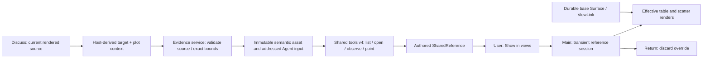

# R2c — Plot context, reference views and Agent round trip

Status: **Implemented, verified and accepted by the user, 2026-09-08.** The user approved R2c after reviewing [R2b](r2b-linked-interaction.md). Accepted behavior and UI: [R2 design](../proposals/r2-linked-views/design.md), [sequential plan](../proposals/r2-linked-views/implementation-plan.md) and this turn's ownership/Show–Return sketch. Source baseline: [hashes](r2c-review/baseline.json), branch `codex/project-workspace-design`.

## Bounded outcome and decisions

A deliberate Discuss action freezes an exact row/column target and the context of a ready linked scatter. Existing target identity remains EvidenceRef v2; presentation is a separate optional member of DraftAttachment/SharedReference and is copied into an immutable evidence asset. Required plot columns are included explicitly. If there is no ready linked scatter, the existing table-only attachment remains truthful.

The Agent receives structured exact source values, plot specification, filter, finite viewport, presentation revisions and bounded source scope. This stage does not capture plot pixels or claim that semantic observation is visual image consumption. Source freshness is checked at preparation and again at Send; oversized exact selections fail instead of silently becoming partial evidence.

Agent references are independent authored marks. Only the User's explicit Show in views begins a temporary reference session. The main-process session owns effective plot/table presentation; durable base Surface/ViewLink settings are not overwritten. A filtered/zoomed-out target expands the temporary view enough to reveal exact members. The banner explains the temporary state and provides Return to my view. User row selection remains editable. Base filter/axes/viewport changes are refused until Return. A later incoming reference cannot replace the session. Explicitly selecting another reference can.

The session ends on Return, Project switch, renderer disconnect/restart or closing its last member. Moving a Surface does not alter target identity. Old source revisions are reported as historical and never reused against new ordinal row IDs. Source/missing-reference errors retain the user's previous work.

## Exact affected set and source skeleton

| Owner / crossing       | Create, read, update and end condition                                                                                                                                                                                                                                                                                                                  |
| ---------------------- | ------------------------------------------------------------------------------------------------------------------------------------------------------------------------------------------------------------------------------------------------------------------------------------------------------------------------------------------------------- |
| Portable contracts     | Add frozen v5 document/content readers, reference-view/presentation helper contracts; update evidence/shared reference shapes, validation, shared tool schemas, v6 workspace migration, render receipt and exports. Generate v6; v1–v5 bundles remain frozen.                                                                                           |
| Workspace host         | Add `workspace/reference-views.ts` for transient session creation/effective presentation and cleanup. Extend `controller.ts`, `render-session.ts`, `tabular-commands.ts`, `model.ts`, storage/version handling. The controller remains the only durable writer; resource/snapshot owners remain unchanged.                                              |
| Evidence               | `evidence/materialize.ts`, `service.ts` only where presentation validation is needed; copied context is hash-bound with exact rows and verified on preview. Existing capacity, recipient, lifetime, fresh-source and immutable asset owners remain.                                                                                                     |
| Shared tools           | Add focused `shared-context/tabular.ts`; extend `host.ts`, `layout.ts`, `catalog.ts` and relevant question observation caller. v4 tools expose exact render receipt/context and explicit source-preview scope. Agent-created plots use existing protected placement; no User/Agent selection conflation.                                                |
| Preload / runtime      | Reuse named checked bridge. Load/acknowledge/invalidate v3 carry data-only effective reference context. No raw IPC, DOM objects, generic execution or additional renderer privilege. Main/preload/renderer rebuild together.                                                                                                                            |
| React                  | SurfaceView derives effective presentation from a host load; add one reference banner and controlled scatter marks. Update ScatterView/chart adapter, TableView only as needed for exact marks, settings/selection controls, ReferenceEvent, attachment preview/list and compact Show navigation. View overrides never become React-owned source truth. |
| Verification / records | Contract/evidence/host/shared-tool and real Electron scenarios, version fixtures/expectations, approved live trial, app README, R2 proposal status and this completion record. No engine, dependency, packaging or publication edit.                                                                                                                    |

Who/when: User actions cross the authenticated Project command queue; Agent actions use bound Project/Agent/turn authority and current observation leases. Source data is read through the existing contained native service. After asynchronous reads, current authority, source/presentation and session are rechecked before use. Transient sessions and listeners are released at their owner boundary. Storage writes preserve original v5 bytes before first mutation; old captures retain hashes.

Pinned construction target: macOS arm64, Electron 44.2.0, sandboxed bundled CommonJS preload, React 19.2.8/TypeScript 5.9.3 renderer, Plotly basic 4.0.0 local lazy chunk. Existing app URL/CSP/asset containment remain unchanged. Current mechanism references: [Electron contextBridge](https://www.electronjs.org/docs/latest/api/context-bridge) and [automated testing](https://www.electronjs.org/docs/latest/tutorial/automated-testing); production behavior must be observed in the pinned actual runtime.

Ordered slices: frozen compatibility and new contracts → semantic evidence capture → host reference session/render lease → shared tool capability and safe plot opening → controlled UI/marks/Show–Return → construction checks → behavior evidence → live Agent trial → completion review.

## Dynamic handoff — Development → testing

Request `r2c-20260908`, consumer: this stage's user acceptance. Construction checks establish source/type/schema/build only. Testing uses the existing Vitest and Playwright layers: pure/host cases for exact membership/context, incompatible spec/filter, unknown rows, old receipts, duplicate calls, source/presentation race, v5 backup and asset tampering; actual Electron for User selection/Agent marks, one composer, Show–Return, other incoming reference, close/reopen/restart and compact focus/geometry. Fixture Agent tests remain explicitly substituted. The final live trial must use a real signed-in provider and owned synthetic Project, deliver exact selected values/context, publish an actual reference and preserve User selection. No unrelated research files or private conversations are used. No automatic turn follows selection/attachment.

No signing/installation, Windows/Linux GUI, scientific execution, large-dataset or external MCP claim is part of this request.

## Completion record

Accepted verification: [final full check](r2c-review/final-accepted-check.log) passed
formatting, type checking, generated schema validation, 196 unit/contract tests in
18 files, the production build and all 42 Electron tests. The
[verification subject](r2c-review/verification-target.json) names the exact source
manifest and runtime tuple. R3 remains a separate approval checkpoint.

### Construction receipt

Portable contracts use v6 workspace documents, v3 render receipts/channels and
`shared-views-v4`. Legacy v1–v5 bundles and dependency/configuration files are
unchanged. Frozen reader comparisons ignore only ordering of JSON Schema's
`required` set. v5 original bytes are backed up exactly before first mutation.
No raw IPC, external plot code or additional renderer privileges were introduced.
[Changed-source hashes](r2c-review/source-changes.json) identify this stage against
its starting baseline, including compatibility readers and updated test expectations.

State/API review: ReferenceViews owns the temporary session; RenderSession binds
loads and callbacks to that session; WorkspaceController remains the only writer.
Pure projection/context helpers own no source reads. Evidence materialization owns
immutable delivery bytes. Shared-context tabular helpers own Agent projection and
explicit plot opening; both User and Agent openings share one linkage operation.
SurfaceView derives host state, TableView owns only DOM scroll bookmarks, and
ScatterChart owns only the Plotly lifecycle. Gobble execution ownership is unchanged.

### Behavior and visual receipt

The first full check passed 196 unit/contract tests and 42 Electron tests. Native
review then found that a filtered-out reference could appear on the plot while the
table stayed above its target. The correction waits for the effective target rows,
scrolls the table to the exact reference, restores its local scroll bookmark on
Return, and returns keyboard focus to the chart. The Electron case now checks target
visibility, base scroll restoration and focus as well as exact selected membership.

The repeated regression run exposed a test timing race in the prior Shift-box case:
it started a gesture before the preceding checkbox selection reached the plot. The
existing generation guard discarded the obsolete gesture. The test now waits for
committed membership and the plot's matching displayed selection before starting
the gesture. The guard was not weakened. First/failure logs are retained, alongside
[three focused passes](r2c-review/gesture-sync-check.log).

Reference mode hides base setting controls and duplicate active-reference strips;
Return stays visible. The separate hollow reference diamonds leave the user's
filled selection points intact. Desktop, compact and 150% screenshots are actual
Electron captures; those screenshots use a scripted protocol peer and are fixture
evidence, separately from the actual signed-in trial.

### Live provider receipt

A new owned **R2c Shared Review** Project was opened through the native chooser in
the existing signed-in profile; credentials were neither read nor copied. One new
**Plot reviewer**, using the app's default GPT-6-Astra/medium configuration and shared
views, received one explicit message and one attached semantic asset. No answer was
scripted. The prompt did not supply the expected selected values or the answer row.

- The attachment delivered `row_3/S03: X=2, Y=7, Score=21` and
  `row_5/S05: X=4, Y=8, Score=23`, with all five named columns.
- Its captured context was linear X/Y, Sample labels, `Condition = Treatment`,
  x=[1.36,10.64], y=[5.68,10.32], with 2 requested/returned rows from a complete
  12-row synthetic source preview. The asset hash was verified before recording
  [delivered content](r2c-review/live-delivered-evidence.json).
- The actual provider reported those values and context correctly, explicitly
  described semantic evidence without plot pixels, observed the source preview,
  and published `row_10/S10: Control, X=9, Y=11, Score=27` as the highest Control
  Score. Its authored reference carries the current captured plot context.
- [Before Send](r2c-review/live-before-send.json),
  [completed response/reference](r2c-review/live-after-agent.json), and
  [after Return](r2c-review/live-after-return.json) prove that selected rows stayed
  `row_3,row_5` and base Surface/ViewLink settings stayed identical. Show expanded
  the table to 12 rows and the plot range to include S10; Return restored the 5-row
  Treatment filter.
- Three pre-existing Project files retained their original hashes:
  [preservation audit](r2c-review/live-profile-preservation.json).

### Remaining limits and checkpoint

CSV remains bounded to 500 preview rows/100 columns and evidence to existing byte
limits. Observations are semantic and must not be described as plot pixel/image
consumption. Changed-source references fail explicitly rather than relocating
ordinal IDs. The product still uses its light appearance; OS dark preference is
covered without claiming a separate dark design. Chat currently renders provider
Markdown as plain text; rich message rendering is a separate follow-up, not an
implicit new content-execution surface. No Notebook, scientific transformation,
external MCP server, packaging, commit, push or engine change is part of R2c.

The user accepted this completion and requested the next design checkpoint on
2026-09-08. [R3a Run navigation](../proposals/r3a-run-navigation/design.md) is the
new scope/ownership proposal; its implementation requires the next approval.

A second asynchronous boundary was found in the legacy column-selection journey:
controls could briefly become enabled after a setting save but before the matching
render was acknowledged. SurfaceView now derives readiness from both acknowledgment
and the exact current presentation identity, rather than waiting for a later effect
to clear a boolean. [Repeated native checks](r2c-review/readiness-repeat.log) cover
successive column edits, old evidence migration and source changes with this guard.

The final native review reopened the actual signed-in trial without sending another
message. It confirmed the saved response/evidence/reference equality and unchanged
base settings, then explicitly showed S10 in both the chart and the scrolled table.
[Restart and final visual review](r2c-review/live-restart-review.json). The app remains
open in R2c Shared Review with the reference view available for inspection.

Final Electron fixture captures: [reference view](r2c-review/r2c-reference-view.png),
[frozen evidence](r2c-review/r2c-evidence-preview.png),
[compact layout](r2c-review/r2c-compact.png),
[150% native zoom](r2c-review/r2c-150.png). The scripted Researcher in these images is
not the live Plot reviewer recorded above. Visual inspection confirmed readable
Return, independent marks, target visibility and accessible compact controls.
