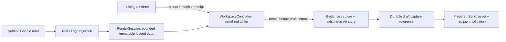

# R3a1 — Typed observed targets and frozen discussion evidence

Status: **Implemented and verified; awaiting completion review, 2026-09-08.** The user approved R3a1 with “네 시작하세요” after reviewing the [design](../proposals/r3a-run-navigation/design.md) and [checkpoints](../proposals/r3a-run-navigation/implementation-plan.md). Source baseline: [hashes](r3a1-review/baseline.json); completed source: [implementation subject](r3a1-review/implementation-subject.json). R3a2 UI and R3a3 Agent behavior remain later approval checkpoints.

## Construction boundary and ownership

Implementation covers portable reference/read-model/evidence contracts, v7 persistence and frozen legacy readers; Main service projections, render observation lifetime, capture/storage/draft preparation; named bridge callers and minimal existing renderer compatibility; tests, schema export and documentation. No engine execution, provider account, packaging, dependency, security privilege or new native-window change is required.

The existing `RenderSession` already owns retained displayed data. Strengthen it instead of adding the proposed parallel `run-observations.ts` cache. Pure functions own normalization, target validation and semantic materialization. Main owns I/O, Project authorization, write ordering and asset lifetime. Preload transports named validated commands; React receives portable data and emits intent.

## Implemented contract and module decisions

| Concept / operation   | Definition and owner                                                                                                                                                                                                                                                                                        |
| --------------------- | ----------------------------------------------------------------------------------------------------------------------------------------------------------------------------------------------------------------------------------------------------------------------------------------------------------- |
| Run task target       | A runtime instance identity plus its observed attempt, including attempt 0 for facts that do not yet have executable logs. `selection.ts` and `reference-target.ts` add v3 targets; authored task IDs remain provenance.                                                                                    |
| Log target            | One Run registration, instance, positive attempt and explicit stdout/stderr stream. `main/service/log-presentation.ts` validates the returned identity and projects portable metadata. No native log path enters the projection.                                                                            |
| Stream selection      | A nonempty half-open range in decoded preview text, with 1-based lines and 0-based UTF-16 columns. `textRange` rejects out-of-bounds and split-surrogate endpoints. These coordinates never claim original-file offsets.                                                                                    |
| Displayed observation | Immutable data retained by `RenderSession` for one visible load generation. A v3 content revision includes semantic facts and excludes observation time. The existing render receipt also binds window session, generation and presentation.                                                                |
| Capture               | `materializeObserved` consumes only Main-retained data. It binds the exact target, content, observed/captured times, engine revision and source bounds into immutable bytes. Log assets contain selected text and metadata; other stream text is excluded. A selected task excludes neighboring task facts. |
| Draft ownership       | `WorkspaceController` checks the receipt, publishes the asset through `ObservedEvidenceCapture`, checks the receipt again, then commits the draft. Closing/replacing the view during publication fails without attaching. A failed workspace write leaves the previous draft intact.                        |
| Prepare / Send        | `EvidenceService` reads and validates the capture, checks recipient/configuration/session and draft binding, and sends those bytes. It does not require the observed attempt to remain current. Existing file/table/scatter preparation stays source-bound.                                                 |
| Reclamation           | `EvidenceStorage` tracks only newly created capture blobs. `retainedEvidenceHashes` traverses draft, submitted and question evidence in every validated recovery root. The Workspace writer coordinates reference checks and removal. Existing untracked blobs are preserved.                               |

New production files are limited to frozen compatibility schemas, normalized log and observed-evidence contracts, the log projection, capture and reference traversal. The existing controller, render lifetime and evidence service retain orchestration. No parallel Run repository, generic panel framework, event bus or new dependency was added.

The workspace format is v7. Frozen v2 references and v1–v6 readers preserve legacy coordinates; migration saves exact original bytes before the first write. Published schema bundles remain unchanged. The Agent toolset stays v4: new task/stream selectors are not accepted by its registered tools. Existing renderer gestures continue to use v2 combined-log coordinates; they now capture the displayed content durably. Separate stream controls and modern selector gestures belong to R3a2.

## Bounds and recovery behavior

Run projection returns at most 1000 instances with available/returned counts. Current-attempt logs retain the native limit of 4096 source bytes per stream. Empty/missing returned text is not proof of an empty source; completeness remains unknown. Render retention caps encoded Run/log JSON at 1 MiB per load and 2 MiB per session, with at most four in-flight loads; these are payload bounds, not process-memory measurements. Hidden or replaced loads lose readiness.

The existing 16-attachment, 64 KiB combined semantic evidence and 64 MiB Project asset limits remain. A capture exceeding the text bound fails explicitly. Capture metadata is part of the hashed bytes. Primary, latest backup and retained migration backup documents keep their referenced assets alive; detaching may therefore retain a blob until a later successful save advances the backup. Missing, invalid, changed or unknown-version recovery documents prevent reclamation. A missing/corrupt saved asset produces an error and is never replaced with current source content.

Cleanup runs before capture and at a successful commit after Project loading, an evidence-reference change or its following backup advancement. Ordinary draft edits do not repeatedly scan recovery roots. Failed publication/commit leaves cleanup pending; the next capture admission also checks for orphan candidates. Cleanup failure preserves bytes and cannot undo a committed draft.

Create: typed Run/log targets, normalized bounded observations and immutable captured assets. Read: current source only during load, retained observed content during capture, captured bytes during preparation/delivery. Update: selection and draft/receipt under one Workspace writer. Delete: release obsolete render loads; reclaim only explicitly tracked capture candidates proven unreferenced by current, backup and retained migration documents. Invalid or unknown storage state prevents reclamation. App close clears readiness; it does not stop a Run. Captured drafts survive relaunch.

## Verification request R3a1-2026-09-08

Electron Development owns construction; Electron Testing owns the test phase. Target: current local macOS arm64 development build with the repository-pinned Electron. Baseline: R2c 196 unit/contract and 42 Electron checks. Source hashes and exact runtime/check results will be recorded on the completed subject.

Lowest-cost behavior checks: contract/projection tests for instance/attempt/stream identity, UTF-16 and bounds; service/controller/storage tests for capture races, quota, tampering, cross-Project access and references; migration fixtures for unchanged old bytes and recursive frozen schemas. Existing real-Electron suite verifies bridge/render/capture/regression behavior. New live provider work belongs to R3a3, and compact task/stream UI belongs to R3a2.

## Verification result

Final `npm run check` exited **0**: formatting, process-specific TypeScript, schema consistency, **218 unit/contract checks** in 19 files and **42 real-Electron checks** passed. [Full final log](r3a1-review/full-check-final.log). Exact environment: macOS 26.5.2 arm64, Electron 44.2.0, Node 25.7.0, React 19.2.8, TypeScript 5.9.3 and Go 1.27.1; [environment record](r3a1-review/environment.json).

| Evidence                  | Result and scope                                                                                                                                                                                                                                                                                                                       |
| ------------------------- | -------------------------------------------------------------------------------------------------------------------------------------------------------------------------------------------------------------------------------------------------------------------------------------------------------------------------------------- |
| Target and capture tests  | 21 new checks cover stream/attempt/revision mismatch, UTF-16 boundaries, omitted unselected text, selected-task isolation, bounded projection, failed save/publication, restart, tampered/missing assets, quota and reclamation roots.                                                                                                 |
| Compatibility             | Frozen v2–v6 workspace schemas equal their published definitions; all six published schema files are byte-for-byte unchanged. Exact v6 migration backup is verified. Existing v1/v2 native migration and saved evidence hashes also pass.                                                                                              |
| Agent input compatibility | Current shared tool v4 inputs exactly match `SharedToolRequestSchema` in the published v6 bundle. [Comparison result](r3a1-review/toolset-compatibility.log).                                                                                                                                                                          |
| Actual window + service   | Keyboard-selected log text is attached, its source advances to attempt 3, the app quits/reopens normally, and attempt 2 is unavailable. Its original excerpt remains previewable and reaches the substituted provider with the original version/hash and no adjacent log text. [Screenshot](r3a1-review/frozen-log-after-restart.png). |
| Regression                | Linked table/scatter, Plot Show/Return, question/reply, immutable history, recovery, compact layout, keyboard navigation and 150% zoom scenarios pass in the full suite.                                                                                                                                                               |

The first full run exposed failures in table mark migration and shared Agent observation. Tracing reproduced a presentation-readiness gap during rapid column-scope changes: source actions could remain enabled while Main had invalidated the previous receipt. `SurfaceView` now disables those actions as soon as a column change starts, through persistence and the next render acknowledgment. A migration test now asserts the shared event before reading persisted data, and the protocol fixture reports observation failure details. The two scenarios passed three consecutive repetitions each after the fix, then passed the full suite. [Initial full log](r3a1-review/full-check.log), [reproduction](r3a1-review/native-regression-repeat.log), [receipt trace](r3a1-review/native-lease-diagnostic.log), [six passing repeats](r3a1-review/native-regression-fixed.log). Temporary diagnostic logging was removed.

Visual inspection confirms that the unavailable current-source view is distinct from the readable saved attachment. The capture dialog has visible controls and a source-version disclosure; it leaves the right Chat and its draft in place. R3a2 still owns the compact task/stream navigation design.

Limits: this stage verified the development build on macOS. Docker and Codex protocol executables are test-local substitutes in the new native scenario; no real analysis or signed-in provider turn was run. Live runtime evidence from Stage 6 is not relabeled as fresh R3a1 evidence. Windows/Linux packaging, prior-attempt fetching, paging, graph/Notebook tools and the new Agent selector/reveal loop remain outside this slice. No engine changes, dependency additions, commits or publication were made for R3a1.

## Next approval subject

R3a2 implements the approved compact User navigation on these contracts: task-instance selection/search/state filter, deliberate companion log opening, separate stdout/stderr selection, observation details and Discuss in the existing composer. Supplement its interaction/ownership sketch before implementation and review its actual UI, keyboard behavior and compact layouts before requesting R3a3.
