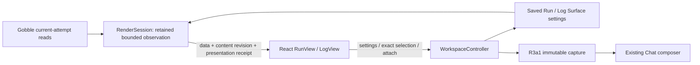
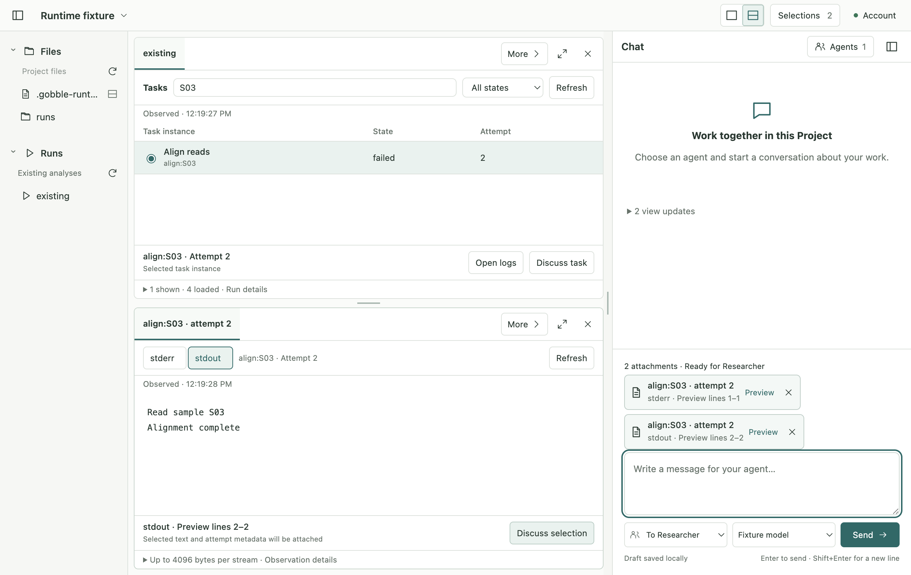

# R3a2 — Task and stream navigation

Status: **Implemented and verified; awaiting user completion review, 2026-09-08.** Implementation authorized by the user's “네 진행해주세요”, following the accepted [R3a1 result](r3a1-observed-evidence.md). This stage implements the accepted [Run/log sketch](../proposals/r3a-run-navigation/sketch.html) and R3a2 checkpoint. [Source baseline](r3a2-review/baseline.json). R3a3 Agent tools remain the next approval boundary.

## Interaction and ownership supplement

```text
Project          Run tab                                  Chat
Files / Runs     Tasks  [Search tasks…] [All states ▾]      Agent recipient
                 ○ Name · exact instance   State  Attempt
                 ● Selected task      [Open logs] [Discuss task]
                 Observed time · Preview counts · Details ▸
                 ─────────────────────────────────────
                 Log tab · exact instance / attempt
                 [stderr] [stdout]              [Refresh]
                 Decoded selectable stream text
                 Preview lines 2–4       [Discuss selection]
                 Observed time · Tail limit · Details ▸   One composer
```



Create: normal Run/log Surfaces receive typed navigation settings. Run selection identifies one instance and its observed attempt; log selection identifies one stream and a UTF-16 range. Open logs reuses the exact attempt resource in the companion Pane. Discuss captures through the existing writer before focusing the composer; it never sends a turn.

Read: Main reads the runtime for an initial load or explicit Refresh. Search, state filter and stream changes re-present retained data and do not silently query a newer attempt. The renderer receives both the existing receipt identity and the R3a1 content revision for v3 targets.

Update: Surface `runView` owns query, exact status filter and presentation counter; `logView` owns stream choice and presentation counter. Existing LocalSelection owns the deliberate task/range, without a duplicate selected-task ID. React owns unfinished gestures, search editing and scroll. A filtered-out task or inactive-stream selection is retained but cannot be attached until visible again. Capture validates visibility and the current receipt in Main.

Delete / recovery: hidden/replaced/closed Surfaces release retained loads. Run/log refresh reserves a new load while retaining its previous bounded content; failure returns that content with an explicit earlier-observation notice. Successful source changes clear only local selections that no longer resolve exactly. Saved attachments survive. No background polling, autoscroll, attempt substitution or engine control is added.

The existing receipt v3 can bind these presentations through its `presentation.view` counter, load generation and Main-retained Surface state. Main additionally validates that a stream/task target is visible under those settings. The input envelope stays unchanged. Workspace v8 stores the new settings; frozen v7 Surfaces/document readers preserve v1–v7 bytes and old combined-log coordinates. Legacy log selections retain a clearly labelled combined preview with an explicit switch to stream mode. A legacy reference reveal uses that legacy presentation instead of guessing stream offsets.

The shared Agent toolset remains v4. It must not claim a modern task/stream view observation using its older semantics; modern view observation/pointing is explicitly unavailable until R3a3. Addressed captured attachments and source reads remain available. No registered input schema is silently widened.

## Source boundary and skeleton

Contracts: new `run-navigation.ts` for settings, stream choice, task filtering and source visibility; frozen `surface-v7.ts` and `workspace-document-v7.ts`; existing Surface, bridge/load, document/migration/export contracts and historical surface membership. Main: existing RenderSession, WorkspaceController, resource opening/model, reference resolution and shared-context admission. No Go engine/service edits or dependency changes are planned.

React: compact `RunView`, new `LogView` and observed-view styles; a bounded Run/log load hook if needed to keep `SurfaceView` composition readable; existing Pane refresh/companion placement, selection labels and composer focus. Shared text keyboard mechanics are reused. Each file owns a concrete domain responsibility, without a universal panel framework or metadata bag.

Implementation order: portable settings and compatibility → Main presentation/refresh/selection boundaries → compact Run and Log consumers → tests, visual review and documentation. All product text is English.

## Testing request R3a2-2026-09-08

Electron Development owns source construction; Electron Testing owns tests and their results. Subject: this stage's recorded source tree on macOS arm64 / Electron 44. Baseline: 218 unit/contract and 42 Electron checks. Formatting, separate process typechecks and generated schema checks establish construction only.

Pure/controller tests cover exact identities, unfamiliar states, templates/attempt 0, filters bounded to 1000 returned tasks, stream mismatch, stale receipts, cached presentation changes, refresh failure/success, capture after source advancement, migration bytes and unchanged v4 tool inputs. Native Electron tests use the real Go service with test-local Docker/provider processes to exercise task → companion logs → mouse/keyboard range → Discuss → restart/Send, identical text in both streams, empty/error tails, compact layout and 150% zoom. Preserve existing table/scatter and legacy reference scenarios. Visual evidence must show actual controls before hover, retained draft/work and honest observation scope. A real provider loop, actual analysis execution and packaging are outside this stage.

## Implemented behavior and design review

The accepted navigation now runs in the actual Electron app. Task rows use the exact
instance and observed attempt, retain unfamiliar engine states, and explain why a
template or attempt 0 has no logs. Search and state filters apply only to the returned
preview. Open logs uses the companion Pane, moving an existing exact-attempt tab
there without duplicating it or discarding other tabs.

The log presenter shows one decoded stream at a time. Native mouse selection and
keyboard ranges feed the same portable target; Discuss captures the addressed text
and focuses the existing Chat composer without sending a turn. Stream, attempt and
preview lines also appear on the attachment cards. Observation details remain
collapsed by default, and primary actions are visible before hover. Short windows
reuse the existing Pane switch; compact width reuses Workspace/Chat navigation.

The construction review resulted in these corrections:

- Extracted asynchronous load/acknowledgment into `useSurfaceLoad`; `SurfaceView`
  composes presenters, while `RunView` and `LogView` own their bounded gestures.
  Pane retains layout ownership. Removed unused large Run-header/dependency CSS.
- Kept navigation and observation refresh separate. Saved settings re-present bounded
  Main data. Runtime errors and render-size admission failures retain the previous
  observation with an explicit failure notice, including after stream switching.
- Invalidated in-flight presentation receipts when filters/streams change. A late
  result cannot revive old readiness, even when its retained content is still reusable.
- Validated active stream/visible task in Main at selection and capture. A successful
  changed-source refresh removes invalid local coordinates, preserving frozen drafts.
- Preserved UTF-16 coordinates, exact-attempt resources and existing capture storage;
  no log paths, inferred original offsets or combined stream chronology are introduced.
- Preserved frozen v1–v7 bundles/readers and exact migration backups. Workspace v8
  adds typed navigation only; published Agent toolset v4 inputs remain byte-equivalent.

## Verification record

`npm run check` exited 0 on the [recorded source](r3a2-review/implementation-subject.json)
and [environment](r3a2-review/environment.json). [Complete log](r3a2-review/full-check-final.log).

| Check | Result |
| --- | --- |
| Formatting, main/preload/renderer/contracts type checks, generated schema | Passed |
| Unit, contracts, storage and ownership | 229 passed across 20 files |
| Native Electron scenarios, including existing R1/R2 flows | 42 passed |
| Published schema bundles v1–v7 | Hashes unchanged; frozen reader equivalence passed |
| Toolset v4 registered input shapes | Byte-equivalent to the published v7 bundle |
| Changed-source selection, stream mismatch, stale completion, size limit fallback | Passed |
| Capture preservation, exact v7 backup, source replacement, normal restart and fixture Send | Passed |

Earlier diagnostic logs are retained in `r3a2-review`. The native scenario uses the
real sandboxed Electron bridge and built Go Project service. Its Docker and Codex
process peers are test fixtures; it does not establish a real model's interpretation
or execute an analysis.

The first unit diagnostic was an expected-message mismatch in a new negative test;
its rejection behavior was correct. Native diagnostics corrected the test's assumption
that an asynchronously saved radio is checked immediately and that every compact
window uses the short-height Pane switch. Visual captures confirmed the app's existing
height-based layout behavior. These were not resolved by weakening source validation.

R3a3 remains outside this implementation: versioned Agent observation/point tools,
distinct Agent marks and explicit Show/Return restoration for task and stream targets,
plus a real signed-in Agent trial. No production-provider turn, engine mutation,
packaging, commit or push is part of R3a2.


## Native visual review

Reviewed the final app captures at 1280×840, 900×650 and 1280×840 with 150% page zoom.
Task controls, stream choice, Refresh and Discuss remain readable before hover.
At 900×650 both panes fit; the 150% layout uses the existing short-height pane switch.
Task IDs remain next to labels, details are collapsed, and the failed-refresh banner
coexists with the retained text and both captured draft cards. The restart capture
shows attempt 3 in Run, an honestly unavailable attempt-2 source, and the preserved
attempt-2 attachment. No live-provider or live-analysis claim follows from these images.

- [Task, log and one Chat composer](r3a2-review/r3a2-task-log-chat.png)
- [Refresh failure with retained observation](r3a2-review/r3a2-refresh-failed.png)
- [Compact two-pane layout](r3a2-review/r3a2-compact.png)
- [Tasks at 150%](r3a2-review/r3a2-tasks-zoom-150.png) and [log at 150%](r3a2-review/r3a2-zoom-150.png)
- [Frozen attachment after normal restart](r3a2-review/r3a2-frozen-log-after-restart.png)



Next approval: R3a3 — let the Agent observe and point to exact task/stream targets,
then show that reference and return without changing the User's selection or draft.
Before construction, supplement the tool/version and temporary-presentation ownership
diagrams against this implementation. The signed-in provider trial belongs there.
