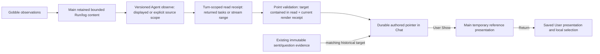

# R3a3 — Agent observations and temporary references

Status: **Completion accepted by the user on 2026-09-08.** Implementation was authorized by the user's “네 진행해주세요”, after accepting
[R3a2](r3a2-task-log-navigation.md). The accepted [R3a design](../proposals/r3a-run-navigation/design.md)
and checkpoint define this bounded outcome. Source baseline: [hashes](r3a3-review/baseline.json).
Electron Development owns construction; Electron Testing owns test design and evidence.

## Before-code sketch and ownership supplement

```text
User view: stderr + local range          Chat
                                       Agent: stdout explains the failure
                                       [Show in view] [View captured evidence, when available]
Explicit Show:
Reference view · Researcher [Return to my view]
stdout · amber Agent range
User stderr, selection and scroll retained underneath
Return: previous base view and source focus
```



The toolset becomes `shared-views-v5`; old provider bindings require the existing
explicit new-conversation flow. v4 input definitions are frozen. The contract export
bundle becomes v9, while the durable Workspace document stays v8 because no persisted
field changes. Main/preload/renderer rebuild together; no new Electron mechanism or
dependency is introduced. Pinned Electron 44.2.0 / Codex 0.153.4 local protocol records
remain applicable.

Create: observe issues a bounded, turn-scoped read ID. It identifies only returned
instances/attempts or the returned stream range. Point must provide that read ID and
matching current renderer acknowledgment for v3 targets. A source read alone does not
prove a displayed screen. Publishing a pointer never navigates or sends a message.

Read: default observe describes the displayed filter/stream. Explicit source-preview
can inspect another stream or task in the same retained observation without changing
User settings. Structured task results stop at the message size limit; they never
truncate JSON midway. Log coordinates remain decoded preview UTF-16 positions. Empty
streams are observable but cannot produce a nonempty range pointer.

Update: User Show creates a temporary reference presentation from matching content,
expands only its task filter or changes only its stream. Main binds that override to
the render receipt. User base settings, local selections and draft are preserved.
React retains base scroll during Show/Return and returns focus to the source. Existing
protected tab/Project policies still apply. Return restores prior active tabs when
still present; it does not roll back new tabs, resized geometry or unrelated work.

Delete/recovery: read IDs expire with their turn and cannot survive refresh, hiding,
Project switch, cancellation or account revocation as valid visual proof. Reference
presentation is transient and is cleared on return, closure, Project switch or restart.
A historical bare pointer reports its missing snapshot rather than substituting a
new attempt. Existing captured sent/question evidence that contains the target can
be opened through the existing preview. Pointers do not create a second asset store.

## Affected source set and order

Contracts: `shared-tools` frozen v4 / current v5, `shared-context`, new observed
reference/read-scope helpers, SurfaceLoad and schema export. Durable document shapes
and published bundles v1–v8 remain unchanged. Main: shared-context observations/read
receipts/host/catalog, Codex collaborator instructions, protected Agent opens;
workspace temporary-reference owner/controller/render receipts. React: observed
reference banner/presenter, Run/log Agent marks and source scroll/focus, Chat reference
cards and existing evidence preview. Tests: contract/host/controller and native UI
fixtures; isolated signed-in Agent trial harness. No Go engine, dependency, packaging,
release, unrelated Project or synced source edits.

## Testing request R3a3-2026-09-08

Baseline: 229 unit/contract checks and 42 native Electron scenarios. Construction:
format, process-specific type checks, generated bundle and built entries. Behavioral
proof: filtered Run observations, same-text different streams, returned-range
containment, stale/cross-turn/cross-Project receipts, explicit source scope, no focus
steal on pointer arrival, Show/Return preserving selection/filter/stream/scroll/draft,
historical pointer refusal and saved evidence preview, v4 renewal, normal restart.
Native regression uses process fixtures. A separate real signed-in Agent trial uses
only synthetic task/log data, records delivered text and tool responses, and checks
its actual reference; no real analysis execution or user file disclosure is needed.

## Implementation review — 2026-09-08

R3a3 is implemented, verified and accepted by the user on 2026-09-08. No next R3
family, commit or publication is included in this checkpoint.

| Owner | Final responsibility |
| --- | --- |
| `contracts/shared-tools-v4`, current `shared-tools`, `observed-reference` | Frozen v4 inputs; v5 requests and transient reference presentation; pure target containment. Export bundle v9, durable Workspace v8 unchanged. |
| `main/shared-context/observed`, `run-observation` | Per-turn read scopes, bounded complete task records and stream excerpts. `workspace_point` additionally requires current Main render proof. Source-only reads never authorize visual pointing. |
| `main/workspace/observed-reference-views` | One bounded temporary observation, original return destination across repeated Show, explicit stale refusal, base-edit guard and lifecycle cleanup. |
| `main/workspace/controller`, `render-session` | Serialized authorization/commit and resource reads; matching ready data; reference-bound render receipts. Current-task search reloads a bounded Run preview and leaves historical pointers unchanged. |
| `renderer/ObservedReferencePanel`, `RunView`, `LogView` | Read-only Agent presentation, distinct marks, retained mounted base state and source focus. Keyboard log navigation now follows the selected caret. |
| `renderer/shared-context/captured-reference`, `ReferenceEvent` | Chat affordances and lookup of an existing explicit task/range capture. Historical preview reuses the established evidence UI/storage path. |
| `main/questions/service` | Typed Run/log question observations use the established immutable observation materializer. No second capture store. |

### Verification

The complete [App check](r3a3-review/full-check-1.log) exited 0: formatting, process-specific
TypeScript checks, schema generation consistency, **235 unit/contract checks in 21 files**,
service/desktop build, and **43 native Electron scenarios**. The focused tests cover
filtered Task scope, identical text across streams, wider/foreign/expired receipts,
UTF-16 surrogate boundaries, empty streams and bounded task JSON. Host tests cover
Show/Return, blocked base edits, stale point proof, refreshed current-task search and
historical refusal. Existing cancellation, account, Project and render lifecycle tests
remain passing. [Compatibility checks](r3a3-review/compatibility.json) confirm all published
v1–v8 bundles and the durable v8 document shape are unchanged.

Native review exercised filtered task → logs → exact capture → Chat → Agent pointer →
Show/Return → changed source → captured evidence → current Task → normal quit/reopen.
It confirmed untouched local filter, stream, selection, scroll and draft for the mounted
Run/log views, source focus on Return, disabled Refresh in a temporary reference, and
persistent history after restart. The first focused native attempt exposed keyboard
selection that did not scroll into view; this was fixed and the complete suite rerun.

Screens: [Agent reference](r3a3-review/r3a3-reference.png),
[User return](r3a3-review/r3a3-return.png), [historical evidence](r3a3-review/r3a3-historical.png),
[900×650](r3a3-review/r3a3-compact.png), [150% zoom](r3a3-review/r3a3-zoom-150.png).
Small enlarged windows use the existing pane switcher; the reference and Return remain
visible. Task lists remain scrollable or can be maximized. Visual review removed repeated
Agent prose from the central reference content to leave more space for the actual excerpt.

### Real signed-in Agent trial

A new synthetic Project and `Run reviewer` Agent used the connected account and the
App's available `gpt-6-astra` model with `shared-views-v5`. The real Agent reported both
attached excerpts exactly: `ERROR 😀 exact` (stderr) and `Alignment complete` (stdout),
`align:S03`, attempt 2, engine revision `fixture-revision-4`.

Three initial attempts lost OS foreground focus and were correctly refused. For the
successful trial the harness held the actual native window foreground for at most
50 seconds, then removed that temporary setting. Product guards were not stubbed or
changed. The real Agent obtained current receipts and published **two distinct targets**:
`prepare`, attempt 1 (completed and outside the User's S03 filter), and stdout line 2,
UTF-16 columns 0–18. The visible stream stayed stderr and the composer retained focus.

Actual Show/Return highlighted `Alignment complete`, then restored the User's
`ERROR 😀 exact` selection and source focus. Surface settings, local selections and Chat
state compared equal before/after. The captured preview also returned `Alignment complete`.
See [delivery and tool responses](r3a3-review/live-provider-delivery.json),
[assertions and references](r3a3-review/live-review.json),
[actual Agent reference](r3a3-review/live-agent-reference.png) and
[actual User return](r3a3-review/live-user-return.png).

This proves a real provider turn through the App's tools and capture path. Runtime data
was synthetic, delivered through the actual Go App service and a test-local Docker process;
**no bioinformatics analysis, real Docker execution or new native engine validation ran**.
The [environment](r3a3-review/environment.json) and trial harnesses make this distinction explicit.
Existing four Project documents were byte-identical after the trial
([preservation record](r3a3-review/live-profile-preservation.json)); account credentials
were not read or copied. The prior active Project/window was restored and the normal App
relaunched without the synthetic runtime override.

### Limits and next approval

Pointers contain addresses and authorship, not source bytes. A closed/evicted source needs
a current read; if it changed, Show refuses instead of substituting another attempt. Native
scroll retention applies while the base presenter stays mounted; reopening a closed view
starts a new preview. Captured evidence is offered only for an existing containing explicit
Task/range capture; a bounded whole-Run capture is not assumed to contain every task.
`Find current task` searches the current preview using up to 200 identity characters and
never claims whole-Run absence. Historical-attempt engine access, live streaming, larger
Run pagination and another viewer family remain outside R3a3.

The next implementation family starts only after the user accepts this checkpoint and
reviews its scope, ownership diagram and sketch.
