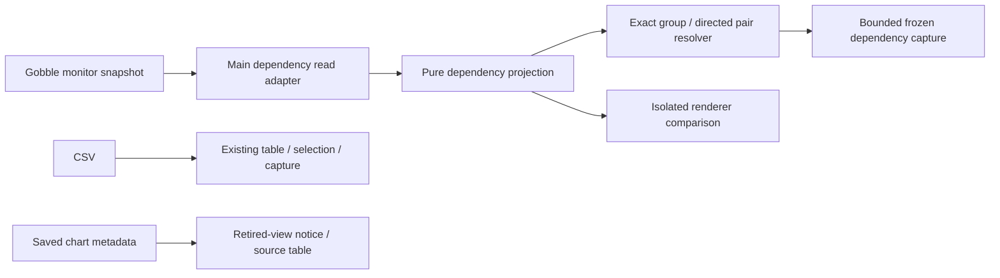

# R3b1 — Dependency facts and CSV chart retirement

Status: implemented for owner review on 2026-09-08. The user authorized R3b1 and explicitly
removed CSV chart creation from scope and the existing product. R3b2 UI and R3b3 Agent graph
integration remain separate approval checkpoints.

## Authoring contract

Owner: Codex, author mode using TypeScript Development; Electron Testing owns the recorded
verification claims. User requirements: compact Project workbench, English UI, exact shared
references, clean boundaries, staged review; CSV remains a selectable table.

1. Remove chart creation/settings/rendering and the Plotly dependency. Reject retired requests
   at Main, remove Agent chart-open arguments with toolset renewal, and keep existing saved
   chart metadata/evidence readable. An old chart tab offers its source table. No stored bytes
   or migration identities are silently rewritten.
2. Add a closed dependency read/observation contract, exact group/directed-pair targets, pure
   validation/projection/resolution and bounded immutable capture. Preserve current Run/task/log
   contracts and their hash algorithms. New dependency targets are not yet accepted by the live
   workspace/Agent bridges.
3. Compare a small read-only renderer with React Flow + Dagre in an isolated Electron qualification
   harness; no general viewer registry, plugin framework or runtime graph dependency is added here.

## Typed ownership sketch

The source adapter preserves unavailable, reported-empty, malformed and bounded topology. The
projection owns labelled grouping, counts and diagnostics; it never derives a group execution
state or instance routing. The renderer owns only geometry and translates events to semantic IDs.
New target/capture APIs remain separate from current evidence unions until R3b2 integrates them.
This is preferable to widening every existing Run reference and changing old hashes now.

## Project kinds and consumer paths

- Workspace library: `app/contracts/src/index.ts`; `app/contracts/tsconfig.json`; source imports by
  Main/preload/renderer and test runners; generated JSON bundle through `contracts/scripts/export-schema.ts`.
- Desktop: Electron 44.2.0; Main `desktop/src/main/index.ts` → `desktop/out/main/index.js`, preload
  `desktop/src/preload/index.ts` → `desktop/out/preload/index.cjs`, React renderer → `desktop/out/renderer`.
  Exact configs: `desktop/tsconfig.main.json`, `desktop/tsconfig.preload.json`, `desktop/tsconfig.renderer.json`.
- Test/build tooling: Node 25.7.0; `app/tsconfig.tools.json`, `app/vitest.config.ts`,
  `app/playwright.config.ts`; Go service built through the existing App script. No distribution,
  installed package, update, release or remote deployment claim is made.

Affected owners: contracts, Main service/workspace/shared-context, renderer table/legacy view,
focused fixtures/tests, App dependencies and current design/status documentation. External inputs
are monitor JSON, IPC/Agent arguments and stored workspace/capture bytes; all require runtime parsing.
Unrelated engine modifications and synced `sources/` remain outside the affected set.

## Verification request R3b1-2026-09-08

Consumer: implementation review before R3b2. Freeze baseline hashes before changes. Verify old
schema bundles and evidence hashes; malformed/missing/empty/truncated/cyclic topology; group and
direction identity; stale/cross-Run targets; bounded capture; no source mutation; active CSV table
selection and Discuss; rejected chart opens; saved chart recovery and historical capture reading.
Run focused unit/contract checks before native Electron tests, then the App's final `npm run check`.
Qualify graph candidates separately under the existing production CSP, with keyboard, selection,
large bounded fixtures, native 150% zoom and teardown. Report measured results without generalizing
one-machine timing to all users. Representative graph usability remains an R3b2 owner walkthrough.

Baseline: [r3b1-review/baseline.json](r3b1-review/baseline.json). Failures and corrections retain their
logs; test changes must reflect this approved behavior change, not hide defects. Each result states
passed/product defect/test defect/environment gap/unsupported/not run as appropriate.

## Implemented ownership and APIs

| Module | Input → output and responsibility |
| --- | --- |
| `main/service/dependency-presentation.ts` | `presentDependencies(unknown) → DependencyRead`: validate a coherent monitor envelope, inspect at most 1,000 edge entries, preserve missing/invalid/empty/partial topology, and enforce the 1 MiB read bound. No separate Plan query. |
| `contracts/dependency-projection.ts` | `projectDependencies(unknown) → DependencyObservation`: group returned instances by authored task ID, preserve exact attempt/template/state facts, detect cycles iteratively and return bounded groups/edges with explicit scope. |
| `contracts/dependency-resolution.ts` | `resolveDependencyTarget(target, source?)`: exact returned ID/direction/Project/Run/revision or historical/unavailable. `readDependencyCapture(unknown)` additionally validates archived endpoint membership/count relationships. |
| `main/evidence/dependency-capture.ts` | `dependencyRevision(observation)` owns a separate versioned hash. `captureDependency(observation, target, capturedAt)` freezes selected group/edge context and returns capture, bytes and content hash. `readDependencyCaptureBytes(bytes, expectedHash)` validates size, integrity and semantics. |
| `qualification/run-dependencies` | Isolated Electron comparison of two renderers over the same projection. Product code imports neither adapter yet. |

`run-dependencies.ts` owns the closed schemas and limits. Read, observation and capture are v1;
the portable dependency target is v4. These are exported in bundle v10. The live Workspace
remains v8 and its EvidenceRef union remains v2/v3; activating dependency targets is later work.
No broad controller, renderer state store, plugin registry or second evidence store was added.

A **group** is an authored task ID and its returned runtime instances. Its counts describe that
observed preview, including templates and unstarted/attempted members. A group has no invented
aggregate execution state. A **dependency** is an exact directed pair of authored task IDs from
the same monitor response. It does not assert a sample-to-sample edge or a cause of failure.
Missing task IDs remain unmapped; missing preview members are never declared absent from the Run.

The projection returns at most 80 groups and 200 edges. Over-limit, malformed, truncated or
cyclic topology is explicitly diagnosed and uses list fallback; missing topology is unavailable.
Captures include at most 100 whole member records per selected endpoint and 64 KiB total. Size
trimming removes records, preserves identities/counts, and declares truncation. Oversized fixed
metadata is refused. Log bytes, native paths and camera coordinates are never implicit content.

## CSV retirement and compatibility

Removed chart creation buttons, plot settings, scatter rendering/assets, Plotly, active chart
mutation helpers and Agent chart-open arguments. Old IPC chart actions receive an explicit
refusal before receipt replay, I/O or mutation. `shared-views-v6` activates this smaller Agent
tool surface through the existing conversation-renewal flow; frozen v5 input schemas remain.

CSV selection, sorting, column choice and **Add to message** continue through the existing table
and capture owners. Legacy chart tabs show **Chart view retired** with **Open source table**.
They cannot acquire a ready render receipt. Saved chart pointers reveal exact source rows in a
table, while captured metadata stays readable and historical targets never relocate to new data.
Pure legacy validators/projections remain only for saved formats; chart generation is not hidden
behind a feature toggle. New tables create no `ViewLink` or chart state.

[CSV table and attachment](r3b1-review/csv-table.png) and [legacy chart recovery](r3b1-review/legacy-chart-recovery.png)
are native captures from synthetic temporary Projects. The central table and right Chat retain
the existing compact layout, English controls and a single composer.

## Renderer decision and evidence

Choose minimal HTML/SVG for initial R3b2. Both it and pinned React Flow + Dagre passed the bounded
Electron qualification; the smaller integration fits this read-only overview. No graph package
was added to the product. The [decision record](r3b1-review/renderer-decision.md) includes primary
sources, native images, exact measurements, visual limitations and the remaining camera work.
The comparison harness is not the final graph UI and proves no general usability claim.

[Verification record](r3b1-review/verification.md): final static/schema/build checks, 248
unit/contract tests and 40 native Electron scenarios passed, plus the separately qualified graph
harness. The final native CSV subset passed again after strengthening visible readiness checks.
The extra final unit case verifies archived pointer recovery with an existing table, a closed
source and a changed revision. Earlier failures and their classification remain in the record.

The [compatibility audit](r3b1-review/compatibility-audit.json) confirms unchanged v1–v9 bundles,
current v8 Workspace shape, old Run/evidence hash and capture sources, and all 78 baseline files
outside the App. The exact affected source set is in [implementation-subject.json](r3b1-review/implementation-subject.json).

## Next approval boundary

This checkpoint completes CSV chart retirement and dependency data/target/capture foundations.
**R3b2 has not started.** After owner approval, show the stage-specific sketch and implement
Tasks/Dependencies within the existing Run Surface, compact group/member detail, exact attempt
log navigation, explicit view camera/list behavior and User selection → frozen attachment.
R3b3 separately adds versioned Agent observation/pointing and temporary Show/Return.

No installed build, signing, packaging or distribution change is included. Existing scientific
result viewing remains a separate product capability; CSV-derived chart building is excluded.
