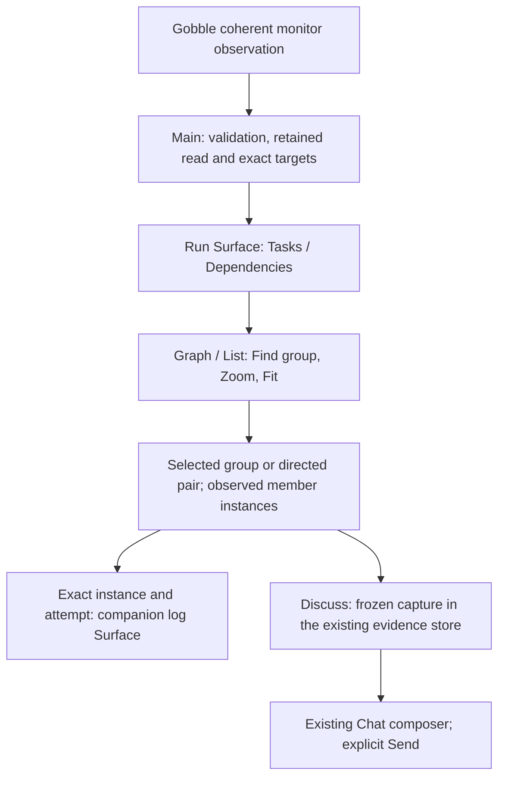
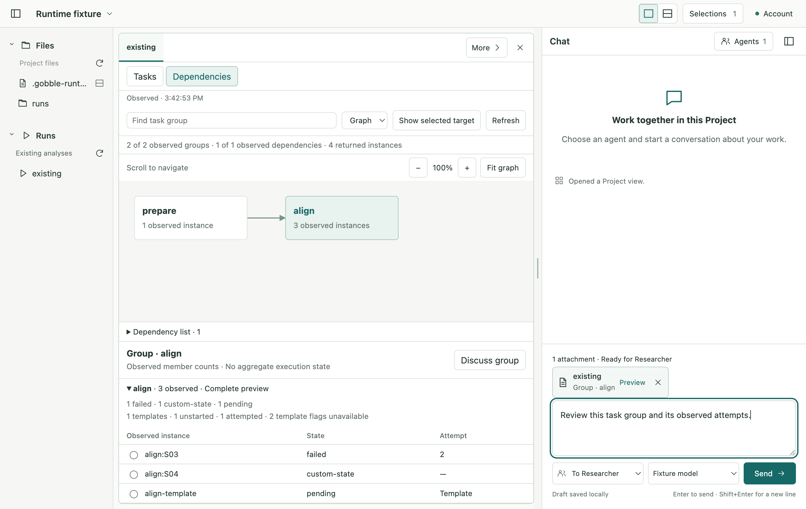

# R3b2 — User Run dependency navigation

Status: R3b2 implemented and verified for owner review on 2026-09-08, following the owner’s R3b1 acceptance and R3b2 implementation approval.
Scope: existing Run Surface → Tasks/Dependencies → exact group/dependency/member selection →
exact-attempt companion logs or frozen attachment in the existing Chat composer. CSV chart
creation remains removed. R3b3 Agent graph tools, new transports and packaging remain separate.

## Before-implementation sketch

The Project shell, Pane layout and Chat remain unchanged. Dependencies occupies the current Run
Surface; a compact detail area shows observed counts and instances. A textual graph/list alternative
makes every edge available without hitting a thin line. The selected group, dependency or instance
is one LocalSelection. Mode switches preserve its identity, task filters and dependency navigation.
A group has no aggregate execution state. Attempt zero/templates cannot open logs.

## Complete implementation skeleton and boundaries

- Contracts: add optional dependency observation beside the unchanged Run presentation; activate v4
  targets for local selection/attachments; preserve v2/v3 source hashes and frozen storage readers.
  Workspace v9 adds Run mode and dependency view navigation; original v8 bytes get a backup before
  migration is persisted. Contract export advances to v11; old bundles remain immutable.
- Main service: one monitor call feeds the existing Run presenter and dependency adapter. A dependency
  projection failure has its own unavailable explanation; existing task facts remain usable.
- Main workspace: retain the same source read, validate exact target and render receipt, persist
  mode/camera through existing serialized commands. Camera state never changes source identity.
- Main evidence: route dependency capture into the existing immutable blob store and normal
  prepare/preview/send path. No new cache, store or polling loop. Historical captures remain readable.
- React: RunView owns mode composition; the existing task presenter retains its task/filter behavior.
  A focused dependency view owns navigation/detail; one HTML/SVG adapter owns layout, hit targets,
  camera and native keyboard/scroll. A small capture presenter owns readable saved dependency facts.
  Pane owns log placement. Surface loading retains its current cancellation/readiness lifecycle.
- Agent v6 observe/point inputs stay frozen. A dependency display cannot be advertised as a task
  observation by the old view tool. Source-preview reads remain explicit. New graph tools are R3b3.

Persistent: Run mode, Tasks query/state, Dependencies graph/list and query, camera; semantic
LocalSelection; captured draft. Derived: groups/counts/layout, visible members, capability labels.
Transient: incomplete search input, pointer/scroll gesture, pending command and loading/error state.
No animation or automatic re-fit on refresh. Errors use the existing Run notice and explicit retry.
Existing renderer error containment and host interfaces are reused; no new privileged API is added.

## Ordered slices and verification request R3b2-2026-09-08

1. Frozen contracts/migration, coherent read and target/capture integration; verify old schema/hash
   fixtures, exact scope/direction, immutable capture, stale refusal and v8 backup/restore.
2. Complete Run UI composition, graph/list/detail/camera and capture preview; verify native pointer
   and keyboard paths, group → exact attempt → logs, Discuss without Send, source refresh and restart.
3. Compact/zoom visual review against 1280×840, 900×650 and 150%; empty/missing/partial/cyclic/large
   fixtures, no-hover action reachability and retained User draft/filter/camera/selection.
4. Final affected-set design review, complete App checks, source hashes and limitations. Present the
   result to the owner before R3b3. No commit, push or release is requested.

Request owner: implementation author (React Development + TypeScript/Main integration); testing
owner: Electron Testing. Consumer: owner review before R3b3. Subject: baseline.json and final source
digests; target macOS arm64/Electron 44.2.0/React 19.2.8/TypeScript 5.9.3. Existing Vitest/Playwright
and production Electron build/CSP are retained. Static checks prove construction; unit/contract
checks prove pure and storage semantics; native tests prove IPC/rendering/restart/focus behavior.
Failures retain first logs and classifications. Windows/Linux, installed lifecycle, signing/update,
new live Agent tools and general usability claims are outside this checkpoint.

## Design activity dispositions

Identity: accepted Project/pane/Chat brief → current live tokens and [R3b design](../proposals/r3b-run-dependencies/design.md).
Actor is Codex; owner approval is the authority for implementation. For every activity below,
reopen if its stated evidence no longer supports the same bounded workflow. No user study is implied.

| Activity | Exactly one disposition | Current evidence, decision and limits |
| --- | --- | --- |
| Discovery | Reused current evidence | R3b research and R3b1 source/renderer qualification, 2026-09-08; same Run observation and desktop audience. No new library/platform assumption; revisit if source availability changes. |
| Requirements | Performed for the current subject | Owner approval and CSV removal mapped to the scope, ownership and pass conditions above. No broad viewer platform; revisit if exact targets or compact interaction conflict. |
| Concepts | Reused current evidence | Prior Tasks/Dependencies versus separate-pane graph comparison and accepted sketch. Existing Run Surface selected; separate-pane alternative consumes the log comparison space. No hierarchy change is introduced here. |
| Prototype | Performed for the current subject | Before-implementation ownership sketch above, followed by real bounded renderer/UI slices. Prior prototype is synthetic, not product proof; native failures reopen the relevant interaction. |
| Representative-user testing | Reused current evidence | Owner's 2026-09-08 review/approval of the Run concept and simplification scope. This supports owner preference only; production walkthrough is returned at this checkpoint and cannot establish general usability. |
| Collaboration | Performed for the current subject | This skeleton links Main, contracts, React, capture, tests and recovery. Exact affected paths/results will accompany the implementation; conflicts return to their earliest owner. |
| Post-release improvement | Not applicable with exact reason | This is an unreleased source-checkout checkpoint, with no deployed graph UI or telemetry. Release evidence cannot affect its current construction decision; no ongoing monitoring is created. |

Success means choosing the intended group, directed pair or attempt and retaining it in the draft.
Click count or time alone is not a productivity measure. Mistaking a group for one sample, treating
an arrow as causal evidence, losing the selected target or obscuring controls reopens the design.

## Implemented module and API review

| Owner | Input → output / boundary |
| --- | --- |
| `contracts/dependency-navigation.ts` | Closed mode, query/representation and camera intents; persisted state has all three. Independent updates prevent a late camera write from replacing search. |
| `contracts/reference-v3.ts`, `*-v8.ts` | Frozen historical and Agent request readers. Current local EvidenceRef accepts v4; historical content does not acquire new fields. Workspace migrates 8 → 9 with exact-byte backup. |
| `main/workspace/service.ts` | One native Run observation → unchanged task presentation plus bounded dependency projection. Projection failure has an independent explanation. |
| `main/workspace/render-session.ts`, `selection.ts` | Retained coherent data, separate dependency revision, exact render authority and the existing memory bound. Optional dependency context cannot displace admissible Tasks. |
| `main/workspace/model.ts` | Serialized mode/filter/camera changes preserve one LocalSelection. Camera writes do not advance semantic view identity. |
| `main/evidence/dependency-evidence.ts` | Dependency capture → existing immutable publication, validation, preview and delivery. Saved bytes never consult a later Run. |
| `renderer/workspace/views/RunView.tsx`, `RunTasksView.tsx` | RunView owns the mode and common freshness/readiness notice; task view retains its filter and exact attempt/log behavior. |
| `views/dependencies/DependencyView.tsx`, `DependencyDetails.tsx` | Graph/list/search coordination and exact group/pair/member actions. Edge endpoint details are collapsed initially to preserve reading space. |
| `views/dependencies/DependencyGraph.tsx`, `dependency-layout.ts` | Bounded HTML/SVG layout, keyboard nodes/list equivalents, scroll/zoom/Fit and explicit reveal. Geometry never supplies semantic identity. |
| `renderer/evidence/DependencyEvidence.tsx` | Readable saved group/edge facts. The presenter cannot query a current Run. |

The existing Project shell, Pane placement and composer are reused. No graph framework, CSV
chart creation, extra discussion window or new transport was added. The graph is read-only.
New or modified App files and exact source digests are recorded in the
[implementation subject](r3b2-review/implementation-subject.json).

## Native walkthrough and expected result

1. In a Run's Dependencies mode, select a group by keyboard or pointer. Separate member counts,
   templates and exact instance/attempt rows appear. An edge represents the reported directed Task
   pair, without sample routing or causal inference.
2. Select a real attempt and open its logs in the companion Pane. A template or attempt zero has
   no log action. Switch to Tasks and recover a selected row hidden by the prior filter.
3. Select a directed dependency and Discuss. The existing composer receives one frozen attachment
   and focus; no message is sent. Preview identifies exact endpoints and observed attempts.
4. Switch modes, search, pan/zoom and restart. One selection, prior Tasks filter, dependency camera
   and draft remain. Refresh failure retains the last observation. A changed source cannot relocate
   the old target or alter already captured evidence.
5. Use list fallback for missing/cyclic/bounded topology. Search can temporarily hide a selected
   group; Show selected target restores it. At 900×650 and native 150% zoom the selected identity,
   member details and Discuss action remain reachable through ordinary scrolling.

Final evidence, first failures and exact limits are in the
[verification record](r3b2-review/verification.md). R3b3 remains unimplemented and needs the
owner's next approval: versioned Agent group/edge observe/point, distinct marks and temporary
Show/Return while preserving User mode/camera/selection/draft.

## Completed verification and owner review

Final full App checks passed: **254 unit/contract tests and 42 native Electron scenarios**, plus
formatting, process type checks, generated schema consistency and production build. Old schema
bundles and Agent request shapes remain unchanged. All 78 baseline engine/service code files were
untouched. [Exact results and limitations](r3b2-review/verification.md).

[Split panes and attachment](r3b2-review/dependency-discussion.png) ·
[Saved evidence after source refresh](r3b2-review/dependency-frozen-preview.png) ·
[Small window at 150%](r3b2-review/dependency-compact-150.png) ·
[Visual review checklist](r3b2-review/visual-review.md).

These are real built Electron captures from temporary synthetic Projects. Provider/monitor
fixtures do not establish live Agent graph support; that remains the explicitly separate R3b3
checkpoint. This report is the next owner review gate, not approval to begin R3b3.
