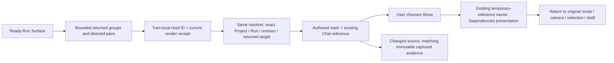
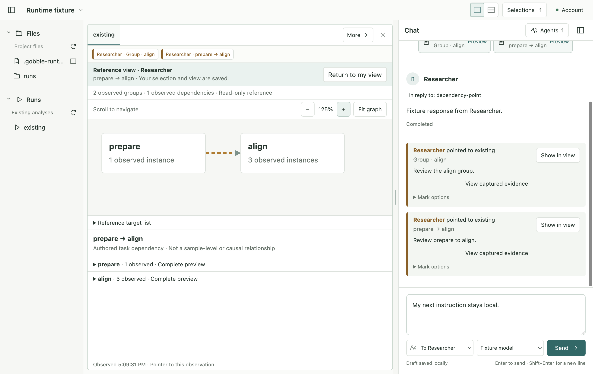

# R3b3 — Agent dependency references

Status: implemented, verified and accepted by the owner on 2026-09-08. Authorized after R3b2 on 2026-09-08. This checkpoint implements
versioned Agent dependency observations/pointers, distinct marks and temporary Show/Return,
then returns a verified result for owner review. CSV chart creation stays removed.

## Before-implementation sketch and scope

Gobble owns monitor facts; the Go service owns access and Run association; App Main owns
observation scope, authorization, published references, temporary presentation and immutable
captures. React owns graph geometry and temporary camera. No new transport, evidence store,
polling loop or graph dependency is introduced. Arrival never navigates or steals input focus.

A group/pair pointer needs a view-scope read from a currently displayed Dependencies mode,
an exact returned target, and that read's still-current render receipt. A `source-preview` read
can explicitly request dependency content from Tasks but is not a visual observation and cannot
publish a mark. Agent tools never switch the User's mode just to obtain authority. An existing
mark can later be shown across modes without altering the durable User view. Separate source
lookup is labelled `Find current group` / `Find current dependency`; it never rewrites an old mark.

## Whole implementation skeleton and ordered slices

1. Contracts: freeze SharedReference v3, toolset-v6 inputs and Workspace v9 reader; advance current
   Workspace to v10, export bundle to v12, and shared tool binding to v7. Preserve all old bundles
   and captured bytes. New Run `representation` input separates requested content from displayed
   mode. Existing v4 target semantics are reused; no new identifier or coordinate system.
2. Main observation: `shared-context/dependency-observation.ts` builds bounded returned group/pair
   facts and exact targets; `ObservedReads` remains the sole turn-local receipt owner. No graph
   snapshot cache. Whole records and endpoint context are bounded; omitted targets gain no authority.
   Existing host guard/recheck/serialized publish protects against stale, hidden, cross-Project,
   unreturned, source-only, cancelled and duplicate tool calls.
3. Main presentation: extend `ObservedReferenceViews` and its existing guard/recovery, retaining the
   original Surface state. Explicit current dependency search opens current data in list mode and
   clears only that view's local selection; it is not automatic historical-target substitution.
   Existing capture lookup can match exact v4 captured targets in prior sent/question evidence.
4. React: pass exact current marks through RunView/DependencyView to graph/list nodes and pairs.
   Label author and use a separate visual treatment from User selection. Extend the existing
   reference panel with a focused read-only dependency presenter and its own transient camera.
   Base view remains mounted and hidden during Show. Existing Return and Chat remain the controls.
5. Verification: pure scope/bounds/target tests, real storage migration/capture/controller tests,
   native scripted pointer arrival/Show/Return/stale/restart/compact scenarios, then one real
   signed-in Agent trial using synthetic data and the actual registered tools. Preserve original
   Project/profile state during that trial. Finish with full App checks and source digests.

Persistent: authored references and User Workspace settings. Transient: turn-local read receipts,
current render authority, one temporary reference session/camera. Derived: marks, displayed counts,
matching captures and target resolution. No source revision depends on presentation coordinates.
Shared questions already consume capture IDs; dependency selected observations use the same
publication path. Whole-graph reads do not fabricate one selected evidence target.

## Evidence request R3b3-2026-09-08

Implementation owner: current task's React/Main/contract author. Testing owner: Electron Testing
workflow, exercised by this same task. Consumer: owner approval after this checkpoint. Baseline:
[r3b3-review/baseline.json](r3b3-review/baseline.json). Target: macOS arm64, Electron 44.2.0,
React 19.2.8, TypeScript 5.9.3, installed Codex 0.153.4. Existing strict per-process configurations,
react-jsx, renderer-only DOM libraries, Vitest/Playwright, built CSP and named bridge are reused.
No compiler, lint, SSR or installed-package migration is introduced. No performance improvement is
claimed; output/record limits are executable invariants and the R3b1 bounded layout remains.

Map pure scope/direction/version checks to Vitest; storage and serialized authority to Main
integration; focus, native controls, Show/Return, renewal and restart to actual Electron. A scripted
provider proves delivered fields and UI integration; the real Agent trial separately proves actual
registered-tool use. Windows/Linux, installed lifecycle/signing/update and general usability are
unsupported claims for this checkpoint. Retain first failures and classify each correction.

## Design activity dispositions

Actor: current implementation author; accepted Project/Pane/Chat identity and R3b sketch are the
source of interaction decisions. These results apply to this owner-approved extension only.

| Activity                    | Disposition                       | Evidence, decision and reopening condition                                                                                                                                                              |
| --------------------------- | --------------------------------- | ------------------------------------------------------------------------------------------------------------------------------------------------------------------------------------------------------- |
| Discovery                   | Reused current evidence           | R3b research, R3b1 renderer qualification and R3b2 implementation reviewed on 2026-09-08. Same coherent Run facts and audience; reopen on a new source capability or unavailable field.                 |
| Requirements                | Performed for the current subject | Current owner approval maps to exact pointers and reversible Show above. Reopen if authority would require changing User state or source meaning.                                                       |
| Concepts                    | Reused current evidence           | Accepted same-Surface temporary presentation versus separate graph pane; same-Surface preserves companion logs and matches existing task/log Show. Reopen if native review loses orientation or Return. |
| Prototype                   | Performed for the current subject | Boundary diagram above plus the existing simulated Agent sketch precede executable native slices. They are hypotheses until actual scope/return tests pass.                                             |
| Representative-user testing | Reused current evidence           | Owner's acceptance of R3b2 and explicit next-step approval support preference only. The implemented R3b3 walkthrough is returned for review; no general usability assertion.                            |
| Collaboration               | Performed for the current subject | Complete contract/Main/React/test/caller skeleton and narrow slice sequence above. Every discrepancy returns to the relevant owner before expansion.                                                    |
| Post-release improvement    | Not applicable with exact reason  | Unreleased source checkpoint, without deployed graph references or telemetry. No release/monitoring decision is made; reopen when actual deployment supplies evidence.                                  |

## Implemented checkpoint and owner review

The approved R3b3 skeleton is implemented. The App now observes and publishes exact dependency
group/pair references, distinguishes Agent marks from User selection and provides temporary
Show/Return. The current-source and frozen-capture paths remain separate.

| Component                                                               | Boundary                                                                                              |
| ----------------------------------------------------------------------- | ----------------------------------------------------------------------------------------------------- |
| Frozen v9/v6 readers; current Workspace v10 / toolset v7                | Preserve existing conversations and captures; explicit tool renewal for earlier Agents.               |
| `dependency-observation.ts`, `ObservedReads`                            | Bounded context and exact turn-local authority; source-only reads do not grant visual pointer scope.  |
| `SharedContextHost`                                                     | Current foreground receipt, visibility and source checks before serialized publication.               |
| `ObservedReferenceViews`, `current-dependency.ts`                       | One temporary reference session versus explicit current-source search.                                |
| `dependency-marks.tsx`, `DependencyGraph`, `DependencyReferenceContent` | Derived labels/geometry and temporary camera; no durable User-state writes from reference navigation. |
| Existing capture/question/Chat paths                                    | Versioned group/pair evidence uses the existing immutable store and one composer.                     |

The actual signed-in Agent trial completed with two exact references; native Show/Return and
capture preview preserved the User's draft, selection and navigation. Existing Project contents
were preserved, including an exact backup for the active Project's storage-version migration.
[Verification and failure corrections](r3b3-review/verification.md) ·
[Visual review](r3b3-review/visual-review.md) · [Actual Agent result](r3b3-review/live-review.json).

This checkpoint is returned for owner review. No subsequent stage, commit, push or release is
included in this approval.

Final verification: **263 unit/contract tests and 43 native Electron scenarios passed**, with
formatting, type checks, generated schemas and production build. The
[complete log](r3b3-review/check-1.log) verifies the [frozen source](r3b3-review/final-app-source.json).
All 78 baseline engine/service files, published old schema bundles and dependencies are unchanged.

[Agent marks](r3b3-review/dependency-agent-marks.png) ·
[900×650 at 150%](r3b3-review/dependency-agent-compact.png) ·
[Captured evidence](r3b3-review/dependency-agent-capture.png).
