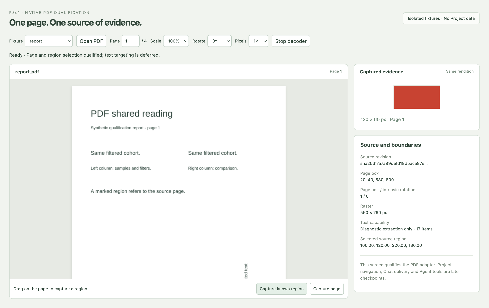
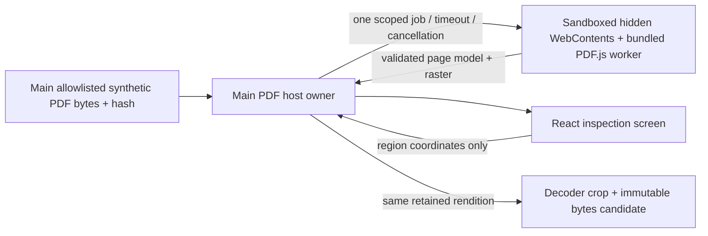
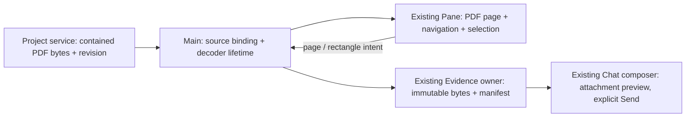

# R3c1 — PDF decoder and target qualification

Status: **implemented and qualified within the scope below; owner review pending, 2026-09-08**. Authorized by the owner's request to resume. Starting point: [A: inline reader](../proposals/r3c-pdf-shared-reading/design.md) and [R3c1 scope](../proposals/r3c-pdf-shared-reading/implementation-plan.md). R3c2 integration and R3c3 Agent tools remain separate review checkpoints.

Decision: proceed with direct PDF.js 6.3.289 in a dedicated sandboxed decoder, initially exposing **page and rectangular-region evidence**. Exact text targeting is deferred. The working native sample and 17 passing scenarios qualify this bounded adapter; they do not install PDF support in the Project workspace.

This is the adapter inspection screen, not a replacement for the approved central reader/right Chat layout. [Compact native view](r3c1-review/native-compact.png), [verification](r3c1-review/verification.md), [source and run instructions](../../../app/qualification/pdf/README.md).

## Source boundary and process sketch

This is an isolated source-checkout qualification in `app/qualification/pdf/`. It creates a typed job protocol, pure geometry, synthetic PDF fixtures, a sandboxed decoder host, narrow preload, React inspection screen and existing-Playwright runner. The normal App entry, source/service API, dependencies, contracts, saved Workspace and account profile are read-only. Evidence lives in `stages/r3c1-review/`.

Main creates/destroys one decoder session; the decoder reads retained bytes and renders one page at a time. New documents or cancellation dispose the prior host. Only fixed packaged assets are reachable. Main binds every reply to its pending job and validates result bounds. React can request a fixture/page/region, not a path, URL, account operation or trusted evidence body. The fixture registry stands in for the accepted service access port; this stage does not claim real Project integration.

CRUD / 5W1H: create ephemeral decode jobs and page results on explicit fixture/page requests; read exact synthetic bytes; update only the current job/rendition; delete jobs, worker/window and scratch profile on cancel, timeout, failure or shutdown. Main owns binding/lifetime because it must reject late results; decoder owns parsing and derived page data; React owns presentation. No decoder handle is persisted. The runner writes evidence after each case and records failures without changing claims.

Construction followed protocol/geometry → decoder/Main → preload/React → build/runner. Candidate: PDF.js 6.3.289, Electron 44.2.0, React 19.2.8, macOS 26.5.2 arm64; exact observed runtime versions and hashes are recorded in the evidence. PDF.js is installed only in a temporary candidate directory; optional native canvas is omitted.

## Definitions and ownership decision

| Concept | Definition and owner |
| --- | --- |
| PDF source | Exact service-supplied bytes and their SHA-256 revision. Main retains the authorized source identity. The current fixture registry is a substitute for this service port. |
| PDF View | The App's read-only projection of that source under a pinned decoding profile. It will live inside an existing Surface/Pane; it creates no new Project, Run or conversation. |
| Page model | Source revision + decoding profile + zero-based page index, CropBox/UserUnit/intrinsic rotation, and bounded diagnostic text items. Decoder derives it; Main validates and hashes it. |
| Rendition | One model rendered with a scale, user rotation and pixel density. Its job ID and viewport transform bind the displayed pixels. Changing the presentation invalidates the prior rendition. |
| Selection | User intent over a whole page or a nonempty contained rectangle in PDF user coordinates. It is neither quoted text nor an image inferred from Chat. |
| Evidence candidate | Immutable PNG bytes cropped from that exact held rendition, with source/model/page/region/pixel-rectangle metadata. R3c2 will pass this into the existing durable Evidence owner. |
| Agent reference | A later R3c3 observation/pointing contract. Diagnostic text and arbitrary source reads do not grant permission to point into a visible Surface. |

`PdfHost` owns only process/job/source binding and capture validation. Pure geometry and PNG validation are separate from Electron. The decoder owns only parsing/rendering, and neither preload exposes generic filesystem, account or Workspace operations. The fixture generator is not a dependency of the host. The React sample tracks request epochs and painted-rendition readiness so late work cannot attach under a changed page. Choosing another fixture does not relabel the already displayed source.

No Gobble execution metadata moves into the PDF decoder. Run, Pipeline and artifact provenance stay with their existing Gobble/service owners. Production Workspace v10, schema bundle v12 and shared-views-v7 are unchanged; this qualification does not reserve the next wire version.

## Results and limits

The [native report](r3c1-review/qualification.json) contains **17 passing scenarios and 64 actual rendered transform combinations**. Eight additional combinations were correctly rejected at the pixel limit. Source→pixel→source maximum error was **5.684341886080802e-14 PDF user units**; cropped output matched the same retained raster pixel-for-pixel. Model hashes stayed stable across zoom, rotation and pixel density. The suite includes pointer capture, keyboard activation and visible controls at 900×650.

The fixture set includes nonzero crop origins, intrinsic rotation, UserUnit 2, image-only scans, duplicate text/columns, deliberately ambiguous Unicode, dense paths, 200/201 pages, exact file-size limits, noisy raster evidence, active actions, malformed/encrypted input and oversized/corrupt embedded images. Source hashes, exact package lock, 189 decoder assets and redistribution notices are recorded beside the report. Bundled standard fonts were actually requested; inclusion of CMaps is not a claim of broad CJK/font qualification.

Admission limits: 8 MiB source, 200 pages, 4 million raster pixels, 20 million pixels per embedded source image and a 5-second job deadline. Page PNG is limited to 6 MiB of base64, capture PNG to 1 MiB of base64. Oversized capture fails with a smaller-region recovery path; it is not silently resized. Diagnostic extraction is capped at 1,000 items / 32,768 UTF-16 units and carries a truncation flag.

Cold/warm time, cancellation time and process working-set observations are recorded in the [verification notes](r3c1-review/verification.md). All 31 retired hosts were closed with no pending job, leaving the preview usable. These synthetic observations establish lifecycle behavior, not a hard RSS ceiling, a packaged-app benchmark or arbitrary-PDF resource safety. Production integration must preserve the deadline/disposal path and qualify representative report sizes.

## Text and completeness decisions

The Unicode diagnostic extracts `fi😀éבאA` from synthetic glyph codes; several UTF-16 units may originate from one glyph. Duplicate phrases have separate positions, and scans have no text. Extracted strings/item widths are insufficient evidence for exact character boxes. R3c2 therefore supports page/region only; no inferred text range is exported to Agent tools.

A real defect was found: this PDF.js tuple can return a partial/blank raster when a strict-mode operator stream fails late. Awaiting its public complete-list promise did not reliably reject that fixture either. The chosen candidate uses recoverable-warning mode and makes every PDF.js display/worker warning fatal before publishing a page. An explicit ready handshake prevents jobs reaching the worker before initialization. Both a 21.16-megapixel image and a corrupt JPEG now produce an unavailable page and can recover by opening a valid source. The diagnostic bridge depends on the pinned PDF.js mechanism and must be requalified on upgrade; vendor code is unmodified.

The fixed profile excludes annotation/form appearance, XFA, dynamic font faces, system-font fallback and WASM. Password entry, OCR, embedded files, PDF JavaScript/URI activation, editing and native PDF accessibility are outside this stage. R3c2 must visibly disclose unsupported appearance/content, or revise and requalify that profile; it cannot present this sample as full-fidelity support for every PDF.

## Next review checkpoint — R3c2

After owner approval, integrate this bounded page/region adapter into the existing compact reader and common composer:

R3c2 defines the production source/selector/evidence schemas and migration together, adds page navigation and accessible region selection, and verifies source replacement, draft/history persistence and restart. It uses the existing Pane and Chat; the qualification facts sidebar does not enter the product. Agent observation/Show/Return follows only in R3c3. CSV chart creation remains excluded.

## Dynamic handoff — Development → testing

Request ID: R3c1-2026-09-08. Requesting owner: Electron development; testing owner: Electron testing, performed sequentially in this task. Subject baseline: [434 protected files](r3c1-review/baseline.json). Required environment: this macOS native Electron source checkout. No user credentials, Docker or external service is needed.

Claims and lowest observable layers: pure geometry/schema tests for invalid selectors and transforms; real PDF.js worker tests for fixture rendering/extraction/crop fidelity; native Electron tests for preload sender checks, network/window denial, host cancellation/crash recovery and responsive independent preview. Size/page/pixel/time bounds and cold/warm latency/memory are measured on named synthetic fixtures. Construction checks remain distinct from runtime evidence.

Pass conditions: exact source/profile/page binding, measured source→pixel→source error, crop pixels agree with the retained page raster, invalid/stale inputs fail explicitly, asynchronous cancellation cannot publish a result, and host recovery leaves preview usable. Exact per-character text targeting is accepted only if glyph/range mapping is proven; otherwise the result explicitly selects page/region support for R3c2. Installation, packaging, other operating systems, native PDF accessibility, real Projects and Agent delivery are not claims of this stage.
