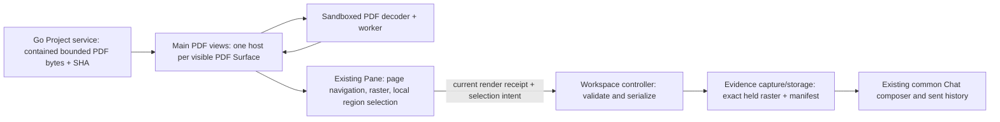

# R3c2 — User PDF reading and captured discussion

Status: implemented and verified; owner review pending, 2026-09-08. Accepted inputs: R3c inline reader concept, R3c1 native qualification and the owner's request to implement R3c2. App copy and new documentation are English; CSV charts stay excluded. Agent PDF observations/marks/Show/Return remain R3c3.

## Source and ownership sketch

PDF is a file Resource with a PDF View, placed in an existing Surface/Pane. The service owns source access, not page parsing. Main owns at most two visible decoder hosts, exact bytes/model/rendition binding, disposal on hidden/closed/switched views and timeouts. React owns controls and selection gestures and acknowledges readiness only after the raster is painted. Page/zoom/rotation are saved Surface navigation; parser handles and raster bytes are ephemeral. Explicit Refresh reads a newer revision. Captured attachments remain independent of the source and survive restart.

Selection is a whole page or contained rectangle in PDF user coordinates, bound to a source revision, decoder profile, page index and model hash. It is not guessed text. Evidence adds the exact rendition transform/pixel crop and immutable PNG hash. Unsupported annotation/form appearance is disclosed in the reader. No automatic send or source substitution occurs.

## Bounded implementation sequence

1. Contracts and storage: add PDF source/render/navigation/target/capture schemas, freeze the previous storage shapes, advance Workspace to v11 and schema bundle to v13; preserve previous evidence hashes.
2. Service and Main: bounded PDF byte transport; packaged decoder assets; per-Surface lifecycle; render-session integration and exact capture storage. Existing Gobble engine code is protected.
3. React: compact inline page controls, pointer and keyboard rectangle selection, whole-page attachment, explicit source refresh, failure/retry, visible supported-profile explanation. Existing composer handles prepared previews and explicit Send.
4. Verification: meaningful contract/service/native tests for coordinates, stale receipts, source replacement, two Surfaces, cancellation/close, saved draft/sent evidence and restart; native visual review at normal and compact sizes.

Affected set: `app/contracts/src` and new schema v13; `internal/appservice/files.go` and focused tests; `app/desktop/src/pdf`, Main workspace/evidence composition, existing preloads through shared workspace contracts, renderer PDF presenter/attachment labels; build configuration and pinned PDF.js dependency; relevant App tests and this stage's documentation/evidence. Qualification fixtures remain synthetic reference inputs. No engine edits, release, normal account interaction or new Agent PDF capability is included.

CRUD/5W1H: User creates PDF Surfaces and selections through existing Workspace commands; the service reads only registered contained bytes; Main derives/updates an ephemeral page on navigation and disposes hosts when visibility/Project/window changes; the single Workspace writer persists navigation and captured attachment manifests; EvidenceStorage retains content-addressed bytes for draft/sent/recovery roots and reclaims only unreferenced captures. These owners keep exact viewed content separate from execution metadata and prevent late asynchronous work changing a newer view.

Development and testing are sequential owner roles in this task. Construction results will be recorded separately from native behavior evidence. Final completion and the R3c3 proposal require owner review.

## Final owner/API review

| Owner                    | Boundary and public entry                                                                          | Lifetime / failure rule                                                                                                         |
| ------------------------ | -------------------------------------------------------------------------------------------------- | ------------------------------------------------------------------------------------------------------------------------------- |
| Go file service          | Existing contained regular-file read; PDF header, 8 MiB bytes and SHA revision                     | No PDF parser, renderer or execution changes                                                                                    |
| `ServiceResources`       | `readSurface(surface, refresh)` for presentation; `read(project, resource)` for ordinary resources | Raw PDF file IPC and generic Agent reads refuse PDF; no implied observation                                                     |
| `PdfViews`               | `retain`, `read`, `capture`, `clear`                                                               | At most two visible Surface hosts; reject identity drift across every async result; dispose on hide/close/Project/window change |
| `PdfHost`                | Fixed sandbox job protocol for open/page/capture                                                   | Exact sender/frame/job/source/model validation, five-second job deadline and same-rendition crop                                |
| PDF React View           | Compact navigation, pointer/keyboard local editing, image paint acknowledgment                     | Emits intent; no parsing, source access, persistence, PNG creation or direct sending                                            |
| Workspace controller     | Existing serialized commands and render receipts                                                   | Reject cross-Pane origin, stale navigation/selection and late results before publishing evidence                                |
| Evidence capture/storage | PDF adapter produces the existing immutable image manifest                                         | Crop without resizing; preserve source coordinates/transform/hash; normal draft/sent retention roots                            |
| Shared Agent tools       | Existing toolset v7 stays frozen                                                                   | Explicitly sent PDF image evidence works; PDF observations and authored marks remain R3c3                                       |

Named file-preview content schemas are reused by transport and Surface schemas; union array indexes do
not encode presentation ownership. PDF decoder imports are checked separately from Main, shell preload,
React and portable contracts. The renderer gesture code stays local to the PDF presenter and uses the
shared pure coordinate helpers. No plugin registry, general document editor, new chat/composer or
CSV chart path was added.

Workspace v11 and bundle v13 add PDF navigation, target v5 and captured PNG metadata. Storage v9/v10
are frozen from the published v12 bundle, preventing the current reference/evidence union from widening
old documents. Their static JSON is bundled and interpreted with TypeBox kind tags, with no runtime
schema download or code generation. Older evidence representation unions remain frozen. Migration
validates the old shape first and preserves the exact original `.vN.backup`, including v10.

## Dynamic handoff — Development → testing

Request identity: **R3c2-2026-09-08**. Requesting owner: Electron development; testing owner:
Electron testing, exercised sequentially within this task. Lower-tier claim: the accepted R3c1
page/region decoder can now serve User PDF Surfaces and immutable chat evidence through the existing
Workspace owners. Predecessor: [R3c1 qualification](r3c1-pdf-qualification.md) and its native fixture
report; production predecessor R3b3. Construction and behavioral proof are separate below.

Subject: [source inventory](r3c2-review/source-subject.json), [native-tested build](r3c2-review/tested-build.json)
and the final manifest/digests in [verification](r3c2-review/verification.md). Branch remains
`codex/project-workspace-design`, HEAD `7fe3d5c9e10d0cc104a15b6e7aa3def0d15b98f1` with uncommitted
App work. No commit, push, packaging or release was requested or performed.

Required environment: macOS 26.5.2 (25F84), arm64, native foreground Electron 44.2.0 / Chromium 152,
Node 25.7.0, npm 11.10.1, Go 1.27.1; pinned PDF.js 6.3.289, TypeScript 5.9.3, React 19.2.8,
Playwright 1.63.0, Vitest 4.1.11. Real Electron and the built Go service read real synthetic PDFs.
Only the native folder chooser response and Codex provider are fixture-controlled. Tests use isolated
profiles and never the owner's signed-in profile.

Pass conditions: User page/region intent resolves to the exact current PDF model/rendition; two Panes
navigate independently; raw PDF bytes do not reach the shell bridge; stale/cross-Pane references fail;
loading/hidden/closed views cannot retain or publish late work; draft and sent image evidence survives
refresh/source removal/restart; failure remains local and Retry recovers; old storage/evidence and
existing User/Agent scenarios continue working.

## User walkthrough and visual review

1. Open a Project PDF. Use Previous/Next, page number, Fit width/zoom and Rotate in the existing Pane.
2. Choose **Select region**, drag a box, then **Use region**. Keyboard: arrows move, Shift+arrows resize,
   Enter applies and Escape cancels. **Add to message** attaches the region. **Add page to message**
   captures the current page. Neither action sends automatically.
3. Inspect the attachment in the common composer; enter a message and choose an image-capable recipient.
   Send uses the frozen PNG and source metadata. There is no separate answer/selection composer.
4. Duplicate the PDF into the other Pane to compare pages. Each Surface retains its own page/zoom/rotation.
5. Refresh after changing a source. Existing captures keep their original content. Deleting the source
   makes the current reader unavailable but does not remove saved attachments or sent history.
6. At 900×650, use the existing Workspace/Chat switch. The PDF controls remain visible without hover,
   and switching regions preserves the draft and pending evidence.

The [normal reading and discussion](r3c2-review/pdf-discussion.png),
[compact Workspace](r3c2-review/pdf-compact.png) and
[captured preview after source removal](r3c2-review/pdf-captured-preview.png) are actual native-app
captures. Expert visual review found readable controls, clear region outline, stable bottom actions,
and central reading/right Chat at normal width. Compact mode intentionally shows one region at a time.
This is not representative-user usability evidence; owner walkthrough remains the approval checkpoint.

## Limits and next checkpoint

Read-only page and region images are supported. Exact PDF text selection, OCR, passwords,
form/annotation appearance and document actions remain unsupported. Diagnostic extracted text does
not authorize a text reference. The reader discloses these limits. If a refreshed document no longer
contains the saved page, the error explains closing/reopening at page 1. Oversized captures ask for
a smaller region or lower zoom; evidence is not silently resized.

This stage proves a native source build on this macOS tuple. Installed/signed distribution, Windows,
Linux, arbitrary-report performance, hard RSS isolation and live-account Agent PDF reasoning were
**not run**. The scripted provider proves existing delivery format and metadata, not model accuracy.
R3c1's geometry/decoder limit evidence remains linked to its exact subject; this integration adds
Workspace lifecycle, receipt, storage and native UI evidence rather than claiming every decoder fixture
was rerun against production.

**R3c3 requires owner approval:** extend the Agent observation/pointing contract for PDFs, define visible
page/region scope and authored marks, then design Show/Return and historical-capture fallback without
replacing User navigation or draft. The same Project/Resource/Surface/Evidence boundaries continue.

Verification completed: **269 unit/contract/architecture tests, Go service tests and 47 distinct native Electron scenarios passed**. See the [complete evidence record](r3c2-review/verification.md).
