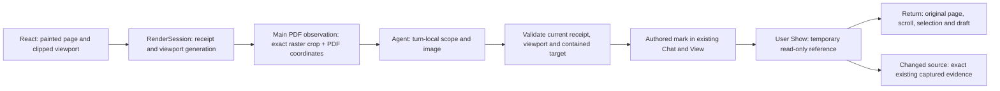
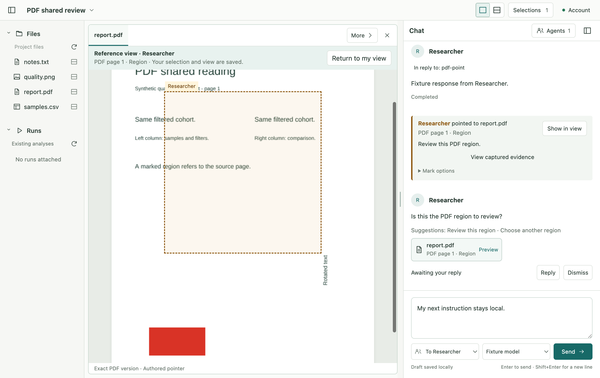

# R3c3 — Agent PDF references

Status: implemented, verified and owner-accepted, 2026-09-08. The owner accepted R3c2 and requested this next stage. App copy and documentation are English. CSV charts and exact PDF text targets remain excluded.

## Scope and ownership

A view observation includes only the currently clipped PDF region. Main tracks an ephemeral viewport generation bound to the painted page receipt; page/visibility changes and changes of the clipped rectangle (scroll/resize) invalidate earlier pointing authority even if the User returns later. The initial observation returns its exact PDF target, raster crop and transform. An Agent may point within that returned region with the same page/model/revision. Source-preview explicitly includes the currently decoded page and is never pointable; off-page background browsing and PDF text extraction are outside this checkpoint. Agent opening follows existing protected-view layout rules.

The renderer reports geometry and owns gestures. RenderSession owns visibility and receipts. ObservedReads owns only turn-local addresses and guards. The PDF evidence adapter crops Main's retained, validated lossless PNG without resampling, reusing existing image delivery/capture limits and question evidence. The Go service and execution engine gain no new responsibilities.

Existing ObservedReferenceViews owns one temporary Show session. A bounded temporary decoder reads an exact source revision for another page, then is destroyed; the two interactive PDF hosts and original React presenter remain unchanged. Reference navigation is never written into User navigation. Show fails closed on changed/missing source and offers a matching saved capture where available. Reference arrival never navigates. Persistent shared references use target v5, Workspace v12 and toolset v8; freeze v11 storage and v7 tool input before widening current schemas. Earlier conversations require explicit renewal.

## Ordered implementation and verification

1. Freeze the baseline and document geometry, authority, storage and ownership contracts. Add viewport bridge and current PDF shared-reference/tool schemas.
2. Implement scoped image observation, current-target checks, PDF question capture and temporary exact-page Show/Return.
3. Add authored amber marks, viewport reporting and temporary PDF presenter while preserving User state and existing single composer.
4. Verify pure scope/staleness/migration, native scripted Agent delivery and User preservation (including scroll/resize/off-page rejection), native visuals and a signed-in Agent trial on synthetic data if the available account permits it. Return findings and results for owner review.

Request R3c3-2026-09-08: Development and Testing are sequential owners within this task. Baseline source hashes: r3c3-review/baseline.json. Required environment: current macOS arm64 Electron source build. Pass conditions are exact returned scope, stale/off-page/hidden/foreign/cancelled rejection, no automatic User navigation, restored base state and immutable captured fallback. Construction checks cannot stand in for runtime evidence. Installed builds, other operating systems and general model correctness are not claimed.

## Implemented result

The accepted R3c3 behavior is implemented. [Architecture and concept review](r3c3-review/architecture-review.md)
records each owner and API boundary. The public PDF target stays version 5; Workspace v12,
bundle v14 and shared-views-v8 widen authored references and Agent requests while frozen old
storage/tool schemas keep their original validation.

The real signed-in Agent trial read the synthetic page image, selected the left cohort heading and
caption, published one exact region pointer and asked one evidence-backed question. Arrival,
Show and Return preserved User state. [Native Agent trial](r3c3-review/live-review.json) and
[sanitized tool calls](r3c3-review/live-tools.json) distinguish actual model behavior from scripted tests.

[Verification](r3c3-review/verification.md) · [Visual review](r3c3-review/visual-review.md).

Owner checkpoint accepted in the conversation. The next [R4 Notebook proposal](../proposals/r4-notebook-shared-reading/design.md) supplies the concept/ownership sketch and bounded R4a1 plan for review before implementation. No R4 production work is included in this stage.

[Compact workspace](r3c3-review/pdf-agent-compact.png) · [Captured PDF evidence](r3c3-review/pdf-agent-capture.png).
