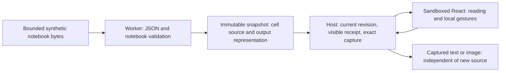
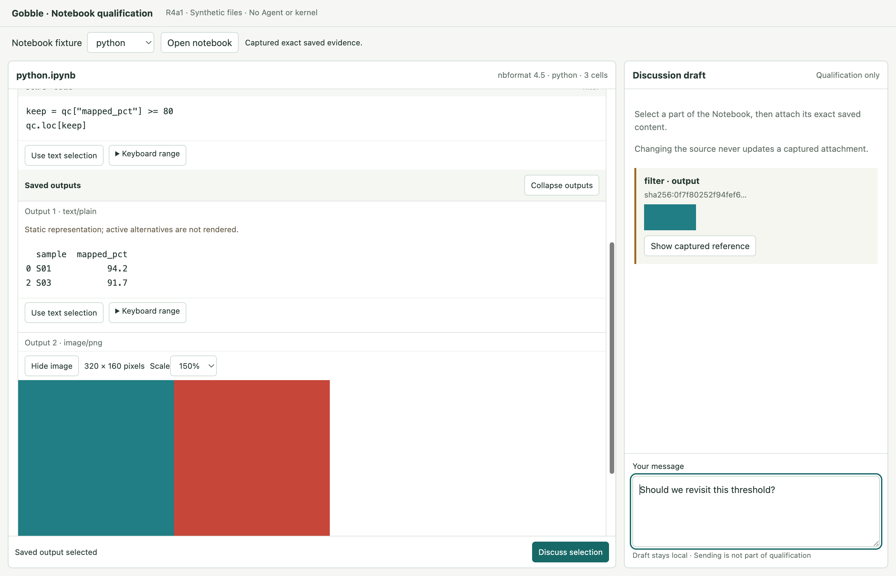
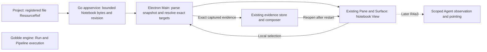

# R4a1 — Saved Notebook qualification

Status: **Implemented and qualified; awaiting owner review**, 2026-09-09. The owner accepted
[concept A and the R4a1 plan](../proposals/r4-notebook-shared-reading/implementation-plan.md).
Author mode; only `app/qualification/notebook/` and stage/proposal documentation
may change. Existing production, engine, provider, schema and account state are
protected by the [baseline](r4a1-review/baseline.json).

## Locked design and verification request

Request R4a1-2026-09-08: Development → Testing, sequential owners within this
task. Electron source-checkout qualification on macOS arm64, Electron 44; not a
packaged, installed, cross-platform or real-Agent claim. Existing Node/TypeScript,
Electron, React and Playwright dependencies are reused. No Jupyter installation.

Project kinds: desktop qualification plus private pure-module consumers. Entries
are `main.ts` (Electron Main), `preload.ts` (sandbox bridge), `renderer.tsx`
(Chromium/React), `worker.ts` (Node worker) and pure parser/target modules.
`qualification/notebook/tsconfig.json` includes these explicitly and extends the
strict App base. `build.cjs` emits temporary CJS Main/preload/worker and ESM React
assets. `qualify.cjs` imports the pure output and launches that exact built Main;
`view.cjs` opens the same qualified reader for review. No production import or
workspace package dependency is added.

The selected API separates pure parsing/resolution from a stateful Host owning
worker cancellation, current snapshot, image materialization and visible receipts.
Alternative: parse in React through generic text preview, feasible in the existing
TextView, but capped at 1 MiB and would duplicate capture/source authority in the
renderer. This qualification retains registered-file concepts without changing
the production service. A named 8 MiB Notebook transport is compared against the
existing 1 MiB text limit using measured fixtures before R4a2.

Testing owns fixtures/cases and evidence. Lowest layers: pure JSON/format/range and
revision checks; construction: strict typecheck/bundle; native: actual image
decoding, bridge, DOM selection/geometry/visibility, lifecycle and memory/time.
Expected pass: exact cell/part identity, no silent retarget, passive fallback,
bounded work/capture, cancellation and retained User draft/reference recovery.
Preserve initial failures and classify their cause before correction. No provider,
kernel, package/update or production migration scenario is claimed by this slice.

Working verification commands from `app/`: `node qualification/notebook/build.cjs`
and `node qualification/notebook/qualify.cjs`. Final source and emitted-build
digests, environment, cases, corrections and limitations accompany the result below.

## Result and supported scope

Strict TypeScript and the isolated emitted entries passed construction. **27 pure
tests and 15 qualification scenarios passed**, including 13 native Electron
scenarios. See the [verification report](r4a1-review/verification.md),
[author architecture review](r4a1-review/architecture-review.md), and
[module/API and exact limit guide](../../../app/qualification/notebook/README.md).

The reader qualifies saved code/raw source, basic Markdown, streams/errors/plain
text, and static PNG/JPEG. Text targets preserve exact cell/part identity and raw
quotes across LF/CRLF, Unicode and displayed control characters. Image regions use
natural pixels even at 150% scale. Captured evidence remains unchanged after new
source loads; returning preserves the local draft and reading position. This is
an inspection app using synthetic files, not the production Notebook Pane or Chat.

The final profile admits source up to 8 MiB, 1,000 cells, 1 MiB aggregate text and
4 MP per image, with two readers and on-demand image decode. Text windows of 2,048
UTF-16 units bound browser work; observed ranges remain partial and expire after
view changes. A 1 MiB long-line open/next/previous flow improved from about 6 seconds
in the rejected candidate to **225 ms** in the final run. The >3 MiB embedded-image
fixture supports a named Notebook transport without widening generic text preview.
These are local fixture measurements, not a whole-process memory/time guarantee.

Unsupported active content remains passive or unavailable. This profile does not
provide full Markdown, animated PNG, JPEG EXIF/orientation, editing, execution,
Agent delivery or durable application attachment storage. CSV chart creation stays
excluded. Existing Workspace v12 / bundle v14 / toolset v8 remain unchanged; the
[preservation report](r4a1-review/preservation.json) checks the 554-file baseline.

## Proposed R4a2 ownership sketch

A Notebook remains a file resource. A cell/output is an address inside its View;
it is not a separate Project, Workspace or Pane. Main owns projection and capture,
the file service owns registered access, and existing Workspace/evidence owners
own durable layout and attachments. The qualification's draft/capture composition
must not become a second production store. The engine has no new execution path
in R4a2.

Proposed scope: open registered `.ipynb` in existing Panes; map the qualified
source/output targets into focused production contracts with explicit coordinate
units; attach through the existing composer; preserve immutable evidence across
restart/source changes. Freeze prior schema inputs and verify migrations before
allocating new versions. Add source-change, failed-read, renderer-recovery,
keyboard, compact-window and existing-evidence regression cases. Expose bounded
or partial reading states honestly. Agent tools and Jupyter remain later stages.

This completes the approved R4a1 scope. R4a2 implementation awaits owner acceptance
under the user's requested stage-by-stage review process.
