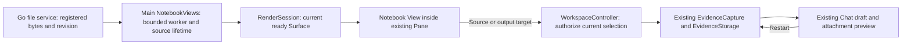
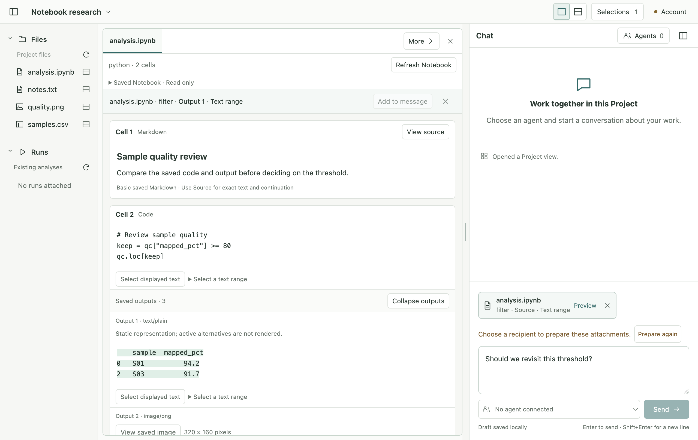
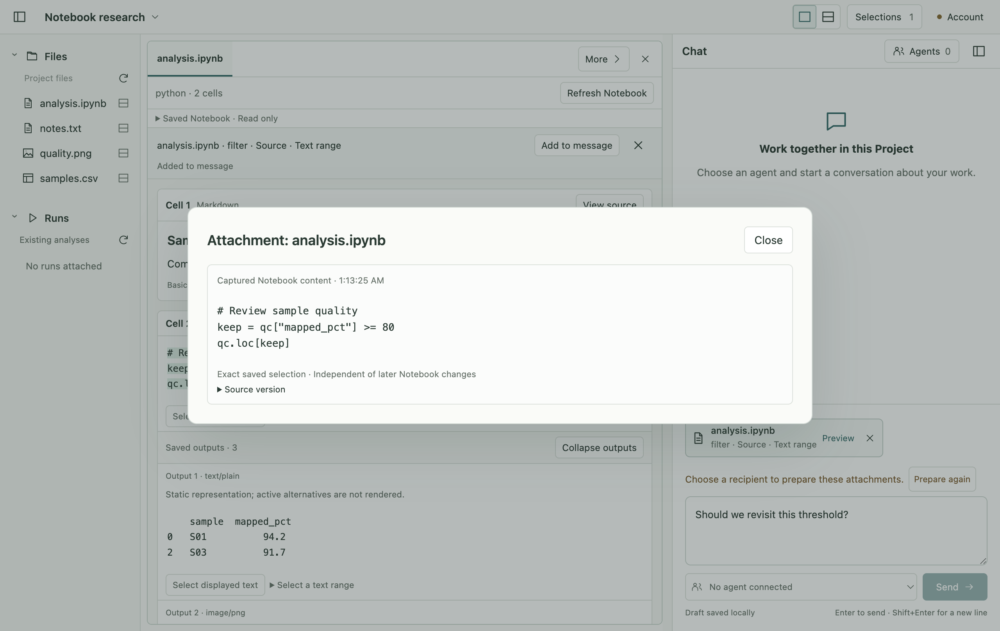
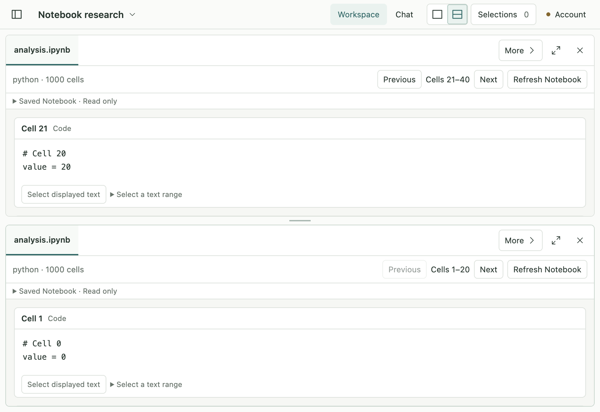
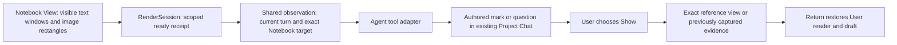

# R4a2 — Saved Notebook in the Project workspace

Status: **Implemented and verified; awaiting owner review**, 2026-09-09. The owner accepted
the [R4a1 result and R4a2 ownership sketch](r4a1-notebook-qualification.md).
Completed Author-mode implementation and sequential verification; the scope is registered saved Notebook reading, User selection and
immutable attachments in the existing Pane/composer/storage. App UI is English.

## Definitions and API decision

A Notebook is a registered file ResourceRef. Its cells and saved outputs are
addresses inside one read-only View. A Pane remains a layout container; it does
not own parsing, source bytes or attachments. Workspace owns layout/navigation
and draft metadata; EvidenceStorage owns immutable asset bytes. Gobble retains
all Run/Pipeline execution authority. No Jupyter server or kernel is opened.

Keep the qualified worker parser and Main capture owner, and adapt their private
cell/part addressing into a focused Notebook contract. The rejected alternative
is direct generic-text parsing in React: feasible in TextView but exceeds its
1 MiB transport on the measured 3.39 MB embedded-image fixture and duplicates
authoritative capture. Use a named ≤8 MiB Notebook content variant on the existing
registered-file route, retaining generic-text limits.

Notebook targets bind Project, resource, exact byte revision, passive profile,
cell ID or revision-scoped legacy ordinal, source/output identity and explicit
UTF-16 display offsets or integer natural-image coordinates. Only decoded saved
content can be captured. No source searching or retargeting after a changed file.
Notebook text assets retain normalized selected text and original raw quote;
image assets retain natural dimensions and exact crop. Existing evidence owners
handle quota, durable manifests, preview, recipient preparation and explicit Send.

Source decoding is cancellable in a bounded worker; visible Notebook Surfaces
retain at most two hosts. Close, switch, disconnect and failed load release them.
Readiness continues through RenderSession. Images decode on demand; React owns
Blob URL lifetime and local gestures, not bytes used for capture. A draft capture
can be previewed locally without requiring an Agent connection. Agent Notebook
observation/marks/Show/Return and Jupyter remain later slices.

## Affected code and compatibility

- `internal/appservice/files.go` and focused tests: Notebook bytes on the existing
  contained file route, original revision preserved.
- `app/contracts/src/notebook*.ts`, file/Surface/selection/evidence bridge unions:
  one focused contract family. Freeze Workspace v12 and bundle v14 before adding
  Workspace v13 / bundle v15. Existing evidence digests remain unchanged.
- Main `notebook/`, `workspace/notebook-views.ts`, existing resource/controller,
  narrow preload and evidence owners: bounded projection, image read and capture.
- Renderer `workspace/views/notebook/` and focused style: compact saved reader;
  reuse selection actions and the existing composer/attachment preview.
- Existing shared toolset v8 input remains identical; Notebook pointing and shared
  marks are explicitly unavailable in this stage. No production imports from
  `qualification/`; qualification sources/evidence remain frozen.

Project kinds: Electron desktop and private source-consumed contracts library.
Runtimes: Electron 44 Main/Node worker, sandbox preload, Chromium/React; Go service.
Entries are `desktop/src/main/index.ts`, dedicated Notebook worker, preload/index.ts,
renderer/src.tsx and contracts/src/index.ts. Exact checks use contracts/tsconfig.json,
desktop/tsconfig.main.json, tsconfig.preload.json, tsconfig.renderer.json and
app/tsconfig.tools.json. Electron-vite emits desktop/out; its actual Main/preload
and bundled worker are exercised by existing Playwright support. No release build,
installation, signing or cross-platform claim is part of this source-checkout stage.

## Verification request

Request R4a2-2026-09-09, Development → Testing, sequential roles in this task.
Predecessor: R4a1's 27 pure tests / 15 scenarios. Baseline hashes and frozen tool
input are in `r4a2-review/`. First construct/typecheck the typed integration
skeleton, then grow service, host, capture and UI increments with focused checks.

Lowest layers: pure parser/target/manifest and migration tests; Go contained-read
tests; Main lifetime and evidence-service tests. Actual Electron is required for
registered open, source/output text drag, natural-image pointer/keyboard capture,
two readers, source change/failure/retry, durable reopen, draft preservation,
offline captured preview, renderer replacement and compact/zoom visual review.
Malformed/stale/foreign requests must fail before capture; source changes never
rewrite saved evidence. Preserve first failing evidence and classify before repair.

Final commands from app: focused Vitest, `npm run typecheck`, `npm run schema:check`,
`npm test`, `npm run test:electron`, relevant formatting; from root,
`go test ./internal/appservice`. Final report includes source identity, exact runtime,
case results, screenshots, corrections and limitations. Review scope and tests
before requesting the user's next-stage approval; do not start R4a3 in this slice.

## Implemented result

Registered saved Notebooks now open in existing Panes. Users can read source and
saved outputs, select text or original-image regions, attach them through the
existing composer, preview offline and restore the draft after restart. Two readers
keep independent cell pages. Source refresh, missing/malformed files and explicit
retry preserve captured evidence. Application strings are English.

The reader renders 20 cells per page and bounded text sections. PNG/JPEG images
load on demand. Unavailable widgets/active alternatives are labelled in place.
A selection remains local until Add to message; only explicit Send delivers the
stored capture. Captures bind the original revision even after a file is removed.

[Architecture and API review](r4a2-review/architecture-review.md) records ownership,
the rapid-selection correction, frozen compatibility and remaining limits.

## Verification and visual review

**312 unit checks / 28 files and 59 native Electron scenarios passed**, including
all 8 new Notebook scenarios. Typechecking, generated schema, repository formatting
and the fresh Go app-service suite passed. The native matrix covers rapid source →
output selection/attachment, offline preview, deletion/change/retry, source/output
text drag, 150% image pointer/keyboard capture with pixel equality, two readers and
restart, renderer crash/reload, 1 MiB text continuation and oversized refusal,
3.39 MB embedded-image transport and explicit Send through a fixture provider.

[Verification record](r4a2-review/verification.md) includes the actual runtime,
first failures and corrections, source/build identity and preservation results.
Provider delivery uses a test-local Codex executable; no real Agent Notebook or
Jupyter claim is made. The supported saved-reader limits are listed in the
[app development guide](../../../app/README.md#r4a2-saved-notebook-reading-and-user-evidence).

Visual inspection confirms the central reader and single composer remain the main
work areas; source/output labels distinguish attachments. Compact and 150% layouts
use the existing Workspace/Chat switch without losing cell pages. Native keyboard
selection, focus, dialog close and exact image geometry are covered by tests.
These synthetic scenarios are development evidence, not a broad usability study.

## Next proposed checkpoint — R4a3 Agent shared reading

This is an ownership sketch for approval, not implemented Agent behavior.

A visible observation should identify the actually displayed cell/part ranges,
current source revision and render generation. It must not include folded outputs,
offscreen cells or images that have not loaded. A wider explicitly requested source
preview must not grant permission to point at unseen content. Changed viewport,
source, Project or Agent turn invalidates the relevant receipt.

Agent marks should use the same exact target vocabulary while remaining separate
from the User's local selection. They should not change navigation, draft or focus.
Show is a User action; Return restores the base reader. If exact source bytes are
unavailable, only an existing captured attachment can provide historical content.

Proposed R4a3 work: scoped observation and tool/version contract, authored marks and
questions, exact Show/Return with captured fallback, negative visibility/revision/
turn tests, native state-preservation tests and separately identified real Agent
verification. Reuse the existing owners; add no generic plugin platform or kernel.
Notebook editing/execution and CSV chart generation are outside this proposal.

The next-stage approval is required by the owner's requested stage-by-stage workflow.
