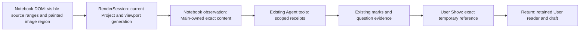
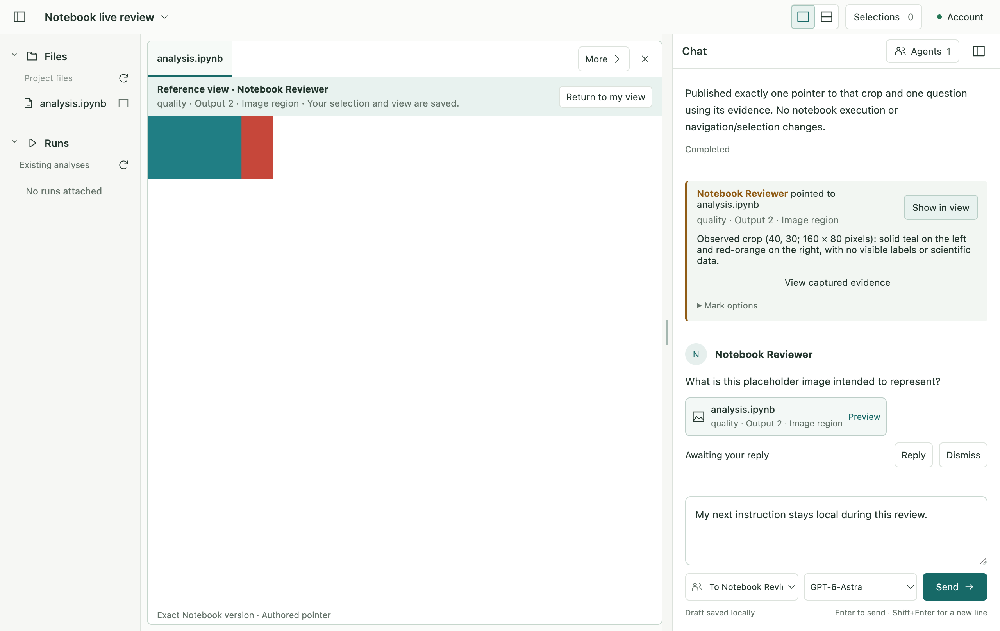
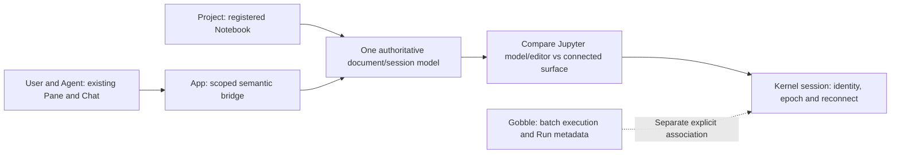

# R4a3 — Agent Notebook observations and authored references

Status: **Implemented and verified; awaiting owner review**, 2026-09-09. The owner accepted R4a2 and
requested continuation. Author mode. Scope: saved Notebook visible observations,
exact authored marks/questions, User Show/Return and captured fallback. English UI.
No Notebook editing, Jupyter/kernel, CSV chart generation, packaging or release.

## Ownership sketch and definitions

A Notebook observation is a bounded account of the content actually exposed in one
ready View. A receipt binds exact file revision, cell/part identity, displayed range
and viewport generation to one Agent turn. It is ephemeral authority, not stored
source content. A mark persists that target and authorship; a question/attachment
may additionally preserve immutable content in the existing evidence store.

Default observation returns visible text with exact addresses; visible image targets
are advertised as available, with an explicit request required to receive pixels.
An image is pointable only after that request succeeds with an image-capable model.
Explicit source-preview requires a part selector and never authorizes pointing.
Folded, clipped and offscreen text or unloaded images cannot become visible authority.
Text windows remain bounded; fully visible character rectangles are reported, with
surrogates/control escapes validated by Main. Viewport changes revoke old receipts.

Show resolves the exact registered source through one temporary Notebook read/capture,
then displays a read-only excerpt in the existing reference panel. The source host
is disposed; the base reader stays mounted. Its page, scroll, folded state, local
selection, image gesture and draft survive Return. Reference inspection is not a new
Agent observation surface; Return restores normal shared reading. Missing/changed
source refuses exact Show and offers only already captured matching evidence.

Reuse RenderSession, ObservedReads, SharedContextHost, QuestionService,
ObservedReferenceViews and the existing EvidenceStorage. Add focused Notebook
adapters and DOM reporting, not a generic viewer/plugin framework. Alternative:
whole-document snapshots through generic text observation are feasible in existing
TextView but would misrepresent hidden/folded content and lose raw-source capture
ownership. The accepted PDF receipt/reference lifecycle supplies local prior art.

## Typed integration and affected set

- New `notebook-viewport` contracts: bounded part selectors and validated containment;
  optional exact Notebook reference excerpt in the existing content union.
- Freeze Workspace v13 and tool v8 before Workspace v14 / bundle v16 / tool v9.
  Earlier conversations require existing explicit toolset renewal. Old evidence and
  schema bundles remain readable and unchanged; generated schema is never hand-edited.
- Main RenderSession/controller and narrow preload: viewport report, scope guard;
  NotebookViews: exact source check/reference capture and disposal.
- Main shared-context/Notebook adapter and question evidence adapter: Main materialized
  text or PNG, turn guards, image capability, existing bounded receipts/captures.
- Renderer Notebook visibility hook, authored marks, temporary reference panel and
  retained base wrapper. Chat continues to own messages, preview and Show/Return.

Project kinds: Electron desktop and private source-consumed contracts library.
Runtime entries: Main/index.ts, Notebook worker, sandboxed preload/index.ts and React
renderer/src.tsx. Electron-vite output is desktop/out, consumed by real Playwright
Electron launches; contracts source is bundled in Main/preload/renderer and consumed
by Vitest and the service schema tests. Exact checks: contracts/tsconfig.json,
desktop/tsconfig.main.json, tsconfig.preload.json, tsconfig.renderer.json and
app/tsconfig.tools.json. Electron 44 / macOS arm64 is the native target. Build the
new typed declarations first, typecheck, then integrate behavior from lower layers.

## Verification request R4a3-2026-09-09

Sequential Development → Testing roles, same task. Predecessor: R4a2 312 unit checks
and 59 native scenarios. Baseline hashes: `r4a3-review/baseline.json`.

Pure/host cases: exact part/range containment, hidden/source-preview/foreign/stale
refusal, immutable captures, v13 migration and old v8 input identity, turn end and
image capability. Native cases: actual clipped text and image reporting, scroll/
fold/zoom invalidation, authored text/image marks, question capture, protected User
state through Show/Return, source change/missing fallback, explicit renewal and
compact interaction. Existing app suites must remain green. Record any actual Agent
verification separately from fixture-provider routing; unavailable credentials or
external runtime remain a literal environment gap, never a simulated pass.

Final checks from app: format, typecheck, schema:check, npm test, npm run test:electron.
Preserve first failures and route corrections to their owning layer before rerun.
Keep normal App profiles and unrelated engine/memory edits unchanged. Review the
result and next-stage scope with the owner; do not start R4b in this checkpoint.

## Implemented result

Verification: **320 unit checks / 65 distinct native Electron scenarios**, plus one
real GPT-6-Astra image-observation, mark/question and Show/Return trial. See the
verification record for the full-run result and focused corrections.

Visible Notebook source/output text now reaches Agent tools with exact cell/part
addresses and scoped receipts. Painted images are advertised separately and become
pointable only after explicit image observation. Users and Agents can publish marks
through the same Project chat. Explicit observations can supply immutable question
evidence through the existing store.

Show opens an exact temporary text/image excerpt. Return restores the retained User
reader, including local selection, scroll, folded outputs, unfinished image region
and draft. Changed/missing source refuses current Show; existing matching capture
remains available offline. The App owns reading, presentation and communication;
Gobble's execution ownership is unchanged.

Current formats: **Workspace v14 / bundle v16 / shared-views-v9**. NotebookTarget
remains v6. Frozen v13/v8 contracts are retained with explicit conversation renewal.

[Architecture and API ownership review](r4a3-review/architecture-review.md) ·
[Verification record](r4a3-review/verification.md) ·
[Live Agent result](r4a3-review/live-review.json)

## Next proposed checkpoint — R4b live integration investigation

This is a proposal for owner review, not authorization to implement live execution.
Compare a reusable Jupyter document/editor model with a trimmed connected surface
and semantic bridge on one pinned local environment. The decision must establish
one authoritative document, save conflict behavior and exact selection mapping.

The bounded investigation should prove document/session/kernel lifetimes, credential
ownership in Main, a revision-bound selection and interrupted-connection recovery.
A submitted execution with lost acknowledgment remains unknown until reconciled;
it must never be blindly repeated. Editing/execution product integration remains
R4c, with its own sketch and approval. CSV chart creation remains excluded.
