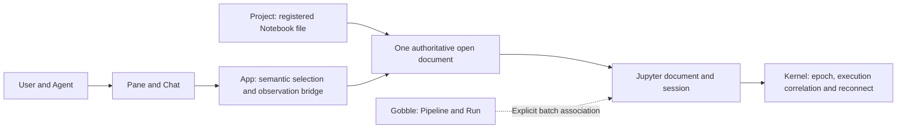
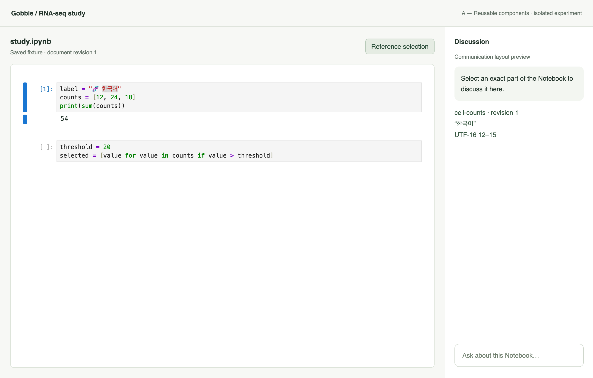
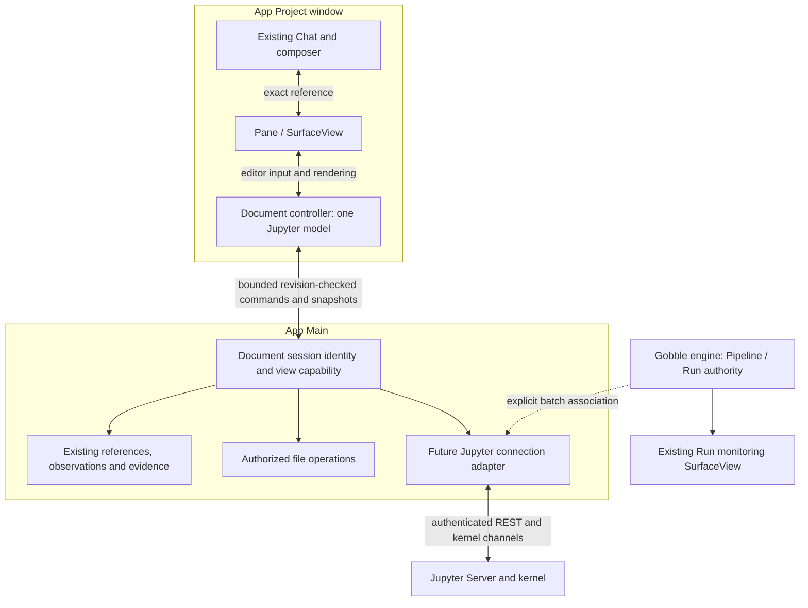

# R4b — Live Notebook integration investigation

> **Owner decision, 2026-09-09:** Do not add document editing now. The R4c1 editing/save-copy proposal below is deferred and is not the next implementation commitment. The investigation remains completed evidence; its integration recommendation is not production approval. Kernel integration remains separately proposed. See [remaining work](../remaining-work.md).

Status: **Authorized investigation**, 2026-09-09. R4a3 is accepted. This stage
compares runnable integration candidates in an isolated synthetic environment;
production editing and execution remain R4c, subject to owner review.

## Decision and scope

Actor: the current assistant, sequential research/development/testing roles.
Caller/consumer: the Gobble project owner. Decide which integration offers one
coherent document authority and precise User/Agent communication while preserving
Project-centered Panes, right Chat, one composer and Gobble execution ownership.

Criteria: source of truth, native editor selection mapping, source/output revision
identity, save conflict handling, document/session/kernel lifetimes, reconnect and
unknown execution outcomes, isolation and integration footprint. Compare component
reuse with a connected Jupyter surface. Inspect primary documentation and pinned
source; prove decision-critical claims in local runnable probes. Stop when the
comparison supports a qualified recommendation and exposes remaining blockers.

Allowed writes: `app/qualification/jupyter/`, this stage document and
`docs/desktop-workspace/stages/r4b-review/`; update current checkpoint documentation.
Production code, existing qualification evidence, normal App profiles, engine and
memory edits remain protected by baseline hashes. Synthetic files only. No CSV
chart creation. No installation into the production dependency graph.

## Initial ownership sketch

A saved file revision, an in-memory document revision and a kernel epoch are distinct
identities. An unsaved selection cannot masquerade as a saved NotebookTarget v6.
Closing a Pane releases a presentation; kernel shutdown is a separate action.
A lost execution reply leaves an unknown outcome until reconciled, never permission
to submit the same code again.

## Planned evidence

1. Pin Python, JupyterLab/Server/kernel, JS components and the existing Electron 44
   environment. Keep all tooling and test data under disposable qualification scope.
2. Instantiate a real reusable Notebook model/editor and a real connected Jupyter
   document. Inspect native selections, in-memory mutations and explicit saves.
3. Challenge stale saves, missing/changed files, linked document identity, kernel
   restart, connection loss and live output updates using synthetic requests.
4. Capture real native comparison screens; record measurements, failures and API
   owners. Recommend one bounded production direction and list R4c prerequisites.

Research claims will use direct Jupyter/Electron documentation and installed pinned
source. A UI shell or mocked reply alone does not establish document/kernel behavior.
No independent reviewer or representative-user usability study is claimed.

## Result and review checkpoint

Status: **Investigation complete; awaiting owner review**, 2026-09-09.
R4a3 is owner-accepted. The final isolated qualification passed. Production remains
Workspace v14 / bundle v16 / shared-views-v9; editing and kernel controls have not
been added to the shipping App.

Recommend **component reuse**. [Study](r4b-review/study.md) records the source-grounded
comparison and its limits; [verification](r4b-review/verification.md) records actual
experiments and corrections. These are implementation experiments, not a finished
UI design or proof that production Notebook execution is ready.

The source is a real Jupyter Notebook model/editor. The right discussion area is a
layout preview and displays locally captured selection data; it is not an actual
Agent conversation. Korean source text deliberately tests Unicode offsets. App
labels are English. Production reference UI should use human-readable cell/line
labels, with raw identifiers confined to diagnostic detail.

[Connected Jupyter surface](r4b-review/connected-selection.png) and its
[save-conflict dialog](r4b-review/connected-save-conflict.png) are actual captures of
the child WebContentsView. The connected surface still shows Jupyter's own controls
and a news prompt after the experimental shell trim. The prompt was not accepted;
external network requests were denied by the isolated host.

## Definitions and owners

| Concept                         | Definition                                                                                           | Owner and lifetime                                                                                            |
| ------------------------------- | ---------------------------------------------------------------------------------------------------- | ------------------------------------------------------------------------------------------------------------- |
| Project                         | Registered research context joining resources, Agent work and explicit Gobble Run associations.      | Existing Project service; independent of a chat or Pane.                                                      |
| Workspace                       | Project presentation state: Pane layout, tabs, focus and restored reading positions.                 | App workspace; does not own scientific execution.                                                             |
| Pane                            | A presentation slot holding SurfaceViews.                                                            | App layout; closing it releases a view.                                                                       |
| SurfaceView                     | A rendering of a saved resource, live document or execution projection.                              | App view; does not become the document/kernel merely by displaying it.                                        |
| Saved Notebook resource         | Registered file identity plus an exact persisted revision.                                           | Existing resource/snapshot path; immutable evidence uses a captured revision.                                 |
| Live document session           | One authoritative Jupyter NotebookModel for the current editable document.                           | App document controller owns model lifetime; linked widgets share it. No second mutable JSON store.           |
| Saved revision / model revision | Persisted file identity versus an in-memory content generation.                                      | File owner versus document controller. Saving is an explicit mapping, not identity equivalence.               |
| Cell                            | Stable notebook cell ID, current source and outputs within a document session.                       | Jupyter model; display index is not identity.                                                                 |
| Live reference                  | An exact address within one document session/generation and cell part, with selected text or region. | App reference contract and Main-validated observation receipt. It is not saved NotebookTarget v6.             |
| Connection                      | An explicitly selected Jupyter server/environment and its authentication state.                      | Future Main Jupyter adapter. Editor renderers receive bounded operations, never generic fetch or credentials. |
| Jupyter session                 | Server-side association of a document path and kernel.                                               | Jupyter Server; App records the association without conflating it with Pane lifetime.                         |
| Kernel epoch                    | One kernel process lifetime, distinguished from the reusable REST kernel ID.                         | Kernel protocol identity; App observes it and invalidates outdated execution assumptions.                     |
| Interactive execution           | One request for an exact source snapshot, correlated with kernel messages.                           | Kernel executes; App tracks request/outcome and presentation. Not automatically a Gobble Run.                 |
| Run / Pipeline                  | Durable batch execution identity and graph/state metadata.                                           | Gobble engine/service remains authoritative; App projects it in a SurfaceView.                                |

## Proposed responsibility boundary

The diagram is a proposal, not an implemented production bridge. Candidate A proves
the document model/editor portion. Candidate B and the protocol probe establish
server behavior. Credential isolation, sender validation and request cancellation
still require concrete R4c contracts and tests.

One editable document session per Project/resource is the initial scope. Same-window
linked widgets can share that model. Opening another Pane must reuse its session.
Cross-window editing and network collaboration require separate ownership design;
a second independent writer must not be silently created. The document controller
outlives individual widgets. Closing its final view with unsaved changes requires
explicit retain/discard handling; closing a Pane never requests kernel shutdown.

Main may hold immutable command/evidence snapshots and session metadata. That is not
another mutable document model. Renderer-originated reports remain untrusted at IPC
and must be bounded, checked against registered view/session identity and tied to the
specific authorized action. A production bridge will not expose the probe's test API.

## Communication and recovery rules

- A live address includes Project/resource association, documentSessionId,
  modelRevision, cellId and part identity. Source text uses explicit UTF-16 offsets
  plus the exact quote. Native selection and Agent-authored references use the same
  contract. Every field is runtime validated at the boundary.
- A model change invalidates old live pointing authority. Reordering preserves cell
  IDs but advances the document generation. There is no automatic retarget to a
  nearby cell/range. Previously captured evidence remains immutable.
- A model read does not prove visibility. Preserve R4a3 visible-observation and
  image-opt-in rules. Offscreen, folded and unpainted output cannot become pointable
  merely because Jupyter stores it in the model.
- Outputs require their own generation. A display_id locates an update stream, not
  an immutable result. Kernel epoch and request identity qualify its origin. Earlier
  output captures remain earlier evidence after an update.
- An execution command must bind environment, server, document/cell source snapshot,
  kernel epoch and a new request ID. The App must track shell reply and IOPub state;
  a disconnected request is unknown, not failed or safely retryable.
- Reconnect must reconcile the current kernel epoch and the request's evidence.
  Never resubmit automatically. A retained kernel ID does not prove retained state.
- Interactive kernel progress is not a Gobble Run. Only an explicit Gobble-managed
  batch association may create/project that Run's metadata.

## Deferred proposal: R4c1 — Editable document and exact references

The owner deferred this proposal. Retain it as future design context; do not implement it without a renewed request.

1. Define/version a live-reference contract independently of saved NotebookTarget v6.
   Build typed APIs before behavior; preserve old workspaces, evidence and toolsets.
2. Mount the reusable editor behind a focused document controller. Source edits,
   dirty state and exact User/Agent references share its one model. The saved reader
   and existing captured-reference behavior continue through their existing owners.
3. Offer explicit **Save a copy** into an authorized Project destination. Create a
   new file exclusively; refuse an existing destination. The original file remains
   unchanged. Register the resulting resource only after successful write. Saving a
   copy does not silently mark the original document clean or retarget references.
4. Preserve the document across Pane changes and Show/Return. Design final-view
   closure and unsaved state in the same compact Notebook toolbar and Chat flow.
5. Verify revision rejection, Unicode selection, linked view lifetime, saved/live
   identity separation, save-copy collision/failure and immutable evidence. Review
   actual native screens and the code boundaries before the next approval.

R4c1 does not launch a kernel. Proposed **R4c2** then implements explicit environment
connection, execute/interrupt/restart and reconnect/unknown-outcome handling after a
separate sketch and approval. In-place overwrite, remote collaboration, arbitrary
HTML/JS output and broad Jupyter extension support remain later decisions.

Save-a-copy is a deliberately bounded first write contract. It avoids pretending a
GET/hash + PUT sequence prevents concurrent overwrites. Any future in-place save
must name its supported storage provider, writer coordination and remaining race
window, or use a provider with a demonstrated conditional-write guarantee.

### Proposed code organization

| Location                                    | Responsibility                                                                                                                                                   |
| ------------------------------------------- | ---------------------------------------------------------------------------------------------------------------------------------------------------------------- |
| Existing `main/notebook/`                   | Saved-file parsing and exact snapshots; do not turn the reader host into an editor/kernel manager.                                                               |
| Focused `main/notebook-documents/`          | Live session/view identity and authorized file command coordination; no mutable editor replica. Add only when R4c1 is approved.                                  |
| Existing shared-context and evidence owners | Bounded live adapters, receipt validation and immutable captures. No second chat/evidence subsystem.                                                             |
| `renderer/workspace/views/notebook/live/`   | Jupyter widget/model adapter and component-local styling, owned by a Project-level document controller. React shell owns layout; Lumino owns the editor subtree. |
| Future `main/integrations/jupyter/`         | Connection credentials, REST/kernel channel lifetime and explicit recovery, beginning in R4c2.                                                                   |

No generic plugin framework, universal Pane base class or new Notebook repository is
needed. Qualification dependencies stay outside the App workspaces. React 18/Lumino
transitive code and styles must remain a bounded dependency island when production
integration is approved; bundle/lazy-load and supported output budgets need review.
