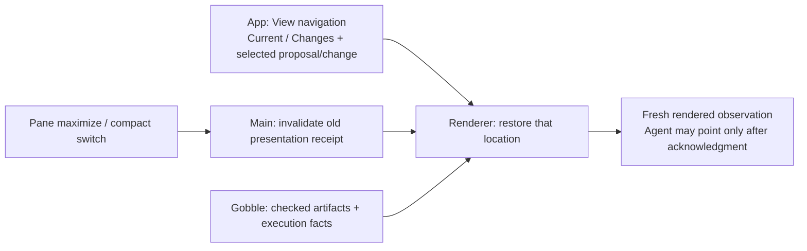

# Live report collaboration — result and next boundary

2026-09-28. Bounded expert walkthrough completed; one navigation defect remains. This is neither independent review acceptance nor scientific validation. Product source is unchanged: Workspace 21 / contract bundle 30 / catalog 5 / shared tools 15.

## Proven end-to-end outcome

A fresh temporary Project was created with 100 synthetic single-end reads. The actual signed-in Agent (GPT-6-Astra through bundled Codex 0.153.4) authored the checked Trim Galore → FastQC design. The operator adopted that test design, prepared it, checked the input and tools, and explicitly started one analysis using the App UI. Gobble ran both tasks successfully at attempt 1. There was no simulated Agent or engine. Only the native folder chooser response was supplied by automation.

The live engine is `sha256:f5f69ad6d965fcbb2217dd89a621effc4b3a60f13a113781571915fee4b0c971`, Linux/amd64. Its recorded execution-core source matches this tree; drift from its source manifest is confined to native App-service report files and runtime packaging, listed in [environment](environment.json). Electron uses the current native service build. Do not infer that every Go file equals the image's build tree.

| Scenario | Result | Evidence |
| --- | --- | --- |
| Actual Agent creates checked two-step design | Pass | 01–03 captures; creation calls in [tool trace](evidence/tool-trace.json) |
| User checks 100 records and starts actual execution | Pass | [Launch review](evidence/06-launch-review.png), [Run snapshot](evidence/actual-run.json), [completed Flow](evidence/08-run-complete.png) |
| Open saved report from completed step | Pass | [Report](evidence/09-report-chart.png); FastQC producer attempt 1, 10 modules, 8 charts |
| Preview the exact attached report | Pass | [Attachment preview](evidence/10-attachment-preview.png) |
| Actual Agent displays all original charts | Pass | Eight read_report image calls followed by image(...); all eight model-facing PNG SHA-256 and byte counts match original saved chart bytes, total 368,622 bytes. [Proof](evidence/report-proof.json), [image records](evidence/model-images.json) |
| User and Agent point to same report | Pass | [Discussion](evidence/12-live-report-discussion.png). Separate current foreground observation precedes the Agent pointer; chart reads grant no pointer authority. |
| Plain-language discussion distinguishes chart pixels, table facts and source labels | Observed | [Full response](evidence/12-live-report-discussion.txt). Visible Q9 line, 80 bp peak and zero adapter traces were described, with synthetic-input and encoding limits. Scientific accuracy beyond this bounded visual check is not established. |
| Actual Agent proposes exactly quality 20 → 25 | Pass | [Focused comparison](evidence/17-change-detail.png), [proposal integrity](evidence/proposal-integrity.json). One checked setting change; Current remains the base, one Run only. Agent points to the changed setting. |
| Proposal references the original outcome | Pass within current scope | Structured followUp retains exact Run/task evidence. Saved report is attached to the same message and named in the Agent summary; it is **not** an additional typed report entry in followUp. |
| Compact Chat keeps unsent draft | Pass | [Compact Chat](evidence/19-compact-chat.png); exact draft retained |
| Restart retains saved report, references and all three completed submissions | Pass | [Restart equality](evidence/restart.json); report reopens with 8 charts, no message resend after account reconnect |
| Maximize / compact Chat return preserves comparison location | **Fail** | [After maximize](evidence/16-maximize-reset.png), [stable compact return](evidence/23-compact-return-stable.png), [reproducer log](compact-check-final.log). The view returns to Current; Changes reopens the same proposal. No data loss. |

The initial analysis is authorized test execution, not the proposed 25-Phred revision. The revision was not adopted or executed. All three actual Agent turns completed. Report source hash is `8f045465fd56bbfb18360592e1b41c4978b45c6054fb6bc2cef52aa724413d52`; saved rendition hash is `3cb1a44e5ff8933704dd0f4978f4e6f47f9fe7dde4642ca034e7951da5282d5e`. The identical synthetic input produces the same HTML bytes as prior qualification, but this is a fresh Run with distinct producer identity.

## Design findings and recommendation

**Fix navigation retention first.** `ResourceWorkspace.tsx` keys PresentedViews by the visible Pane set. Presentation changes deliberately renew observation authority and remount child presenters. `PipelineSurface.tsx` keeps `reviewing` only in component state; `PipelineReviewPanel.tsx` also keeps proposal/change selection locally. A presentation change therefore loses the review location. Removing the authority reset would be the wrong repair.

The next bounded design must give View navigation its own lifetime, independent of presentation receipts. Pane placement belongs to Workspace; Current/Changes and the chosen proposal/change belong to the Pipeline View. Gobble continues to own checked pipeline facts and execution. Renew observation authority after every visibility change; retain only the user's location, never a prior receipt.

The simplest first fix is session-only navigation, matching the existing FlowNavigation contract. Reuse that surface-local navigation object and lift its owner above the presentation subtree, scoped to Project + surface. Include Current/Changes, chosen proposal and change; validate restored identities and do not silently switch proposals. Keep loaded data, confirmation-in-progress and authority receipts transient. Test two changes/proposals, maximize/restore and compact Chat return, alongside rejection of obsolete receipts. Restart currently returns to Current by the same local-state design; restoring comparison location across restart is a separate persistence decision. If required later, use existing Surface navigation and Workspace commands, never a second store.

Other concrete findings, ordered after navigation:

1. Long Agent summaries containing internal IDs/hashes and full pointer notes consume the central reading area. Keep provenance in existing details and make the main summary/marker short. The screenshot [15](evidence/15-checked-proposal.png) shows the comparison detail pushed below the initial viewport.
2. Agent Markdown tables and emphasis are shown as raw text. Render a small safe read-only Markdown subset in Chat; this is presentation, not document editing. Avoid arbitrary HTML, remote assets or a new editor.
3. The Agent named the original step with “quality 20.” A one-setting proposal correctly leaves that title unchanged while proposing 25. The Agent noticed and disclosed the mismatch. Prefer stable step names and show parameter values through typed setting UI; do not parse free-form labels to invent metadata.
4. A compact report caption with Analysis name, producing step and attempt would make its relation to Current clearer. Full producer identity remains available in Saved report details.

These are follow-up design candidates, not silently implemented changes. The approved live proof is finished; the next stage should first repair session navigation, then address reading density with a concrete sketch and owner review.

## Verification and limits

- Actual Electron/App/native service, Docker/Gobble, Trim Galore/FastQC and live Agent were exercised. No new package, installer, dependency, schema or production implementation was introduced.
- Source hashes before/after establish that this turn did not change App code. Prior 397 unit tests and 23 Electron scenarios are **prior-stage** evidence, not rerun totals for this walkthrough. This turn adds the actual live records above.
- Changed support TypeScript passes scoped Prettier; `git diff --check` passes. The one-off harness and evidence folder follow the existing stage qualification convention. Its private helpers own synthetic setup, native UI control and observation only; no public API or product abstraction was added.
- Applied execution checklist categories: scope, affected surfaces, structure, abstraction, simplicity, correctness, verification, delivery, usability and operations; credential isolation and authority lifetime overlays. Present problem: review location loss. Undecided: broad corpus, other models/platforms, representative-user usability and scientific interpretation.
- Read-only subagent `live_report_advice` first checked reuse boundaries and later corroborated all eight image hash pairs and the fresh receipt/whole-report pointer chain. It did not claim independent acceptance or independently recompute the underlying PNG hashes; the root's proof script performed that comparison. Its final source advice identified existing FlowNavigation for reuse and recommended session-only retention as the smaller first fix; that recommendation narrows the next stage above.
- Harness failures are recorded in [execution notes](README.md): incorrect cwd, closed stdin, a transformed import referenced from eval, a state-mutating connection used for observation, too-short compilation wait, PTY input length, and the subsequently reproduced real maximize reset. They are not hidden behind a pass summary.
- Expert/operator-driven synthetic scenario only. Eight chart delivery does not imply general scientific validity, support for other report dialects, arbitrary report regions or unsupported workflows.

## Retained state

[Fixture location](fixture.json) identifies the retained synthetic Project/profile. The App is closed and its temporary `auth.json` copy removed; the known original credential was never edited by this harness. Completed Run, report, draft, messages and unadopted proposal remain. No files were staged, committed, reset or published. Synced sources remain untouched.

[after.json](after.json) identifies source, build and support evidence hashes. The sanitized tool trace stores image hashes/lengths rather than duplicating base64 images; original runtime records remain only in the local qualification profile. It contains no credential payload.
