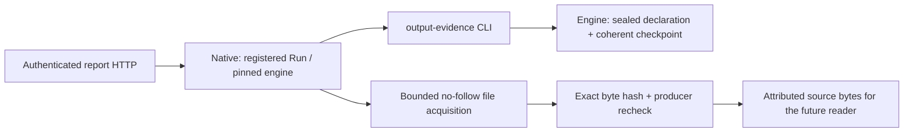

# Report output evidence — execution

Owner approved the [design](../../proposals/fastqc-report-sharing/accepted/ideation-index.md)
on 2026-09-28. This is its first implementation slice. Preserve inherited uncommitted
work; no staging, commit, release or replacement of older engine images.

## Reach and local thinking guide

1. Engine output attribution → root Go API → CLI query/capability. Reuse sealed
   declaration/admission and coherent checkpoint readers, recognize recipe before
   runtime defaults, resolve latest exact attempt and declared checksum. Prove with
   scheduler-backed tests including continuation and ambiguity. Stop before adding UI.
2. Native Run report read → authenticated HTTP. Locate the original admitted launch,
   use the pinned engine with read-only mounts, verify contained regular file bytes,
   recheck producer after read. Prove wrong owner/runtime/attempt, changed/missing/
   unstable/oversized file and unchanged prepared-capability compatibility.
3. Build a distinct local engine and qualify a fresh actual Trim/FastQC Run through
   the existing App/service path. Record returned bytes against real output. Re-run
   affected checks, record exact retained identity and implementation self-check.

Canonical Go types are hand-authored engine/native transport in this slice. No saved
workspace, bundle or tool schema changes yet; contracts/generation and Renderer/Main
report consumers belong to the next slice. Existing execution owners are dependencies,
not rewrite targets. No new abstraction or dependency is needed.

New engine/root/CLI output-evidence files define output attribution; engine hides
checkpoint rules, root exposes the public library contract, CLI validates transport.
Native run_report.go defines verified report acquisition and hides filesystem/runtime
checks from its HTTP caller. Tests and local qualification are proof-only consumers.

## Baseline and learnings

- Existing tree recorded in before.json before production edits.
- Separate output capability preserves strict prepared-capabilities decoding.
- Do not reuse continuation review wholesale: report reading does not require a stopped
  Run, retained inputs, installed tool images or submission cleanup.
- Latest means latest overall attempt, never fallback to an earlier success.
- Exploratory guessed paths/globs (routes, http, api, root Dockerfile, feedback) failed;
  subsequent file discovery uses rg. No design conclusion relies on those reads.

- First engine run: test-only wrong-Run checkpoint mutation was refused by existing
  admission immutability. Removed that invalid fixture mutation; wrong-Run request
  rejection remains covered directly. Other new engine cases passed in that run.
- Native pre-edit baseline: `go test ./internal/appservice` passed in 14.882 s.

- Native test fixture initially omitted parent directory creation; fixed only fixture
  setup. Its HTTP assertion then decoded the existing response envelope incorrectly;
  fixed to read `value`, with no protocol change. An unused import after relocating
  query cleanup caused a compile failure and was removed.
- Focused peer advice found an ancestor-symlink replacement gap in a preflight-only
  path check. Unix platform owner now pins each component with O_NOFOLLOW and verifies the
  child os.Root identity; post-read validation repeats traversal. Deterministic tests
  cover ancestor substitution, leaf replacement and in-place writes.
- Reach adds platform_unix/platform_other for no-follow file acquisition, and runtime
  query cleanup moves from continuation_runtime to runtime because both operations
  now use it. No new dependency or callback/test hook is introduced. The initial x/sys implementation
  violated the native service standard-library-only boundary test; it was replaced
  with os.Root and syscall flags rather than weakening the boundary test.
- Production runtime Dockerfile advertises the separately versioned output capability;
  local qualification builds also label a distinct image. Prior engines stay unchanged.

## Implemented boundaries

`ReadOutputEvidence` takes workspace, sealed bytes, original LaunchIntent and one flat
OutputRequest. It returns a version-1 record with Run, snapshot, origin digest,
instance, attempt, port, recognized recipe, relative path, SHA-256 and size.
Recognition precedes reserved execution defaults. A newer failed attempt cannot
fall back to an older success. The query does not read report content or require
input/tool availability. Original engine install identity must match.

Native `GET /v1/projects/{project}/runs/{run}/report?instance=…&attempt=…` uses the
existing authenticated envelope. It resolves the retained admitted App launch and
registered exact runtime, verifies independent capability version 1, acquires at
most 1 MiB, then rechecks the producer. It returns base64 of those exact bytes plus
attribution. An unrelated checkpoint change is allowed; a changed producer is not.
All query containers use read-only mounts, no network, no Docker socket and bounded
resources. Source files, Run records and execution state are never mutated.

| Unit | Concept | Responsibility | Boundary / relationship |
| --- | --- | --- | --- |
| Engine `ReadOutputEvidence` | Recorded output attribution | Authoritative declaration/attempt/checksum proof | Uses engine readers; never imports App or reads report content. |
| Root output API | Public Gobble output query | Stable library surface and installed executable identity | CLI calls it; implementation remains engine-owned. |
| CLI output routes | Output query transport | Parse bounded request and mounted sealed bundle | No Project evaluation or execution. |
| Native `readRunReport` | Verified Run report source | Registered ownership, runtime policy, bytes and recheck | HTTP consumes it; no HTML parsing or App evidence storage. |
| Platform `openReportSource` | Contained source handle | Pin no-follow directory identities and regular source access | Only native file acquisition; standard library only. |
| `finishReportRead` | Acquisition revision check | Match open/current file identity and exact returned bytes | Read-only validator; deterministic replacement tests exercise this boundary. |
| Runtime query cleanup | Temporary query lifetime | Bounded container removal after read or failure | Shared by continuation/output query owners; no execution semantics. |

## Execution self-check

Applied Coding Execution checklist categories: Project Fit, Affected Surfaces,
Project Structure, Architecture, Data Model, Public API, Parameters, Modularization,
Reusability, Overengineering, Complexity, Readability, Vocabulary, Naming, Docstrings,
Correctness, Testing, Verification, Delivery, Usability, Operations and Compatibility.
No classes, interfaces, registries or patterns were added. Standard functions, flat
records and existing owners satisfy Simplicity and the OOP default-to-no-pattern rule.
No unresolved in-scope defect remains after the recorded repairs. This is an author
self-check, not an independent review verdict.

Performance qualification is bounded to the small synthetic workflow and 1 MiB
source limit; large Project launch-directory enumeration is unmeasured. The HTTP
handler supplies a 30-second deadline and existing 16-request concurrency bound.
UI performance/accessibility, representative-user understanding, live Agent content
consumption, report parsing, durable report storage and packaging are not established
by this foundation. Those report-specific consumers begin in the next approved slice.

See [verification](verification.md), [affected reach](reach.json), initial tree in
before.json and final retained hashes in after.json. No files were staged or committed.
