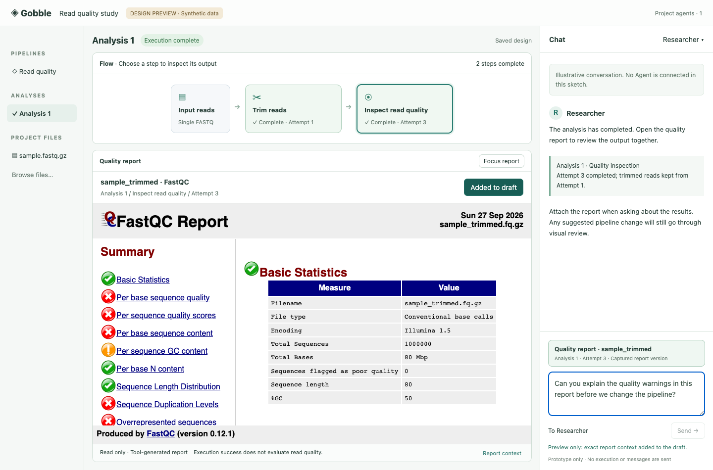

# Single-FASTQ workflow walkthrough

Date: 2026-09-27. Status: review complete; improvement concept awaiting owner review.
The owner accepted P5B-5 and selected the existing single-FASTQ quality-control
workflow for evaluation. Production versions remain Workspace v19 / bundle v28 /
catalog v5 / shared toolset v13. No production code changed in this checkpoint.

## Intent and scenario

A researcher returns to one completed analysis, understands what happened, inspects
the result, and discusses the same result with an Agent before requesting a pipeline
change. The work happens in the Project's Flow, shared Panes and right Chat; no
source-code knowledge should be needed.

Use the existing synthetic Trim Galore → FastQC qualification Run. Create an
isolated copy of its App profile, read the original completed Project, update only
review-profile navigation and an unsent draft attachment, and delete nothing.
Do not execute another analysis or send messages. The original fixture profile is
preserved. `evidence/run-integrity.json` confirms the copied catalog still has the
same one Run. This is an expert walkthrough, not a representative-user study or
scientific validation of the synthetic input.

## Findings and recommendation

| Priority | Finding | Evidence | Recommended response |
| --- | --- | --- | --- |
| High | A completed quality step has logs and discussion, but no readable report route. Finding the actual HTML takes five Files clicks: runs → generated analysis directory → work → fastqc → report. It opens as source text. | [Actual source view](evidence/05-report-source.png); `internal/appservice/files.go`, `RunTasksView.tsx`; [report identity](evidence/report.json) | Open the recorded FastQC report directly from its producing step, retaining Run/attempt/version context. |
| High | At 1100×800 with two Panes, guidance consumes the initially visible Run Flow area. The graph starts at y=292 while its scroll container ends at y=294. | [Initial compact view](evidence/06-compact-workspace.png), [geometry](evidence/compact-geometry.json), [after scrolling](evidence/09-compact-flow-scrolled.png) | One-line completed status; put the Flow before optional details. Keep a visible route to focus either Pane. The graph exists and is reachable by internal scrolling; it is not missing data. |
| Medium | Completed Run still prominently says “Continue this analysis” with a disabled recheck button. Opening Current is emphasized before understanding results. | [Wide Run](evidence/01-restored-run.png); `RetainedRunFlow.tsx`, `ContinuationControls.tsx` | Make result inspection primary when complete. Preserve actionable stop/unknown/review controls and historical Chat confirmations. |
| Medium, inherited | Run sidebar can lag new admission until manual refresh; active Run monitoring already refreshes. | Independent source review of `RunsBrowser.tsx` and `RetainedRunFlow.tsx`; not reproduced by this completed-Run walkthrough | Refresh the existing list after confirmed admission. No generalized subscription system. |

The best next slice is **completed step → shared FastQC report → exact report
attachment → discussion**, with the small state/layout corrections above. A separate
report dashboard, chart generator or general plugin framework is unnecessary.

## Walkthrough checklist and results

| Scenario | Result | Evidence / limit |
| --- | --- | --- |
| Restore completed Run and identify both steps | Pass | 01: both succeeded; retained saved Flow. |
| Select quality step and identify its actual attempt | Pass | 02: FastQC Attempt 3; Trim remains Attempt 1. |
| Inspect selected task logs in a second Pane | Pass | 03: FastQC Attempt 3 stderr in lower Pane. |
| Add latest task to discussion without changing old attachment | Pass | 04: Attempt 1 and Attempt 3 attachments coexist. No message sent. |
| Locate and read quality report without code | Fail | 05: report is accessible only through file navigation and displays HTML source. |
| Keep central Flow initially visible with two Panes at 1100×800 | Needs improvement | 06/09: scroll required past guidance. |
| Switch compact Workspace/Chat without losing draft/context | Pass | 07: original draft and both attachments retained. |
| Reopen historical reference after continuation | Pass | 08: captured Attempt 1 / planned Attempt 2 remains unchanged; no silent retarget to actual Attempt 3. |
| Return from Run to checked Current | Pass with wording concern | 10: checked design opens; “Prepared · No Run started” belongs to a preparation review and may be confused with the completed analysis. Clarify its scope during UX implementation. |
| Start, stop, resume, adoption and Agent response | Prior evidence only | P5B-5 and P5A qualified their bounded behavior. Not re-executed here; test account is deliberately dormant. |
| Representative researcher performs the complete loop unaided | Open | Requires user participation; automated/expert checks do not establish usability. |

Screenshots 01–10 are actual Electron App captures. The separate `sketch/` images
are proposed UI, not implemented behavior. The review profile was relaunched during
inspection, providing an additional draft/reference restoration observation.

## Proposed screen and interaction

[Open interactive concept](http://127.0.0.1:60579/) · [Local HTML](sketch/index.html)

- Compact completed status and saved-design label above the Flow.
- The selected quality step opens its report in the lower Pane. Logs and execution
  details remain secondary navigation, not a permanent task table competing with the report.
- `Focus report` expands the reading area; `Show flow` restores the shared context.
- `Discuss report` adds the exact report to the existing composer. It does not send
  a message or request a pipeline change.
- The first slice attaches the whole report. Precise report section/plot-region
  references are explicitly later work; the prototype does not pretend to identify
  a metric or selected chart region.
- Narrow windows retain Workspace/Chat switching and the unsent draft.

The sketch embeds the **actual synthetic FastQC HTML** under a sandbox and restrictive
content policy. It adds no new scientific chart. Chat text is illustrative and Send
is disabled. Attachment behavior is local mock state, not a production reference API.

## Concepts and ownership

**Run output:** a file produced by a recorded task attempt and declared output port.
It is not any file found by recursively scanning the results folder.

**Report:** a read-only presentation of that output. “Execution complete” is the
engine outcome; FastQC's own quality warnings remain tool-authored content.

**Pane:** a place to display a View, not the owner of output data. Closing, moving or
focusing a Pane must not change the identity of an attached report.

**Report reference:** a captured output version tied to Project, Run, producer
instance/attempt, output port and byte digest. A filepath alone is insufficient.
Neither replacing a file nor starting another attempt may retarget a sent reference.

```mermaid
flowchart LR
    E["Gobble engine\nTask attempt + declared output"] --> S["Native service\nResolve output inside Run; verify bytes"]
    S --> M["Electron Main\nRead-only report + retained reference"]
    M --> V["Shared Pane\nFlow above / report below"]
    V --> D["User: Discuss report\nExisting draft composer"]
    D --> A["Agent\nSame captured report evidence"]
    A --> P["Proposed design change\nExisting visual review"]
    P --> U["User adoption and explicit execution confirmation"]
```

The renderer owns layout/interaction only. Gobble remains execution authority.
The service resolves declared outputs and verifies identity; Main owns shared
reference policy and isolated report access. Agent reads/points/proposes; User
retains adoption and execution authority. Report content has no App bridge, script,
network or arbitrary filesystem access. The prototype sandbox is not proof that a
production report transport and capture policy are qualified.

## Proposed implementation order after approval

1. **Completed Run presentation:** state-appropriate actions, clear preparation wording,
   Flow visibility in stacked Panes, and confirmed-admission Run-list refresh. Use
   existing components and refresh ownership; no new navigation framework. Keep an
   obvious selected-attempt `Open logs` route while inspecting the report.
2. **One supported result route:** expose the recorded `fastqc` `html` output of
   this bounded workflow. Validate authoritative producer attempt, port, contained
   regular file and content revision. Show missing/changed/unavailable states; do
   not guess filenames or fall back to a private work copy. Final contract/schema
   changes must be reviewed against the existing Run/reference models before coding.
3. **Read and discuss:** isolated report View and exact whole-report attachment via
   existing evidence lifecycle. Agent must receive usable rendered evidence as well
   as identity, not just a metadata pointer; inspect existing snapshot limits before
   finalizing the contract. Preserve sender/author, version and request-only behavior.
4. **Verify the user outcome:** real report rendering and Flow→report→draft in Electron,
   wide/compact/focused layouts, keyboard access, missing/changed output, restart,
   immutable sent references, no script/network/App bridge access, and existing
   run/continuation regression checks. Reuse completed fixture; rerun tools only if
   execution/output semantics change. Present result for owner review.

Scope excludes paired-end/multi-sample pipelines, MultiQC aggregation, report metric
interpretation, new charts, report editing, Notebook execution and packaging.
The owner can approve this direction first; detail the report/reference contract
before implementing that part. The narrow presentation correction can be implemented
as the first independently reviewable step.

## Review sources and decision

An independent subagent examined output access, completed state controls and Run-list
freshness. It independently ranked result access first and recommended recorded
output identity over directory scanning. Primary walkthrough agreed and added the
measured compact-layout obstruction. A second review found no blocking package
inaccuracies; it noted that the sketch does not show the promised secondary Logs
route. Preserve that existing route as an explicit implementation acceptance check.
Recommendations above are the resulting joint
review, not evidence of representative-user approval.

FastQC officially produces an HTML report ([Saving a report](https://www.bioinformatics.babraham.ac.uk/projects/fastqc/Help/2%20Basic%20Operations/2.3%20Saving%20a%20Report.html)).
Its module evaluations describe unusual data patterns ([Evaluating results](https://www.bioinformatics.babraham.ac.uk/projects/fastqc/Help/2%20Basic%20Operations/2.2%20Evaluating%20Results.html));
this supports keeping tool report findings separate from process exit success.
No scientific conclusion is drawn from this synthetic example.

## Session learnings and verification limits

- Initial restored screenshot was captured before the view finished loading; replaced
  01 after waiting for the actual ready surface. A generic ready selector can still
  match the previous Pane during asynchronous navigation: wait for destination content.
- Inspection commands used two nonexistent glob/path guesses; corrected after reading
  actual filenames. No code or build failure followed from those read-only commands.
- A guessed `.text-view` selector timed out; actual report control is the uniquely
  named read-only textbox. `.text-preview` alone matches both report and logs.
- Attachment buttons have contextual accessible names; use the existing scoped
  attachment helper instead of assuming the visible word “Preview” is the full name.
- Bundled Playwright headless Chromium is absent. Used already-installed Chrome for
  prototype validation; installed no dependency. Actual App walkthrough used Electron.
- Prototype checks cover report loading, attachment mock, focus/restore and compact
  Chat. Visually inspected wide and compact captures after these checks. They do not qualify production report isolation or Agent consumption.
- Prior P5B-5 manifest matched all 82 files before review. Production code and build
  artifacts were not changed; do not claim newly rerun engine/unit suites.
