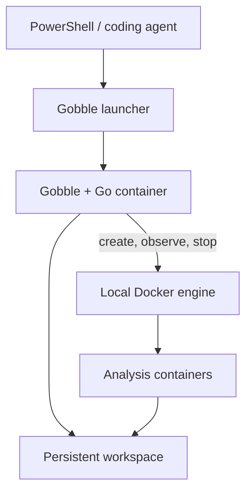

# Decision: Docker is the default installation

Status: accepted by the user. The default beginner route is a containerized
runtime used through a coding agent and a small Gobble launcher. Direct Linux
installation remains supported for advanced users. A runtime Dockerfile,
portable launcher, doctor, and init are implemented in this branch. Release
artifacts and actual Docker/Desktop support still require validation. See the
[preview setup](../../distribution/runtime/README.md).

## User experience

Use a **containerized Gobble runtime with a small native launcher** for
the beginner path. A Windows user installs Docker Desktop and the launcher,
then works in PowerShell or their coding agent's terminal. The versioned runtime
image contains Gobble, compatible Go, Git, and the Docker client. No manual Go
installation or separate Ubuntu terminal is needed for authoring.

Keep direct Linux installation as a developer/advanced path. Initially validate
Linux/amd64 and Windows x64 + Docker Desktop. A Linux image alone does not prove
macOS, ARM, or other Windows backend support.

Implemented commands after entering the project directory:

```sh
gobble init rnaseq-demo
cd rnaseq-demo
gobble doctor
gobble plan .
gobble run . --workspace ./runs/hello
gobble watch --workspace ./runs/hello
gobble stop --workspace ./runs/hello
gobble resume . --workspace ./runs/hello
```

The launcher handles image selection, Docker invocation, directory mounts,
terminal attachment, signals, and exit codes. Users and agents do not need to
copy a long `docker run` command or know internal mount paths.

The external coding agent edits an ordinary host project. Its Gobble commands
compile and validate the pipeline inside the runtime image. Installing Gobble
does not install an AI agent or change where that agent sends prompts/data.

## Execution structure



The Gobble controller and analysis tools are sibling containers managed by one
local Docker engine. The controller accesses that engine through its socket;
it does not start a nested daemon. Analysis containers keep their own selected
images and attempt directories. They do not receive the Docker socket.

Pipeline data, results, logs, state, and a stable workspace identity live outside
the controller's writable layer. Removing or replacing that container must not
remove a run. Container names, hostnames, and transient PIDs are not sufficient
recovery identities.

## Is WSL2 required?

WSL2 is not a dependency of Gobble's pipeline engine. **Linux containers need a
Linux execution environment.** On Windows, Docker Desktop provides it through
an appropriate backend:

| Windows arrangement | User requirement |
|---|---|
| Docker Desktop with WSL2 | Enable the required WSL2/virtualization features; a separate Ubuntu distribution is unnecessary |
| Docker Desktop with Hyper-V | Use a supported Windows edition, installation mode, and hardware configuration |
| WSL2 without a working Docker engine | Insufficient for Docker-backed pipeline tasks |
| Neither Docker nor another supported Linux execution environment | The proposed containerized installation cannot run |

Docker documents WSL2 and Hyper-V installation requirements separately. Backend
selection is Docker Desktop setup; it should not force the user to manage an
Ubuntu shell for Gobble. The current documentation also lists Docker VMM as
beta; it is not a proposed v0.2.0 support claim.

Sources: [Docker Desktop Windows installation](https://docs.docker.com/desktop/setup/install/windows-install/)
and [Docker Desktop WSL behavior](https://docs.docker.com/desktop/features/wsl/).

## Required engineering changes

| Concern | Proposed implementation and observable result |
|---|---|
| Host paths | The launcher declares allowed project/workspace mounts. A path mapper resolves each attempt's controller path to the Docker daemon's actual bind source; it must not pass `/workspace/...` as if that path existed on the daemon host. Test spaces, Unicode, drive paths, and out-of-mount references. |
| Large local datasets | Mount user-selected local data/reference roots read-only; avoid requiring a second copy solely to cross the controller boundary. Existing attempt staging semantics remain explicit. |
| Recovery identity | Persist a workspace ID, owner lease, engine build, daemon identity, and attempt submission intent. Label task containers with the corresponding IDs. Recreated controllers reconcile those records before rerunning anything. |
| Stop and terminal close | Deliver Stop through the durable owner-addressed control channel. Forward Ctrl+C to graceful cancellation. Controller death has a recovery path; a runtime image alone does not promise detached supervision. |
| Live logs | The controller collects task logs continuously into persistent attempt files; a monitor invocation reads those files and state without owning the run. |
| Docker selection | Use one explicit, local daemon configuration for preflight, launch, observation, and recovery. Refuse accidental recovery against another daemon. |
| Versions | Pin the runtime image digest/toolchain per project and retain the matching runtime for an existing run. Do not silently switch a recovering run to `latest`. |
| Permissions | Create readable user-owned output files and protect control files. Validate Linux UID/GID mapping and Windows Docker Desktop mounts separately. |
| Process tasks | Commands execute inside the runtime image. Host-installed Windows/Linux programs are not implicitly available there. Use pinned task images for analysis dependencies. |
| Offline use | After preparing the exact runtime/tool images and Go dependencies, cached execution must work without registry downloads. Doctor reports missing items before a run is occupied. |

Docker resolves bind mounts on the **daemon host**, not the client container.
The mapper therefore needs a tested Docker Desktop path contract; simple string
replacement of a Windows drive is insufficient. A practical prototype should
compare the controller's declared mounts with the actual sources returned by
Docker inspection, and prove a sibling task can read/write the intended files.
See [Docker bind mounts](https://docs.docker.com/engine/storage/bind-mounts/).

## Delivery gates

1. Finish checkpoint publication and durable submission recovery. These are
   shared prerequisites for direct and containerized execution.
2. Demonstrate a controller and one analysis container sharing a persistent
   workspace on real Docker, including Stop, controller death, and Resume.
3. Add the native launcher and its path/terminal adapters; package a versioned
   runtime. Agent-created projects must work without host Go.
4. Exercise the same journey from PowerShell on an actual Windows x64 host,
   including Docker restart, spaces/Unicode, permissions, and a new controller.
5. Promote the verified route to the README quickstart. Retain explicit support
   boundaries and developer instructions for direct installation.

No Docker daemon or Windows host is available in the current development
environment. The existing Docker test image and CI definitions are prepared,
but neither proves this proposed installation route until these gates run.
