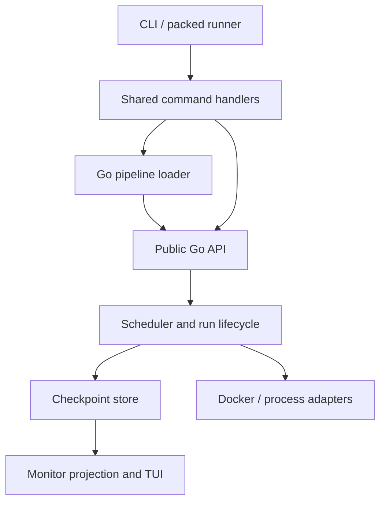

# v0.2.0 design decisions

Status: the user approved the recommended D1–D3 direction. D2 and D3 are accepted
for implementation. Following the user's question about running Gobble itself
in Docker, D1 has a concrete [container installation proposal](container-installation.md)
for selecting the primary beginner installation route. Examples below are
proposed CLI syntax, not commands available in the current implementation.

## D1 — Local installation and Windows

| Option | User experience | Engineering cost / limitation |
|---|---|---|
| **A. Windows through WSL2; Linux execution (recommended)** | A Windows bootstrap guides WSL2 and Docker Desktop setup, then runs Gobble and the coding agent in the same WSL distribution. | Retains Linux process/locking semantics. Requires real Windows/WSL validation; Windows ARM and native PowerShell execution are separate claims. |
| B. Native Windows CLI plus Docker Desktop | Gobble runs directly in PowerShell. | Requires Windows process ownership, locking, paths, signals, file handles, packed-runner IPC, terminal testing, and architecture handling. |
| C. Gobble controller in Docker everywhere | A wrapper launches a development/runtime container containing Gobble and Go. | Shared Docker socket, host path mapping, persistent controller identity, and TUI attachment become part of normal use. A container image alone does not solve these. |

Recommend A for v0.2.0, while keeping runtime adapters replaceable. The Windows
promise must say "Windows via WSL2", and the workspace should be on the WSL
Linux filesystem. Installation should diagnose required restarts, missing
virtualization, daemon availability, and permissions before the first analysis.

**Follow-up:** A was the original recommendation for the smallest change to the
existing Linux engine. C is technically feasible and can give beginners a
smaller host setup: Docker Desktop and a launcher, with Go and Gobble inside a
versioned Linux container. WSL2 is not a Gobble requirement. Docker Desktop can
use WSL2 without the user installing a separate Ubuntu distribution; supported
Windows configurations can instead use the Hyper-V backend. See the follow-up
proposal before finalizing the primary installation path. Neither an image nor
Windows support is published or validated yet.

Proposed setup roles:

| Role | Installed components | First action |
|---|---|---|
| Author working with a coding agent | Gobble CLI, compatible Go, Git, usable Docker | `gobble init rnaseq-demo` |
| Operator receiving a packed pipeline | Packed runner and usable Docker | `./rnaseq-runner doctor` |

Use versioned release artifacts with checksums, plus a bootstrap that finds or
installs the matching authoring toolchain. Keep `go install` as a developer path.
Do not advertise a Go-free generic authoring CLI while it compiles Go pipelines.
Preserve the selected version per project and retain the executable needed to
recover existing runs across an upgrade. An external coding agent remains the
authoring interface; a new embedded agent runtime is not needed for this release.

Proposed project layout:

```text
rnaseq-demo/
  go.mod
  go.sum
  pipeline.go
  samples.csv
  README.md
  runs/
    first-run/
      inputs/
      results/
      .gobble/
```

`init` creates a small, runnable teaching example before real assay setup. The
guide then asks the agent to adapt inputs, reference, steps, resource budget,
and output choices. Reference organism/build and analysis choices must be
confirmed as part of pipeline design.

## D2 — Recoverable state publication

| Option | Structure | Tradeoff |
|---|---|---|
| **A. Immutable JSON checkpoint generations (recommended)** | Write a complete generation, flush it, then atomically switch one current-generation pointer. Retain the previous complete generation. | Fits the existing inspectable JSON state and avoids adding a database. Requires careful file/directory sync, retention, and migration. |
| B. SQLite transactions | Store run, task, ownership, and command records in one transactional store; export JSON for Inspect. | Stronger query/transaction support; introduces a database dependency, schema migrations, backup policy, and decisions about large event histories. |

Example for option A:

```text
.gobble/
  current.json
  checkpoints/
    000041/     # immutable complete plan/tasks/run set
    000042/     # next complete set; current.json changes only after flush
  tasks/        # attempt work directories and logs
  occupy.lock
```

Readers follow a single committed generation. A crash before pointer publication
leaves the previous generation readable. A crash after publication exposes the
complete new generation. Partial future generations are never interpreted as
completed work. Changing schemas requires an explicit migration path for existing
workspaces; old state remains available for rollback and diagnosis.

The checkpoint publication portion is implemented in this branch. See
[checkpoint storage](../checkpoints.md) for its compatibility boundary and
validation. Automatic rollback is deliberately unavailable: a previous state
cannot prove that later external jobs did not start. Submission intent and
backend reconciliation remain the next part of D2.

**Backend recovery is part of this decision.** A checkpoint alone cannot account
for a container started after the last commit. Persist an execution intent before
submission, give containers deterministic run/attempt labels, and reconcile those
labels against the recorded daemon before authorizing any rerun. Test death both
before and after Docker returns a container ID. A durable checkpoint does not
permit assuming an unrecorded task never started.

## D3 — Run, Stop, Resume, and monitor semantics

Recommended public flow:

```sh
gobble doctor
gobble init rnaseq-demo
gobble plan ./rnaseq-demo
gobble run ./rnaseq-demo --workspace ./runs/first-run
gobble watch --workspace ./runs/first-run
gobble stop --workspace ./runs/first-run
gobble resume ./rnaseq-demo --workspace ./runs/first-run
```

| Action / event | Proposed behavior |
|---|---|
| `stop` or Ctrl+C | Stop admitting tasks, request termination of owned tasks, collect available logs, settle backend state, persist the result. This does not promise in-process checkpoints inside bioinformatics tools. |
| `resume` | Verify project/engine/backend identity, reconcile a previous owner after proving it is gone, reuse validated successes, rerun unfinished/changed work. A separate routine Release command is unnecessary for this path. |
| Resume while already running | Report "already running" with the monitor command; do not start another owner. |
| Docker unavailable during stop/recovery | Show "recovery required" and the action needed to restore observation; no duplicate launch. |
| Close the monitor | Analysis continues; the monitor owns no execution. |
| Close the run terminal / kill the controller | Foreground execution has no survival guarantee. The next invocation identifies interruption and reconciles surviving jobs. |
| Machine restart | Resume reconciles persisted attempts and Docker state before reuse/rerun. |
| `run --detach` | Optional separate feature: a supervised local controller persists after CLI exit. Do not imply this exists merely because Docker tasks are detached. |

Choose whether detached execution is a v0.2.0 requirement or a later milestone.
For the first iteration, foreground execution plus explicit recovery is smaller;
for a seamless long-running analysis experience, a supervised per-run controller
is preferable. Neither requires a global always-running service.

Use a per-run control channel or durable stop request addressed to the owner
lease. Stop must be idempotent and acknowledge whether it was requested, settled,
or blocked by unknown backend state. Keep one serialized owner of state writes.
Automatic reconciliation and reacquisition must be one coordinated operation;
simply calling Release followed by Resume introduces a race.

Separate run outcome from ownership and backend certainty:

| Concern | Proposed vocabulary |
|---|---|
| Run outcome | pending, running, stopping, stopped, succeeded, failed, interrupted |
| Backend certainty | known, recovery-required |
| Ownership | idle, owned |
| Task outcome | pending, running, succeeded, failed, blocked, skipped, incomplete, unknown |

Use "run lock" in human text for occupancy; "reconcile" means determining what
happened to owned work. "Resume" restarts unfinished tasks, and "retry" means a
new attempt of a failed task. "Sample" is an input entity, "task" a graph node,
"task instance" an expansion, and "attempt" one execution of that instance.
"Pipeline" replaces "product" in introductory material; assay remains a domain
classification. Public Go/JSON names should change through a documented version
transition, not through inconsistent ad hoc substitutions.

## Internal boundaries



Start by separating files within `internal/engine`: run scheduling, state
documents, resource budget, persistence, expansion, and conditions. Keep the
public root package and pipeline imports usable. Next replace mutable global
test seams with per-run dependencies and share transport-neutral CLI handlers.
Do not introduce public interfaces for every private helper.

Docker logs should be collected by the execution controller into attempt files
while the job runs. The monitor remains read-only. Bound collection shutdown,
preserve stdout/stderr separation, prevent symlink following, and define what
happens after controller death before removing any container whose logs are
still needed.
